# SVN via a windows host

- [SVN via a windows host](#svn-via-a-windows-host)
  - [Downloading the Client](#downloading-the-client)
  - [Configuring the Client](#configuring-the-client)
    - [Setup Local Directory and Define Remote Repository](#setup-local-directory-and-define-remote-repository)
      - [First time Download the latest Repository:](#first-time-download-the-latest-repository)
    - [Download the latest Repository](#download-the-latest-repository)
  - [Working with TortoiseSVN](#working-with-tortoisesvn)
    - [Adding a New File](#adding-a-new-file)
    - [Modifying an Existing File.](#modifying-an-existing-file)
  - [Diffing Version of a File.](#diffing-version-of-a-file)
    - [Comparing Different Versions](#comparing-different-versions)
      - [Compare with Previous Version](#compare-with-previous-version)
      - [Compare with Any Version](#compare-with-any-version)
    - [Customizing your Rig](#customizing-your-rig)
  - [Automatically updating your repo](#automatically-updating-your-repo)

This page explains the steps to install a SVN Client app on a windows host, how to connect and download a repository, and then how to check in or modify current files.

## Downloading the Client
There are a few different ways to access the repository from a windows host, but for now, you will need to install the app [TortoiseSVN](http://en.wikipedia.org/wiki/TortoiseSVN).
- you can get it [from the web](http://tortoisesvn.tigris.org/).
Once you have downloaded the app, install it.

## Configuring the Client
Follow these steps to get your client app setup so that it works with a repository.

### Setup Local Directory and Define Remote Repository
As discussed in the Theory of Operations, the remote SVN repository keeps all the different versions for each file, but copies the most up to date version of all the current files on to your PC. These current version files are kept in your "local repository".
Decide where you want these files to be kept, and create a directory to store them. In this example, I created the directory "s-neteng" and placed it in my "My Documents" directory, which also shows up as "c:\users\s-neteng".

From the Start Menu, find the TortoiseSVN directory, and select Settings.

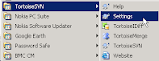

Within the Settings window, in the left column, select Dialogs 1 subsection (under "General"). Then in the "Checkout" section in the main window, under Default path: enter your local directories path (in my case c:\users\s-neteng).

You will also need to point to a SVN repository. Directly below, in the Default URL: section, enter a repository's URL: https://svni1.foo.com/isource/svnroot/s-neteng.

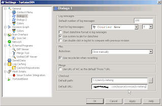

Select OK to activate your settings.

#### First time Download the latest Repository:
The first time you want to download the repository, all you need to do is right click on the directory you chose to be your repository, and then select SVN Checkout...

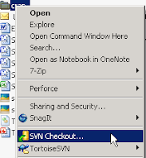

You will get a checkout window to confirm what to checkout and where to put it. Under the "URL of Repository" make sure that you have listed https://svni1.foo.com/isource/svnroot/s-neteng. For the "Checkout Directory", make sure that you have the path of the directory you right clicked. Then select ok, and everything will be synced up.

### Download the latest Repository
When every you want to get a copy of the full repository copied to your local pc, you simply follow these directions. (Note by selecting a sub-directory, instead of the root directory, you will only get updates from that directory. - good if you don't need to sync everything up.)
Right click on the directory you defined above as your "Default Path" (in this example c:\users\s-neteng), and select SVN Update.

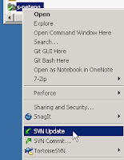

You might have to enter your username and password, which can then be cashed by selecting the Save authentication checkbox.

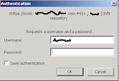

Afterward, the update window will appear, and you will see the current repository files downloaded to your local directory.

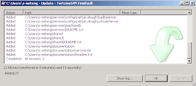

## Working with TortoiseSVN
This section discusses how to add or modify existing files within the repository.

###  Adding a New File
In this example we will add a perl script into our tools\bin directory. First make sure that you are properly synced up as shown in section 2.2. Note that you can sync up your entire repository, or simply the directory you will be working with. You should make sure though, that the directory you are working in is synced, if for nothing else, to make sure that there isn't already a file with the same name there.
Once you have added the new file, you will need to check it in. Do this by right clicking on the file, and selecting the add option under "TortoiseSVN".

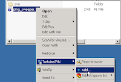

Next, you will need to upload the new changes into the repository. You do this by right clicking anywhere in the local repository and selecting SVN Commit....

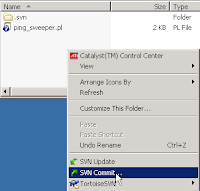

The commit window will then open up and you need to enter in a message describing the change you are making to this file. In this case, I was adding a file, so I am simply describing what the file is. 

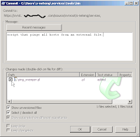

Select OK and the file will be added to the repository.

###  Modifying an Existing File.
In this section we will follow along our example of working with the perl script, but rather then adding a new file, we will modify the existing one.
First, before we make any modifications, we need to make sure that the current copy on our PC is the most up to date. (Maybe someone else made a change since we first checked in the file.) To do this, simply right click in the window with the ping script file, and select SVN Update

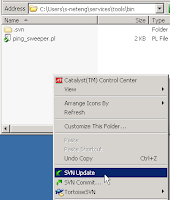

Once the update is complete, go ahead and make the changes to the file. Note that the file has a green checkbox next to it, indicating that it has not been modified since it has been synced.

After you are done making the changes to your file, notice that it now has a red exclamation mark signifying that it is different then what was originally synced.

Next commit the file by right clicking on it, and selecting SVN Commit.

And then in the Message window, explain what the change was that you made, and select OK.

## Diffing Version of a File.
Diffing is a very powerful feature that allows you to see the changes that were made between the current file and the previous or any other version of the file.

### Comparing Different Versions

#### Compare with Previous Version
To simply compare the current version and the previous, right click the file and under TortoiseSVN, select Diff with previous version.

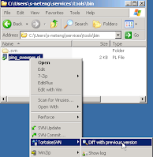

This will bring up the TortoiseMerge tool that shows you the two files side by side, and highlights the changes between the two files.

#### Compare with Any Version
To compare any two versions of a file (some time vs. the current, or any time vs. any time), right click on the file, and under TortoiseSVN, select Show log.

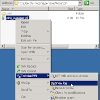

This will bring up the Log Messages window, which shows you every version checked in, the comments for that check in, and the other files that were checked in with it.

Select one of the files you want to compare, and then hold down on the Ctrl button and select the other file you want to compare.


Next, right click on one of the selected files and select Compare revisions. This will then bring up a diff window so that you can see the differences between the two files.


### Customizing your Rig
Of the different modifications you can make to your Tortoise configuration, I would suggest using [Perforce](http://www.perforce.com/)'s [P4Merge](http://www.perforce.com/perforce/products/merge.html) for diffing. (To say it rocks, is an understatement.)

You can download a copy from Perforce at their [download site](http://www.perforce.com/perforce/downloads/index.html). Look for "The Perforce Visual Client (P4V)", and select your operating system. This will install a bunch of Perforce client software (as it is required for their system) including P4Merge.

Once complete, go to the TortoiseSVN, Settings tool from within the Start Menu, or by right clicking within your repository, and under TortoiseSVN, selecting Settings. In the Settings window, in the left menu, select Diff Viewer under the External Programs section. Then in the right side of the window, under Configure the program used for comparing different revisions of files Select External and include the path for P4Merge.

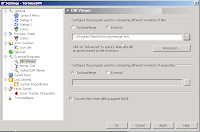

Then when you request a Diff like in the previous section, it will automatically view the diff with P4Merge.

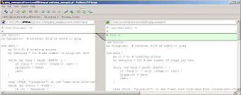


## Automatically updating your repo
You can have windows update the svn repo every day if you like.  To do this, make sure that you have command line svn installed, then write a simple batch file with an update, and then setup a windows cron job to run it every day. 

To install svn command line, make sure that when installing TortoiseSVN to also select command line 

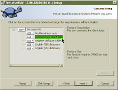

Then create a simple batch file (*.bat) like such that will update your svn repos: 
```
echo updating the svn repo ....
echo ....
cd C:\Users\dude\home\svnrepo\group1
svn update
cd C:\Users\dude\home\svnrepo\group2
svn update
```

Finally, create a cron job (scheduled task) in windows to run the batch file every day. Do this by running Start :: Control Panel :: Administrative Tools :: Task Scheduler.  Then under the Action Menu (1), select Create Basic Task(2). 

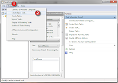

Provide a name for the cron, how often (and when) it should happen, and then under Acton, browse and find the bat file you just created.  Once you select the finish button, your all set. 