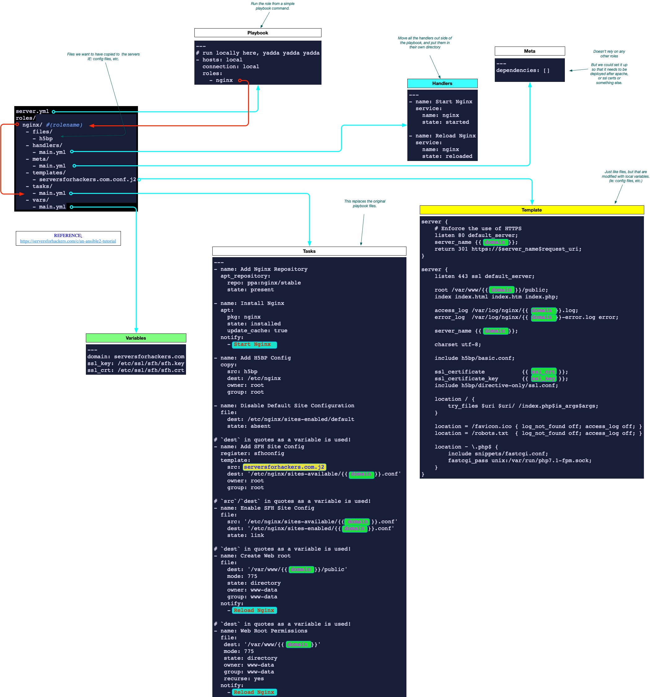

# Roles

- [Roles](#roles)
  - [Configuration](#configuration)
    - [ansible/dev/host.dev.fhm.txt](#ansibledevhostdevfhmtxt)
    - [ansible/roles/ntpd/tasks/main.yml](#ansiblerolesntpdtasksmainyml)
    - [ansible/roles/ntpd/handlers/main.yml](#ansiblerolesntpdhandlersmainyml)
    - [ansible/roles/ntpd/meta/main.yml](#ansiblerolesntpdmetamainyml)
    - [ansible/roles/ntpd/templates/ntp-conf.j2](#ansiblerolesntpdtemplatesntp-confj2)
    - [ansible/playbooks/ntpd.yml](#ansibleplaybooksntpdyml)
    - [Updating the path to the roles](#updating-the-path-to-the-roles)
  - [Output](#output)
- [References:](#references)

Rolls allow us to break the playbook up into a couple of additional files, and then sort them in a specific directory structure to ensure everything is easy to find. They are also called by other playbooks, so it's easy to have a large collection of roles and use them in mass from larger playbooks.

A quick breakdown of a role could be seen here, and a reference to this mapping can be found in the document [An Ansible2 Tutorial](https://serversforhackers.com/c/an-ansible2-tutorial) Feb 2018

<a href="../img/roles.png"></a>

## Configuration
The first step is to create the directory structure for the roles. An overview of the folders is noted below, but you can easily create them by entering the following command in the `roles` directory:
```bash
[root@boss01 roles]# ansible-galaxy init ntpd
- Role ntpd was created successfully
[root@boss01 roles]#
```

```
ansible\
 +-- dev\
 |    \-- hosts.dev.fhm.txt      # (1)
 +-- playbooks\
 |    \-- ntpd.yml                # (6)
 \-- roles\
      \-- ntpd\
           +-- files\
           +-- handlers\
           |    \-- main.yml     # (3)
           +-- meta\
           |    \-- main.yml     # (4)
           +-- templates\
           |    \-- ntp-conf.j2  # (5)
           +-- tasks\            
           |    \-- main.yml     # (2)
           \-- vars\
```

The individual files (that end in `.yml` or `.j2`) are outlined in the following sub sections.

Rather then listing all the files in order, we'll jump around and discuss the files in their usage.

### ansible/dev/host.dev.fhm.txt
No change to this file. This is the same hosts file we were using before.
```yml
[all:vars]
ntp_clock_1=10.33.35.32
ntp_clock_2=10.36.35.32

[test]
10.33.128.150
10.33.128.200


# -------------------------------------------------------
# Dev gear for prod: 

[sga]
sga4.fhm.dev.cmed.com   
#sga5.fhm.dev.cmed.com  

[cfg]
cfg1.fhm.dev.cmed.com   


[app]
app01.fhm.dev.cmed.com  

[db]
db01.fhm.dev.cmed.com   

[dga]
# non-centos
# storage1.fhm.dev.cmed.com

# -------------------------------------------------------
# Support systems: 

[vm]
vm01.fhm.dev.cmed.com      

[foreman]
foreman05.fhm.dev.cmed.com 
```

### ansible/roles/ntpd/tasks/main.yml

This is the old playbook from before, but in this version, we moved the handlers section out and moved it to the `handlers/main.yml` doc.

We can change the path of the src file for the `template` command, and remove all the path info, since we are moving the it into the local template directory. We can also change the ntpdate command to poll the local ntp server, rather then a public host that might not be allowed through the firewall.  To confirm, the `notify` command will restart the ntpd service once the new ntpd config is installed on the server.  

```yml
--- # Make sure that NTP is working properly on all systems

  - name: Set host timezone to UTC
    timezone:
      name: Zulu

  - name: Install NTP
    yum: name=ntp state=installed

  - name: copy the ntp config
    template: src=ntp-conf.j2 dest=/etc/ntp.conf
    notify: restart ntpd

  - name: shut down ntpd so we can do an initial sync
    service: name=ntpd state=stopped enabled=yes

  - name: Sync time initially
    shell: ntpdate {{ ntp_clock_1 }}

  - name: Bring NTP back up
    service: name=ntpd state=started enabled=yes

  - name: Sync hwclock to NTP time
    shell: hwclock -w
```

### ansible/roles/ntpd/handlers/main.yml
This is just the handler section from the original playlist:
```yml
--- # Handler section: 
  - name: restart ntpd
    service: name=ntpd state=restarte
```

### ansible/roles/ntpd/meta/main.yml
The meta section lists all the roles that should be run before this role is run. It provides us the ability to create dependencies for this role

There are no dependencies for this role, so we just create a file with the following to show that we don't have any.
```yml
--- # List the dependencies: 
dependencies: []
```

### ansible/roles/ntpd/templates/ntp-conf.j2
This file is simply the template file we were using before. No changes needed, just plop it in here.
```yml
driftfile /var/lib/ntp/drift

restrict default nomodify notrap nopeer noquery

restrict 127.0.0.1
restrict ::1

server 10.36.35.32
server 10.33.35.32

includefile /etc/ntp/crypto/pw

keys /etc/ntp/keys
```

### ansible/playbooks/ntpd.yml
This is the playbook that will just run the ntpd role. (note in other playbooks, we might run a bunch of roles including ntpd, but in this one, we're just running ntpd and nothing else.)

This playbook is super simple, and just looks like this:
```yml
--- # Run the ntpd role by itself.  
- hosts: test
  roles: 
    - ntpd
```

### Updating the path to the roles
With the directory structure above, your playbooks might not be able to find where the roles path is. (if so, you might get a message similar to this)
```yml
[root@boss01 ansible]# ansible-playbook -i dev/hosts.dev.fhm.txt playbooks/ntpd.yml
ERROR! the role 'ntpd' was not found in /home/git/techops/services/apps/ansible/playbooks/roles:/root/.ansible/roles:/usr/share/ansible/roles:/etc/ansible/roles:/home/git/techops/services/apps/ansible/playbooks

The error appears to be in '/home/git/techops/services/apps/ansible/playbooks/ntpd.yml': line 4, column 7, but may
be elsewhere in the file depending on the exact syntax problem.

The offending line appears to be:

  roles:
    - ntpd
      ^ here
```

We can easily fix this by updating the `/etc/ansible/ansible.cfg` file with the new path for the roles directory.
```yml
# additional paths to search for roles in, colon separated
#roles_path    = /etc/ansible/roles
roles_path    = /home/git/techops/services/apps/ansible/roles
```

## Output

When you run this role, all your doing is running the small playbook file that you created at the last step. It will then run the role and do everything else after.

```bash
[root@boss01 ansible]# ansible-playbook -i dev/hosts.dev.fhm.txt playbooks/ntpd.yml

PLAY [test] *******************************************************************************************************

TASK [Gathering Facts] ********************************************************************************************
ok: [10.33.128.200]
ok: [10.33.128.150]

TASK [ntpd : Set host timezone to UTC] ****************************************************************************
ok: [10.33.128.150]
ok: [10.33.128.200]

TASK [ntpd : Install NTP] *****************************************************************************************
ok: [10.33.128.150]
ok: [10.33.128.200]

TASK [ntpd : copy the ntp config] *********************************************************************************
changed: [10.33.128.200]
changed: [10.33.128.150]

TASK [ntpd : shut down ntpd so we can do an initial sync] *********************************************************
changed: [10.33.128.200]
changed: [10.33.128.150]

TASK [ntpd : Sync time initially] *********************************************************************************
fatal: [10.33.128.200]: FAILED! => {"changed": true, "cmd": "ntpdate 10.33.35.32", "delta": "0:00:08.114278", "end": "2020-04-30 15:45:54.045294", "msg": "non-zero return code", "rc": 1, "start": "2020-04-30 15:45:45.931016", "stderr": "30 Apr 15:45:54 ntpdate[11290]: no server suitable for synchronization found", "stderr_lines": ["30 Apr 15:45:54 ntpdate[11290]: no server suitable for synchronization found"], "stdout": "", "stdout_lines": []}
fatal: [10.33.128.150]: FAILED! => {"changed": true, "cmd": "ntpdate 10.33.35.32", "delta": "0:00:08.123010", "end": "2020-04-30 15:45:54.243986", "msg": "non-zero return code", "rc": 1, "start": "2020-04-30 15:45:46.120976", "stderr": "30 Apr 15:45:54 ntpdate[7968]: no server suitable for synchronization found", "stderr_lines": ["30 Apr 15:45:54 ntpdate[7968]: no server suitable for synchronization found"], "stdout": "", "stdout_lines": []}

RUNNING HANDLER [ntpd : restart ntpd] *****************************************************************************

PLAY RECAP ********************************************************************************************************
10.33.128.150              : ok=5    changed=2    unreachable=0    failed=1    skipped=0    rescued=0    ignored=0
10.33.128.200              : ok=5    changed=2    unreachable=0    failed=1    skipped=0    rescued=0    ignored=0

[root@boss01 ansible]#
```

Note that the error above is no biggie. It's just throwing this because the local ntp server is down, and the command fails.

```bash
[root@test01 ~]# ntpdate 10.33.35.32
30 Apr 15:55:38 ntpdate[9157]: no server suitable for synchronization found
[root@test01 ~]#
```

# References: 
- [Handlers: running operations on change](https://docs.ansible.com/ansible/latest/playbook_guide/playbooks_handlers.html): Details on the `notify` command.  