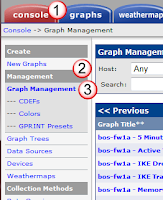
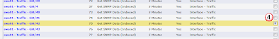
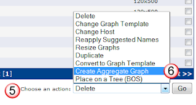
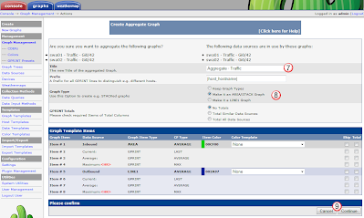
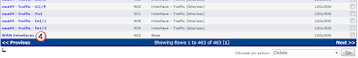
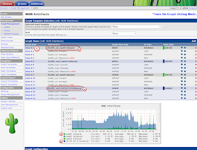
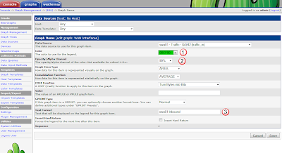
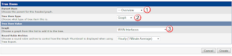

# aggregate

## Overview: 
Say you have two up-link connections that you use to connect to the internet.  Each of these links are connected to different devices (maybe two routers?), and you want to graph the total to see your overall bandwidth.  The aggregate plugin makes this really easy to do.  

In this example we will combine two graphs:
- swa01, port gi0/42
- swa02, port gi/042
Both these ports are our uplinks, and together, they will show us our total WAN usage

## Create the Graph: 
From the Console(1) tab, under Management(2), select Graph Management(3).  

then find the two (or more) items, and check(4) them off.  

Then at the bottom of  the page under Choose an Action(5), select Create Aggregate Graph(6), and press Go.

In the Aggregate Graph window, change the Title(6) to explain what the graph will be, define what kind of graph(8) and press the continue(9) button.  

## Modify the Graph: 
Once the creation of the graph is complete, you can find the new aggregate graph back in the console(1), Management(2) Graph Managmeent(3) section.  

Then search for it and select it's link(4). 

In the main window for the aggregate graph, you can see all the components used to create it.  You can select any of the items and modify them.  A good starting point is to rename the data points to more meaningful points.  In this case, I'm changing the name from the ip address (a) to the devices name (b) by selecting the Graph Item(1).  

When you are modifying a graph item, you can change a couple of different things including the color (1), the opacity(2) (see through-ness) , and the legend(3) of the item.  

## Place the Graph: 
Now that you created the graph, you need to put it somewhere on the tree to be viewed.  

Under Console(1), Management(2) select Graph Tree(3)

Then find the place in your tree that you want to place the new graph, select add(1)

And then under tree type, select Graph(2) and find the graph and select it for the Graph(3)

