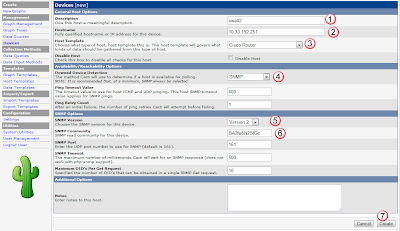
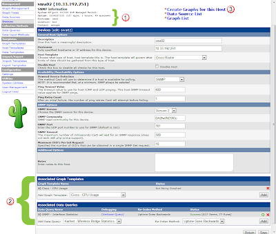
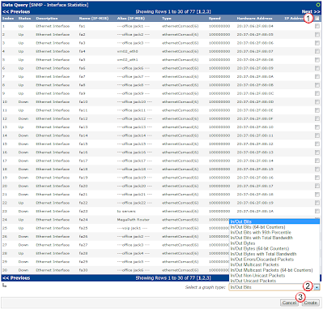
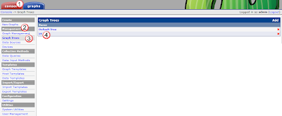
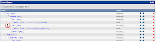
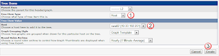
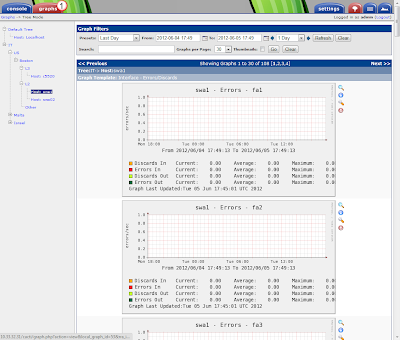

# Define Devices
Before we do any graphing, we first need to define all of the devices out there that we want to poll, and how to poll them.  

## Create the Device: 
To do that, under console(1), Management(2), select the Devices(3) link, and then select Add(4).

In the new device window, enter in the following: 

1. `Description` = {hostname}. The name you want the device to be labeled as
2. `Hostname` = {ip || dns_name}. Either the IP address of the device, or the fqdn for it. 
3. `Host Template` = {correct_template}. Make sure that you have already downloaded (or created) the correct template for this type of device, and select that one.  
4. `Downed Device Detectio`n` = SNMP
5. `SNMP Version` = 2c
6. `SNMP Community` = {good password}

then select the Create(7) button to have this host monitored.  

## Create the Graphs: 
Once the device is created you will see the output of the build operation (1) and you will see the new graphs and data templates (2).  Even thought the host is created, you will still need to create the graphs for it.  You can do this via the link Create Graphs for this Host(3).  

In the data query window either select the specific interfaces you want to monitor or the all (1) checkbox, then select the Graph Type(2) that you would like to use, and save the changes with the Create(3) button.  

there are a couple of different graph types, so you might want to tell cacti to graph all port in/out, and errors.

## Add Device to Tree.  
Now that the device has been created, and graphs are being made, you will need to add it to the tree so you can easily find it and it's graphs.  

Under the console(1) tab, under Management(2) select Graph Trees(3).  In this case, I have already created a tree structure called "IT" so select that(4). 

In this case, the switch is located in the "Boston" office, and it is a switch, so under "L2"(1) select the Add button.

and then for Tree Item Type(1), select HOST, and for Host(2) select the new device you just created.  Then save with the create(3) button. 

## View Graphs
You should now be able to view the graphs under the graphs tab(1).

