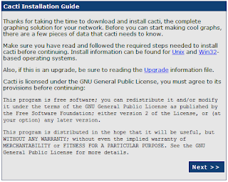
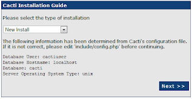
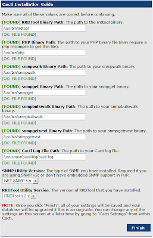
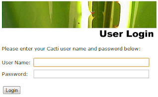
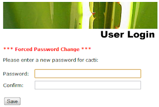
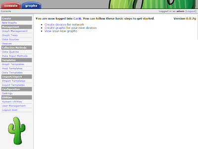

# Finalize Installation
The first time you go to the Cacti webpage, you need to finalize the installation. This is something you will only need to do once, but you can't use cacti via the web until you do this step.  


From the browser, go to the url: 
```
http://{servername}/cacti
```



State that this is a new install and select Next 



You should be able to confirm the base install went properly, because Cacti will see all the services needed to run.  If anything is missing, go back and make sure that the service is properly installed.  



When you get to the login prompt, the default user/pass is admin / admin



You will be required to change the password to something better. 



And then you are brought to the main Cacti web page. 


