**Table of Contents:** 
- [Overview:](#overview)
- [Lines](#lines)
  - [Simple Horizontal or Vertical lines](#simple-horizontal-or-vertical-lines)
  - [Parallel - Set Distance](#parallel---set-distance)
  - [Trim line to another line](#trim-line-to-another-line)
    - [Extend line to another line](#extend-line-to-another-line)
    - [Trim line to another line](#trim-line-to-another-line-1)
  - [Extend line to a distance](#extend-line-to-a-distance)
- [Reference:](#reference)

## Overview: 
The following are examples showing how to do basic activities within the QCAD user interface. 

## Lines
All different ways to place a line on the page

### Simple Horizontal or Vertical lines
When you just want to place your first lines on the page. 

| Select the Line tool (1) | Then select either the Horizontal (2) or vertical (3) line tool | 
|--|--|
| 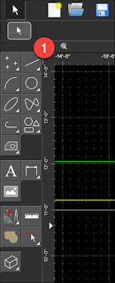 | 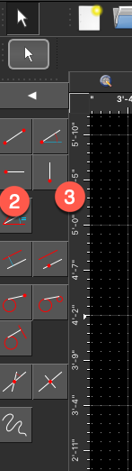 |  

### Parallel - Set Distance
When you already have a line, and you want to make another one parallel to it but some distance away from it.

| Select the Line tool (1) | Then select the Line Parallel (2) option, and then enter in the distance away (3) you want the parallel line.  (for 2.5 inches, enter 2.5") | Then select a line in the drawing (4), and move the mouse to one of the sides of the line.  It will then place the next line the set distance away (5). |
|--|--|--|
|  | 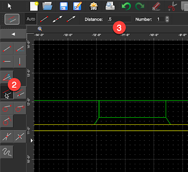 | 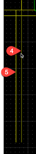 |

### Trim line to another line
Two tricks for either shortening a line where it intersects with another line, or to extend a line to the point where it intersects with another line. 

For both options, first

| Select the Modification Tool (1) | Then select the Trim Tool (2) | 
|--|--|
|  | 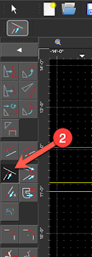 |

We want to extend one line (a) down to another (b), and then we want to remove all the excess (c) part of (b).

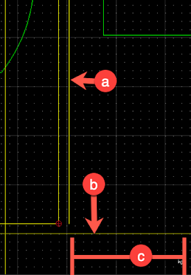

#### Extend line to another line
When one line does not go far enough, and you want to extend it until it touches another line.  

| To first extend the line, select the line we don't want to change (3) | and then select the line you want modified (4). | 
|--|--|
| 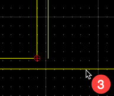 | 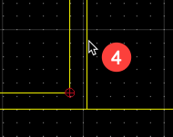 |

Notice how the line we clicked second is extended to the line we clicked first?  

#### Trim line to another line
Now to remove the excess line (which is a trim)

| select the line we don't want to change (5) | and then select the side of the line that we want to keep (6), and the rest of the line will be deleted. |
|--|--|
| 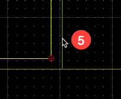 | 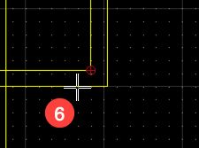 |

Here's a bunch more trimming examples.  First click the line you don't want to modify (1), and then the one you do (2).

 

### Extend line to a distance
When you have two intersecting lines, and you want to have one (or both) of the lines to stop at the point of intersection.

Select the Modification Tool  icon, and then the Lengthen/Shorten  icon.  

Then in the field titled "Amount" in the top of the page, enter the length to modify the line to.  

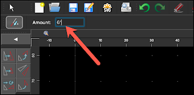 

Then every line you select will be lengthen/shortened to that distance.  

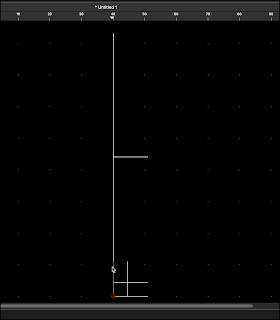 

## Reference: 
- [QCAD Book](http://net.cmed.us/Home/apple/apps/qcad/basic-overview#:~:text=%2D-,QCAD%20Book,-.%20PDF%20instructions%20manual): PDF instructions manual for the application

 