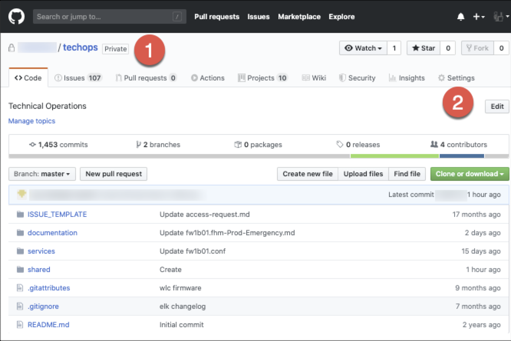
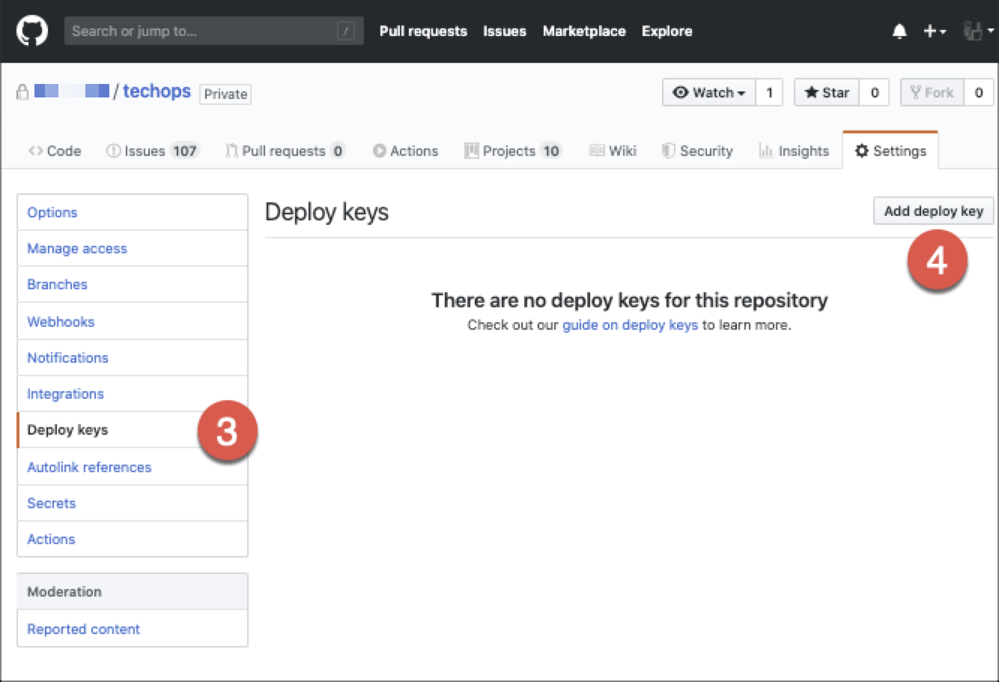
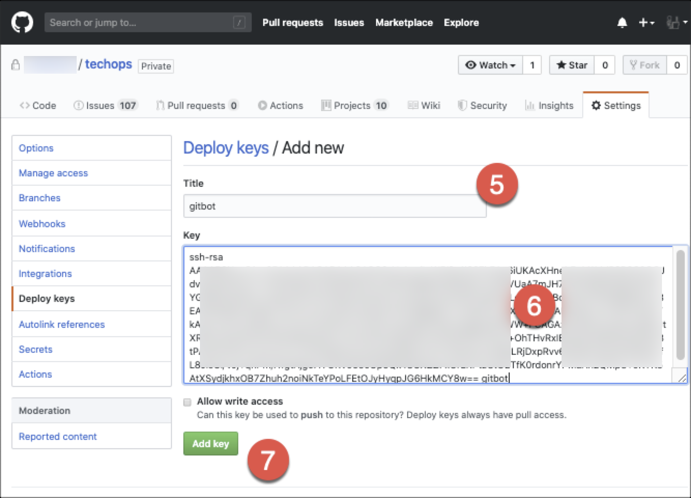
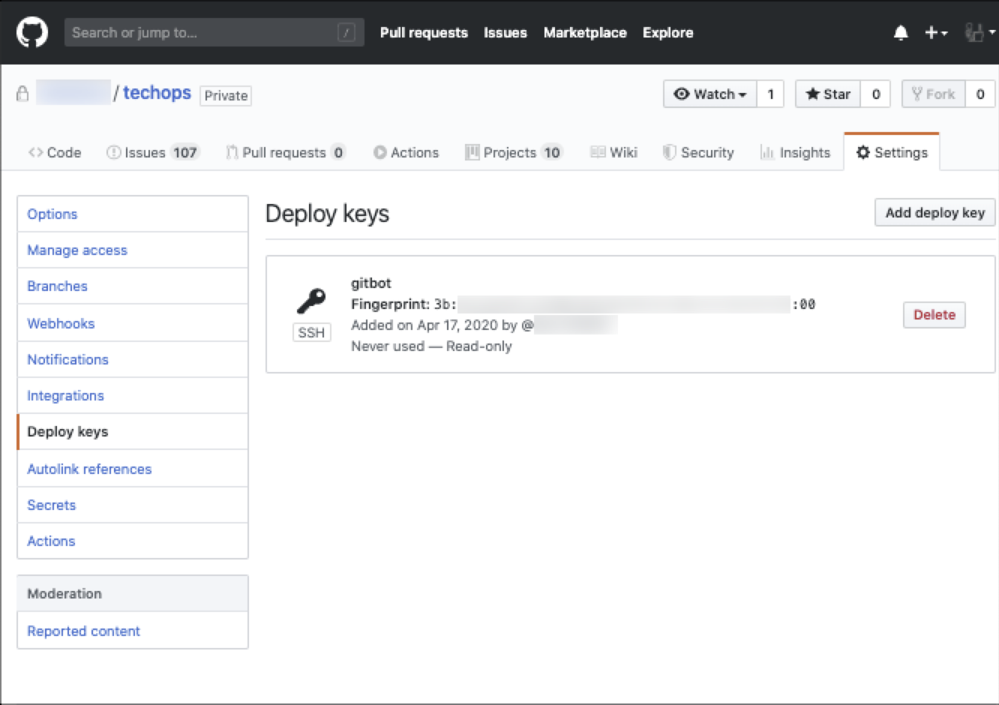

# Deploy Keys in Github

- [Deploy Keys in Github](#deploy-keys-in-github)
  - [Overview:](#overview)
  - [Create your public key](#create-your-public-key)
  - [Enable Account on Github Repo](#enable-account-on-github-repo)
  - [Download the repo using the key](#download-the-repo-using-the-key)
  - [References:](#references)

## Overview: 
This document goes over the process of having a server connect to github using a special account (not yours), and then be able to automatically download the latest version of the repo.  

Note: as of now, there is not an easy way to only download a subsection of a repo like you would be able to in SVN or Perforce.  You have to download the entire repo.  

## Create your public key
On the server you want to connect to github, create a public key.  Not that you don’t enter in a password when prompted, just hit return.
```bash
[root@boss01 ~]# ssh-keygen -t rsa -b 4096 -C "gitbot"
Generating public/private rsa key pair.
Enter file in which to save the key (/root/.ssh/id_rsa): /root/.ssh/gitbot
Enter passphrase (empty for no passphrase):
Enter same passphrase again:
Your identification has been saved in /root/.ssh/gitbot.
Your public key has been saved in /root/.ssh/gitbot.pub.
The key fingerprint is:
SHA256:5Ijeov+6lZJB6l2YewDoM0KoyhCgZG8IVfU9EyaonnI gitbot
The keys randomart image is:
+---[RSA 4096]----+
|o+....... o      |
|B.o   .. + .     |
|=o.o.o  o +      |
|+..+.+ +   o     |
|++..*.o S        |
|=.+oEF .         |
|...oH =          |
|   . =           |
|  ..++.          |
+----[SHA256]-----+
[root@boss01 ~]# ll /root/.ssh/
total 20
-rw-------. 1 root root 3243 Apr 17 19:09 gitbot
-rw-r--r--. 1 root root  732 Apr 17 19:09 gitbot.pub
-rw-------. 1 root root 1679 Apr 15 01:52 id_rsa
-rw-r--r--. 1 root root  416 Apr 15 01:52 id_rsa.pub
-rw-r--r--. 1 root root  550 Apr 15 16:09 known_hosts
[root@boss01 ~]#
```

Then create or add to the x file
```bash
[root@boss01 ~]# vim /root/.ssh/config
```

And enter in the following telling connections to github to use the gitbot key: 
```txt
Host github.com
  Hostname ssh.github.com
  Port 443
  User git
  IdentityFile ~/.ssh/gitbot
```

And then just triple check to make sure that the private key has the correct rights
```bash
[root@boss01 ~]# chmod 600 /root/.ssh/gitbot
[root@boss01 ~]# ll /root/.ssh/
total 24
-rw-r--r--. 1 root root   95 Apr 17 19:23 config
-rw-------. 1 root root 3243 Apr 17 19:09 gitbot
-rw-r--r--. 1 root root  732 Apr 17 19:09 gitbot.pub
-rw-------. 1 root root 1679 Apr 15 01:52 id_rsa
-rw-r--r--. 1 root root  416 Apr 15 01:52 id_rsa.pub
-rw-r--r--. 1 root root  550 Apr 15 16:09 known_hosts
[root@boss01 ~]#
```

Then view what your public key is 
```bash
[root@boss01 ~]# cat /root/.ssh/gitbot.pub
ssh-rsa AAAAB3NzaC1yc2EAAAADAQABAAACAQC9sVx1wyjI+WF/8q1I337kEAg6iUKAcX6nebEuM1MdP3P6C0GGJdvQdw2Gtwi1Y+swP0Zi8qYzcTeqIHB7E//ZrJ0RP3NeBj0zW8s5bCxuCMVUaA7mJH7HjTjXGjjhb3lWkADeIPYGldkPGoHRPx+Hg/KXwWTiEF5ZgsqVEyNSz+kqVlQCc2iUX5i0TugQP3LcnsWcmBclm5mT5eDQ66EpVyV3EA9rMOBKsZh6BLivfGCoFU3mr/6caJdwOpn3RT3/B6i6XFTYMOFVLiyzXQgkXha/AF3W4OLJ/YNG1a7jqItTkAeyLTiGuCuSkiDq+hEJzfiTkxKINaI+ELYBCrvaor92R10Kd/hn6gdwdekWW+FCAGAzHEN5IyXnqIipzngdXUtXRPO1NUQhAExGO6zjbRkI4dkwV+N1HkQGVMpSP0fxuSXW3gOTb2oe+OhTHvRxIBrn8ar0aMEhsDpZWc8tPANHSTeEv/JZyn2zLO+Xhffup6OG2nLgUub29aKS+WJT1iEjyyHCm/9MLRjDxpRvv6P7BZlveOhOSOdDYhfL8JieCi/VJj+qnPm/A1gtAjgo7r7GRVo65cOp6Qk4SOXZZFxOrLRPtzCtOETfK0rdonhYPMaAn2QMp3+oKTK5AtXSydjkhxOB7Zhuh2noiNkTeYPoLFEtOJyHyqpJG6HkMCY8w== gitbot
[root@boss01 ~]#
```

## Enable Account on Github Repo
Go to the github repo you want to manage (1), and then select the Settings (2) menu 



Then select Deploy keys (3) and select the Add deploy key (4) button. 



Then enter in the name of the account (5), the public key (6) that was cat’ed in the last step of the previous section, and then press the green Add key (7) button.  



You will need to enter in your password to confirm the creation of the deploy key


This will create the deploy key, and you will be able to see it in the page.  



## Download the repo using the key
From the host that you created the public key, create the directory where you want the repo to be downloaded to, and pull the data down from github: 
```bash
[root@boss01 home]# mkdir /home/git
[root@boss01 home]# cd /home/git/
[root@boss01 techops]# git clone git@github.com:variantyx/techops.git
Cloning into 'techops'...
The authenticity of host '[ssh.github.com]:443 ([192.30.253.123]:443)' cant be established.
RSA key fingerprint is SHA256:nThbg6kXUpJWGl7E1IGOCspRomTxdCARLviKw6E5SY8.
RSA key fingerprint is MD5:16:27:ac:a5:76:28:2d:36:63:1b:56:4d:eb:df:a6:48.
Are you sure you want to continue connecting (yes/no)? yes
Warning: Permanently added '[ssh.github.com]:443,[192.30.253.123]:443' (RSA) to the list of known hosts.
remote: Enumerating objects: 142, done.
remote: Counting objects: 100% (142/142), done.
remote: Compressing objects: 100% (124/124), done.
Receiving objects:  18% (3195/17452), 1.47 GiB | 14.78 MiB/s
[...]
```
Then you can update the server so that it always updates every 15 minutes.  This is done by running the same command in cron.  

First open up cron
```
crontab -e
```

And make the following update to run the command every 15 minutes. 
```cron
*/15 * * * * /home/git/techops/services/apps/ansible/shell-controls/git-pull-cron-script.sh
```

Which runs the following script: 
```bash
#!/usr/bin/env bash
repo="/home/git/techops"
cd $repo && /usr/bin/git pull -q
```

We can confirm that the cron jobs are running properly 

## References: 
- [Guide on deploy keys](https://developer.github.com/v3/guides/managing-deploy-keys/#deploy-keys): github developer notes on how to create them
- [Generating a new SSH key and adding it to the ssh-agent](https://help.github.com/en/github/authenticating-to-github/generating-a-new-ssh-key-and-adding-it-to-the-ssh-agent#generating-a-new-ssh-key): how to create your public and private keys


