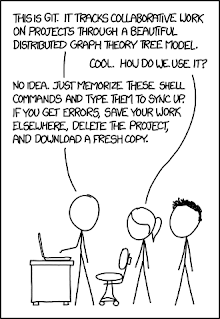

# git

 
https://m.xkcd.com/1597/

## How to Use git
- [Basic Usage](basic-usage.md): Just the simple stuff while using git
- [Git Notes](git-notes.md): Notes on a bunch of most used commands
- [Install Git](install-git.md): How to install git on your computer.
- [Git Cats Cheat Sheet](gitcats.md): Actually, some really good explanations in here using cats

## Using GitHub
- [Pull Request](github-pull-request.md): How to merge a branch into the master repository
- [Having a server auto sync up a git repo](DeployKeysinGithub.md): Have a server log into a git repo, and continuously pull the repo down.
- [Searching files between dates](github-searching-files-between-dates.md): Search for something between dates (closed between X & Y ) 

## References
- [Linus Torvalds' intro to git](https://www.youtube.com/watch?v=4XpnKHJAok8): "I looked at all the source control systems out there, and decided that I could write something better in two weeks.... And I was right."  - LT  (He's a master with words!)
- [Main GIT page](http://git-scm.com/) lists all the details of the app.  
- [Understanding Git (part 1) — Explain it Like I’m Five](https://www.google.com/url?q=https%3A%2F%2Fhackernoon.com%2Funderstanding-git-fcffd87c15a3&sa=D&sntz=1&usg=AOvVaw11bxL746J69ImBQRAOTV77): Kevin Cooper, Oct 2017  
- [Git on the Server - The Protocols](https://git-scm.com/book/en/v2/Git-on-the-Server-The-Protocols)