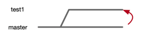
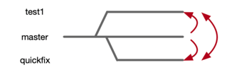
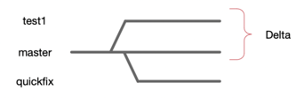

# Git Notes

- [Git Notes](#git-notes)
  - [Overview](#overview)
  - [Commands:](#commands)
    - [int](#int)
    - [clone](#clone)
    - [status](#status)
    - [branch](#branch)
    - [checkout](#checkout)
    - [diff](#diff)
    - [add](#add)
    - [reset](#reset)
    - [commit](#commit)
    - [push](#push)
    - [pull](#pull)
    - [log](#log)

## Overview
This doc just goes over each of the popular commands rather then walking you through how you would use git

## Commands: 

### int
```
git int
```
make a local git repo
(basically make a .git directory)

### clone
```
git clone https://git.cmed.us/tech.git
```
copy/download repo from git.cmed.us to the current local dir

### status
```
git status
```
status of current repo (in current local dir)

### branch
```
git branch
```
a "save-as" of the current repo.  Makes a copy of the current repo that you can then mess with later without messing with the original.  


### checkout
```
git checkout <branch-name>
```
switch to a different active branch. You can switch between the 3 branches with this command. 



There is also `git checkout -b <branch-name>` which is the same as `git branch`, but makes that new branch active.

### diff
```
git diff <branch-name> <other-branch-name>
```
See the difference between the two branches



### add
```
git add <file> <file> ...
```
add files to be "staged" (prepped to be checked in)

(use `git status` to see what's staged and what's not)

### reset
```
git reset <file>
```
opposite as `git add`

takes files out of stage

### commit
```
git commit -m "what's going on"
```
Take all files in stage (all files check in) and add them back to the repo. 

### push
```
git push
git push <origin> <breach>
```
push the current branch or the repo to the site (origin) you originally downloaded it with the git clone command.  

### pull
```
git pull 
git pull <origin> <master>
```
grab the <master> branch from the remote <origin> server (where you downloaded the repo via `git clone` command). 

### log
```
git log --all --decorate --oneline --graph
```
graphically show all of the checkin's and the different branches


