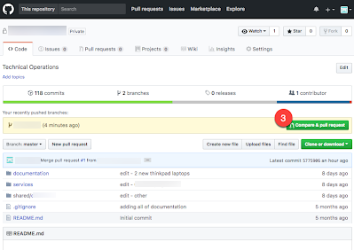
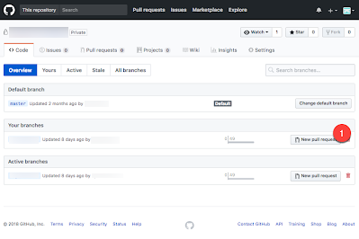
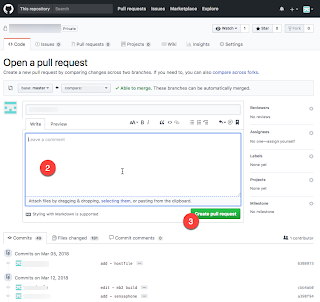
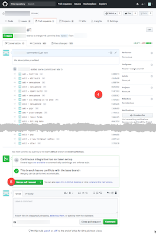
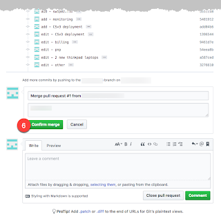
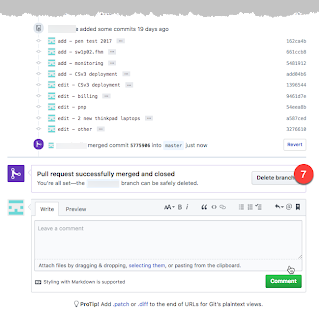

# Pull Request

## Find the repo and the branch
Find your Repository by first going to github
- https://github.com/

and then selecting the octopus cat icon (1) in the upper left corner, and then selecting the repository that you want to work with (2)

Then in the repo's main window, select the branch to merge, and select the Compare & pull request (3) button

Select the branch you want to merge, and press it's New pull request button (1)

Add a comment (2) and press the Create pull request (3) button

confirm that the request has all the correct data (4), and then select the Merge pull request (5) button

Add a comment and select the Confirm merge (6) button to merge the two branches.

Then delete the old branch by pressing the Delete branch (7) button

Afterward, you should see that the branch was deleted (8)

