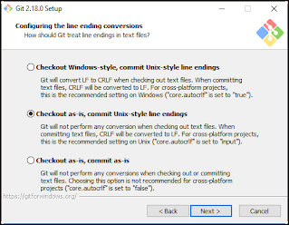
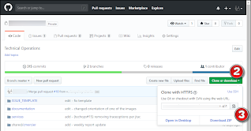
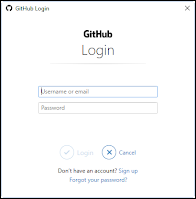
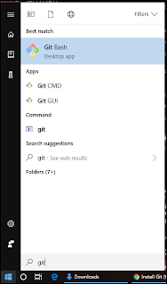

# Install Git

## Overview
To keep track of changes to documents or code, we use a revision control system called git.  The first part of this document goes over how to install this on your laptop.  Git is a decentralized revision solution, so to centralize our repository and have one place that keeps all our most up to date versions of everything we use github.  The next part of this document explains how to link to github and pull down the current repo to your laptop.  

## For the big kids (cli)
Come on folks!  The cli is where it's at!  
### Install Git
Download the git binaries and install
- [Git for windows](https://git-scm.com/download/win): 
- [Git for MobaXterm (for windows)](https://mobaxterm.mobatek.net/plugins.html): download the extension, and put in the mobaXterm directory
- [Git for Mac](https://git-scm.com/download/mac): 

In the setup (in windows), make sure that you use unix-style line endings



### Create a repo directory, and sync with github
Login to [github](https://github.com/), and select the repo (1) that you want to copy to your laptop.  


Select the Clone or download(2) button, and then select the copy to clipboard icon(3) to copy the url for the repo. 



In the cli, navigate to where you want the repo to be downloaded to
```bash
> pwd
/home/mobaxterm/home/github
```

then paste "`git clone {paste_path}`" in the directory where you want everything copied to
```bash
C:\Users\cmercier\Documents\home>cd github

C:\Users\cmercier\Documents\home\github>git clone https://github.com/bobo/tech.git
Cloning into 'techops'...
```

When 2FA has been enabled on your account you must use an SSH Key.  See https://help.github.com/en/github/authenticating-to-github/connecting-to-github-with-ssh to setup SSH Keys.
```bash
mtmartin@laptop % pwd
/Users/mtmartin/github

mtmartin@laptop ~ % git clone git@github.com:bobo/tech.git
Cloning into 'techops'...
```

Then login to github with your username, password, and token



Note if your on a windows box and you fumble a bit using DOS, you might want to checkout git bash (which was installed when you installed git) rather then cmd. 



## Gui Stuff
Notes on how to install gui clients would go here.

## References
- [Cloning a repository](https://docs.github.com/en/repositories/creating-and-managing-repositories/cloning-a-repository): how to copy the contents of the github repo to your laptop
