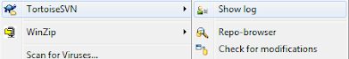
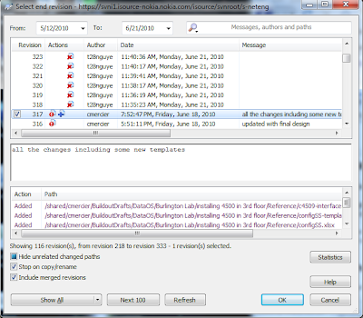
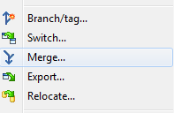
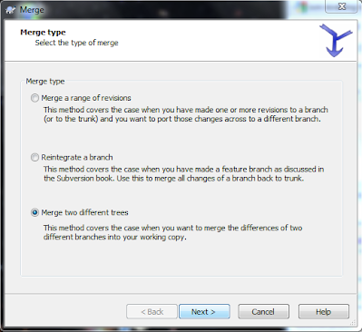
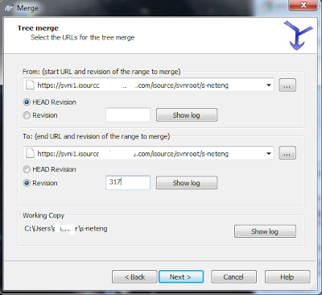
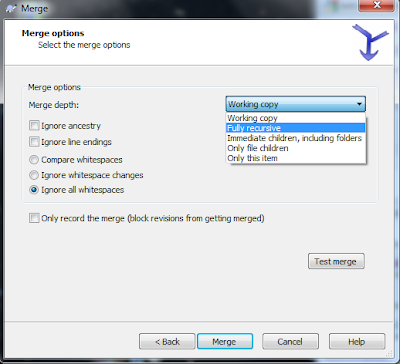
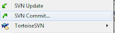

# Revert (undo change)
Subversion is kind of sneaky in their language, so sometimes what you think you want to do is actually called something else. 

A good example is undoing a change.  Lets say someone takes your checked in file or directory and messes with it.  If you want to completely undo their mess, how do you do it? 

The key word here is "merge".  Even if you don't want to merge his changes with yours, what you really are doing is merging the old version with the current one.   .... well, ok that doesn't even sound right... but that's the right wording. 

## Windows Method:
### What was the old version that you want to go back to. 
The first thing we need to do is find out what was the last good version of whatever that you want to revert back to.  To do this, you will want to go to the file or directory you want to change back, right click on it, and select "TortoiseSVN > Show log"

This will pull up a browser that will show you all the previous versions, and you can see where the change you want to revert was made.  This is important, as you will need to find out what the version number was.  In this case, I want to go back to #317, before the directories were deleted by the new employee.  (sigh)

###  Merge old version to newest version
Right click again on the repository, and select "merge"

Then when the window pops up, select "Merge two different trees" and next.

Now you will select the current version (head) and location for the From, and the revision number we tracked down above for the To. 

And then make select how much you want to merge.  If you just want to change a single file, you can choose that, and if you want to make major changes, you can do that too. 

When this process is completed.  You will end up with a local copy of the repository that is (hopefully) the way you want it to be. The good news is that so far, you have only messed with your local version.  If there are any issues, you can always blow it away and re-sync the repository.  If you like the changes, then right click on the file/folder, and select "SVN Commit.." to sync the change up with the repository.

Then the change has been updated. 