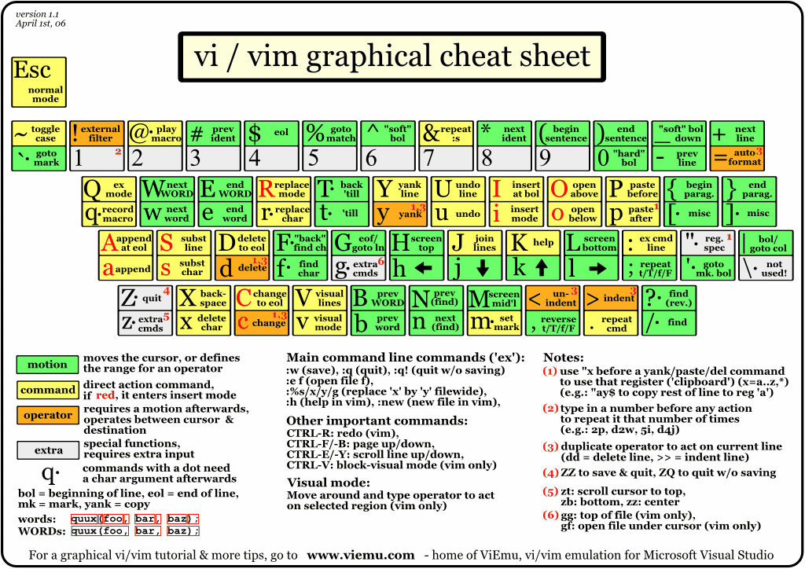

# VIM

<details open>
    <summary><b>Table of Contents</b></summary>

- [VIM](#vim)
  - [Regex](#regex)
  - [Examples:](#examples)
    - [Find and Replace:](#find-and-replace)
      - [Basic:](#basic)
      - [Add carriage return:](#add-carriage-return)
      - [find any number matching a pattern](#find-any-number-matching-a-pattern)
      - [Add spaces](#add-spaces)
      - [Find some non-printed stuff](#find-some-non-printed-stuff)
      - [Delete all empty lines that contain only white spaces](#delete-all-empty-lines-that-contain-only-white-spaces)
    - [Find, copy, and paste](#find-copy-and-paste)
      - [Simple match](#simple-match)
      - [Delete lines containing match](#delete-lines-containing-match)
  - [Scripts](#scripts)
  - [Keyboard Cheat Sheet:](#keyboard-cheat-sheet)
  - [Configuration Settings:](#configuration-settings)
    - [VIMRC:](#vimrc)
  - [References:](#references)
    - [How-Tos:](#how-tos)
  - [Links:](#links)


</details>

## Regex

See great page on VIM RegEx: http://www.softpanorama.org/Editors/Vimorama/vim_regular_expressions.shtml
(copying in case it gets moved)

| #	 | Matching	| # | 	Matching |
|-|-|-|-|
|`.` |	any character except new line	| | | 
|`\s`|	whitespace character	|`\S`|	non-whitespace character|
|`\d`|	digit	|`\D`|	non-digit|
|`\x`|	hex digit	|`\X`|	non-hex digit|
|`\o`|	octal digit	|`\O`|	non-octal digit|
|`\h`|	head of word character (a,b,c...z,A,B,C...Z and _)	|`\H`|	non-head of word character|
|`\p`|	printable character	`\P`	like  |`\p`| , but excluding digits|
|`\w`|	word character	|`\W`|	non-word character|
|`\a`|	alphabetic character	|`\A`|	non-alphabetic character|
|`\l`|	lowercase character	|`\L`|	non-lowercase character|
|`\u`|	uppercase character	|`\U`|	non-uppercase character|

| Quantifier	| Description| 
|-|-|
|`*`|	matches 0 or more of the preceding characters, ranges or metacharacters .* matches everything including empty line|
|`\+`|	matches 1 or more of the preceding characters...|
|`\=`|	matches 0 or 1 more of the preceding characters...|
|`\{n,m}`|	matches from n to m of the preceding characters...|
|`\{n}`|	matches exactly n times of the preceding characters...|
|`\{,m}`|	matches at most m (from 0 to m) of the preceding characters...|
|`\{n,}`|	matches at least n of of the preceding characters...|
|`\({data}\)`|	takes {data} and puts it into register \1|

## Examples:

### Find and Replace: 

#### Basic: 
Search for text cool and replace it with groovy. Do this as many times as necessary for each line.

```
:%s/cool/groovy/g
```

<table>
<tr><th>
was   
</th><th>
 is
</th></tr>

<tr><th>

```
I am cool
cool cool cool
```

</th><th>

```
I am groovy
groovy groovy groovy
```

</th></tr>
</table>


#### Add carriage return: 
Add a carriage return before the word text. Only do this once per line.

```
:%s/text/[Ctrl+v][Return]text/
```

<table>
<tr><th>
was   
</th><th>
 is
</th></tr>

<tr><th>

```
text is written here
this is more text
```

</th><th>

```

text is written here
this is more

text
```
</th></tr>
</table>

#### find any number matching a pattern
Search for all dates (ie: 5-20-2000), and delete: 

```
:%s/\d\+-\d\+-\d\+//g
```

<table>
<tr><th>
was   
</th><th>
 is
</th></tr>

<tr><th>

```
 101
cool
1-1-1
34-2341-12
done
```

</th><th>

```
 101
cool
done
```
</th></tr>
</table>

#### Add spaces 
find and replace with regex `word 123` with `word    123` and use grouping brackets

```
:%s/\(\w\) \(\d\)/\1\t\2/
```

<table>
<tr><th>
was   
</th><th>
 is
</th></tr>

<tr><th>
 
```
# something
number 5
fiveby5
```

</th><th>

```
 # something
number     5
fiveby5
```
</th></tr>
</table>

#### Find some non-printed stuff
Delete all empty lines: 

```
:g/^$/d
```

<table>
<tr><th>
was   
</th><th>
 is
</th></tr>

<tr><th>
  
```
# something

more text here

```

</th><th>

```
 # something
more text here
```

</th></tr>
</table>

#### Delete all empty lines that contain only white spaces
(same as above with spaces)  

```
:g/^\S$/d
```


### Find, copy, and paste

#### Simple match
find some text and store it in register $1, then paste it later

```
:%s/interface \(\S\+\)\n / \1, / 
```
<table>
<tr><th>
was   
</th><th>
 is
</th></tr>

<tr><th>
   
```
interface GigabitEthernet1/0/1
 description switch
```

</th><th>

```
GigabitEthernet1/0/1, description switch
```

</th></tr>
</table>

#### Delete lines containing match
any line with the word match should be deleted

```
:g/match/d
```
<table>
<tr><th>
was   
</th><th>
 is
</th></tr>

<tr><th>
   
```
Word1
match
word2
```

</th><th>

```
Word1
word2
```

</th></tr>
</table>

## Scripts
if you create a text file (in this example called "xl.vim", and in this example putting it in your home directory), and in that text file put a bunch of search and replace statements that you want to do (like such): 

```
:%s/^!#.*\n//g
:%s/\t//g
:%s/<t>/  /g
:%s/<p>/\r/g
```

then in your current file that you want to run this script against, call the script by the following command: 

```
:source ~/xl.vim
```
  

## Keyboard Cheat Sheet:
Quick list of what each key does:



also note:

[Ctrl-R]: Redo changes which were undone (undo the undos)

## Configuration Settings: 

### VIMRC: 
- Config files and good standards for them. 
- [Where is the `.vimrc` file](vimrc-location.md)? 
- [My `.vimrc` files contents](my-vimrc-files.md) 

## References:

### How-Tos:
- [Best_Vim_Tips](http://vim.wikia.com/wiki/Best_Vim_Tips): vims own tips page. 
- [Learn Vim Progressively](http://yannesposito.com/Scratch/en/blog/Learn-Vim-Progressively/): Step by step training on vim
- [Example `.vimrc` files](example-vimrc-files.md):  These are the config files for vim, which help format how the app works
- [Syntax Highlighting](syntax-highlighting.md): So that your perl scripts and cisco acl's are properly color coded.
  - [VIM Color Scheme Test Sheet](http://vimcolorschemetest.googlecode.com/svn/html/index-pl.html): See LOTs of different color schemes, and download them. 
  - [My windows local config](my-windows-local-config.md): 

## Links:
- [VIM Cookbook](http://www.oualline.com/vim-cook.html): Great site that reviews a bunch of things you can do with vim.
- [VIM Tips Wiki](http://vim.wikia.com/wiki/Vim_Tips_Wiki): kind of like this but good. 
- [VIM Adventures](http://vim-adventures.com/): an online game that help teach how to use vm
- [Formatting with VIM](http://www.east5th.co/blog/2017/10/16/formatting-with-vim-scripts/): writing vim scripts and more!
- [Official VIM Site](http://www.vim.org/)
