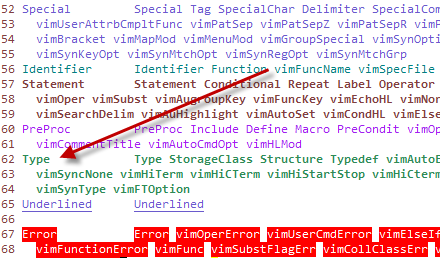

# syntax highlighting

<details open>
    <summary><b>Table of Contents</b></summary>

- [syntax highlighting](#syntax-highlighting)
  - [Overview:](#overview)
  - [Syntax files (file type description files)](#syntax-files-file-type-description-files)
  - [Using a prebuilt highlighting recipe:](#using-a-prebuilt-highlighting-recipe)
  - [Making your own recipe:](#making-your-own-recipe)
    - [syn region:](#syn-region)
    - [Region:](#region)
    - [Match:](#match)
    - [Keyword:](#keyword)
    - [HiLink:](#hilink)
    - [Aliases:](#aliases)
  - [Filetype (pointer file)](#filetype-pointer-file)
    - [Updating Filetype:](#updating-filetype)
  - [colors files](#colors-files)
    - [Example:](#example)
  - [References:](#references)

</details>

## Overview: 
Syntax highlighting allows text of specific file types to be color coded for readability.  Note the additional links and reference to this topic:

- [Changing the default syntax highlighting](http://vim.wikia.com/wiki/Changing_the_default_syntax_highlighting)


## Syntax files (file type description files)
Each file describes a different file type (.txt, .conf, .http, etc.), what words and variables to look for, and how to color them.  You can download additional or custom syntax files for any filetype.  

Syntax files should be located in one of these paths: 

```
$HOME/.vim/syntax/
/usr/share/vim/vim74/syntax/
```

## Using a prebuilt highlighting recipe:
You can download text highlighting recipes and add them to your repository to use.  To do this do the following: 

1. Download the syntax highlighting file.  Some good examples would be: 
    1. Unofficial Cisco Highlighting.  Looks good on a black background
    2. Official Cisco Highlighting.  Note that you can find lots of goodies at this site.  
2. Stick the downloads in your syntax directory.  
    1. In Windoz, it's here: `C:\Program Files\Vim\vim72\syntax\`
    2. In Mac (linux), it's here: `/usr/share/vim/vim73/syntax/`
    3. In unix, it's here: tbd
3. You can see how this highlighting looks on your current file by loading it via the command `:set syntax={filename}` (without the extension).  For example, if you wanted to test the official cisco highlighting look, you would have downloaded the file `ciscoacl.vim` into your `\syntax` directory.  Then while having some file open, like a cisco config file, you would type the following command `:set syntax=ciscoacl`   
4. If you want this highlighting to be automatically enabled on a specific file type, you need to modify the filetype.vim file, and denote what kind of highlighting recipes you want for each file type.  At it's most basic level this is really easy.  If you want all `.conf` files to be filtered with the ciscoacl formatting, you would create the following line: 

```
" Special Configs
au BufNewFile,BufRead *.conf            set filetype=ciscoacl
au BufNewFile,BufRead *.txt             set filetype=txt
```

The challenge is if you want more then one file with that extension.  (for example proftpd.conf* uses an apachestyle formatter.)  I have not figured this out just yet.

## Making your own recipe:
I was looking for a simple highlighting syntax that would color code comments but nothing else.  With limited google searching, I decided to try this on my own, and realized that it's really easy.  I started with [current recipe for log files called txt.vim](https://www.vim.org/scripts/script.php?script_id=1532), made a few changes, and got what I was looking for.

Note: sync, and HiLink are modifications in the txt.vim file.

### syn region:

The "syn" region (where every line starts with the syn word) is where we define what matches to look for and what colors to colorcode those matches.  

Within the syntax file are a bunch of ways to match text or strings of text and assign a type of formatting.  Note that the syntax only assigns a "flag" for the area of text.  The color file in use is what defines how that area of text should be colored.  

### Region:

A region is defined as having some kind of defined start and end, but within it can be anything. The following statement says to assign the "txtComment" to any string within two brackets "( )"

```
syn region txtComment   start="("       end=")"         contains=@txtContains,txtCite,@txtAlwaysContains
```

### Match:

A match is any string that matches a regex. The following statement finds any string with `<add>{any_amount_of_spaces}:` and assigns it as a "txtChangelogs"

```
syn match txtChangelogs         "\<add\>\s*:" contains=txtOperator
```

### Keyword:

A keyword is simply any string of characters.  The following statement finds any of the following words "todo" "fixme" "xxx" and "note", and assigns them as "txtTodo".

```
syn keyword txtTodo todo fixme xxx note
```
 

The first line in the example below is for anything that starts with a bang "!".  Anything in that "oneline" should be color coded however region "txtBang" is defined.

syn region txtBang       start="^!"      end="$"     oneline

syn region txtPound      start="^#"      end="$"     oneline 

### HiLink:

The "HiLink" section are the lines that start with "HiLink" (or link highlighting).  Here we take a region like "txtBang", and define a color pattern to it like "LineNr"

### Aliases:

The search matches can use their own variable names for the text that they match (like txtChangelog, or txtTodo), but then they need to make sure that they are "reassigned" to globally used names that would be found in the color files.  This is done with the HiLink command.  The following converts the variables used above to more globally recognized variable names (like Comment, Keyword, and Todo).  

```
  HiLink txtComment             Comment
  HiLink txtChangelogs          Keyword
  HiLink txtTodo                Todo
```
 

You can now link the "txtType" to a predefined highlighting format.  

```
  HiLink txtBang                LineNr
  HiLink txtPound               Special
```

Where the "Type" format is already defined in vim.   

You can view all of the formatting types by either selecting Syntax > Highlight test in gvim, 



I also didn't like the coloring it did to numbers so i marked out some of the lines in txt.vim: 

```
"syn match txtNumber "\d"
"syn match txtOperator "[~\-_+*<>\[\]{}=|#@$%&\\/:&\^\.,!?]"
```

## Filetype (pointer file)
Vim looks to the configuration file `filetype.vim` to match file extensions to syntax files.  

filetype.vim files can be found in one of the following paths: 

```
/Applications/MacVim.app/Contents/Resources/vim/runtime/filetype.vim
```

or 

```
~/.vimrc
```


For mac's, the filetype file gets overwritten, so you can also update your `.vimrc` file with these changes.  

Whatever you're entering below that was supposed to go in the filetype file can also go into the `.vimrc` file.  

### Updating Filetype:
Don't forget to also update the filetype.vim file as noted above in section 1.4.  For this modification, I simply added the following:

```
" TXT - Basic Text file
au BufNewFile,BufReadPost *.txt                     setf txt
```

## colors files

The colors files are lists of predefined color templates that you can choose from for the look-and-feel of your vim terminal.  

a color file can be chosen in the terminal by entering in 

```
:colorscheme <tab>
```

and then typing in one of the possible options.  For example you could enter: 
```
:colorscheme elflord
```

There are a few color files that come standard with all vim deployments, but you can also download others and install them.  One source of color files is http://vimcolorschemetest.googlecode.com/svn/html/index-pl.html

To see the current color file that you are using in your terminal, enter in: 

```
:echo g:colors_name
```

The files are located in the following locations: 
- windows: `C:\Program Files\vim\vim72\colors\`
- unix: `~/.vim/colors`

### Example: 
As an example of a color file, lets look at some sections of the `elflord.vim` file.  

First we start with the color definitions.  This defines a name of a type of text, and how that text should be modified.  This includes the formatting of the text (bold/underline/etc), the font color, and the color of the background to the font.  It also includes the ability to have this look different depending on the type of a terminal (black/white, color terminal, or color GUI-terminal.)

```
let g:colors_name = "elflord"
```

| highlight name|  non-color term | color term | color term font color | color term background | gui screen | gui screen text | gui screen background |
|---------------|-----------------|------------|-----------------------|-----------------------|------------|-----------------|-----------------------|
| hi Normal	 	| 	 	 	      |    	       |                       |                       |            | guifg=cyan	  | guibg=black |
| hi Comment	| term=bold	 	  |            | ctermfg=DarkCyan	   |     	               |            | guifg=#80a0ff	 ||
| hi Constant	| term=underline  | 	 	   | ctermfg=Magenta	   | 	                   |            | guifg=Magenta	 ||
| hi Special	| term=bold	 	  |            | ctermfg=DarkMagenta   | 	 	               |            | guifg=Red	 ||
| hi Identifier | term=underline  | cterm=bold | ctermfg=Cyan	 	   |                       |            | guifg=#40ffff	 ||
| hi Statement	| term=bold	 	  |            | ctermfg=Yellow        |  	 	               | gui=bold	| guifg=#aa4444	 ||
| hi PreProc	| term=underline  |	 	       | ctermfg=LightBlue	   |	 	 	           |            | ||
| hi Type	    | term=underline  |	 	       | ctermfg=LightGreen	   |	 	 	           |            | ||
| hi Function	| term=bold	 	  |            | ctermfg=White	 	   |	                   |            | guifg=White	 ||
| hi Repeat	    | term=underline  | 	 	   | ctermfg=White	 	   |	                   |            | guifg=White	 ||
| hi Operator	|    	 	 	  |	 	 	   | ctermfg=Red	 	   |	                   |            | guifg=Red	 ||
| hi Ignore	 	|    	   	   	  |            | ctermfg=black	 	   |                       |            | guifg=bg	 ||
| hi Error	    | term=reverse	  |	           | ctermfg=White	       | ctermbg=Red	 	   |            | guifg=White	| guibg=Red |
| hi Todo	    | term=standout	  |	           | ctermfg=Black	       | ctermbg=Yellow	 	   |            | guifg=Blue	| guibg=Yellow |

Next we have a section of aliases.  After the "hi link" (highlight link) constant, is the name of the 'other' highlight phrase, and its replacement that is defined within this document.  For example, if a syntax file says that a piece of text should be colored as a "number", then this color file will color it as a "constant".  

```
hi link String         Constant
hi link Character      Constant
hi link Number         Constant
hi link Boolean        Constant
hi link Float          Number
hi link Conditional    Repeat
hi link Label          Statement
hi link Keyword        Statement
hi link Exception      Statement
hi link Include        PreProc
hi link Define         PreProc
hi link Macro          PreProc
hi link PreCondit      PreProc
hi link StorageClass   Type
hi link Structure      Type
hi link Typedef        Type
hi link Tag            Special
hi link SpecialChar    Special
hi link Delimiter      Special
hi link SpecialComment Special
hi link Debug          Special
```

## References: 
- [Vim documentation: syntax](http://vimdoc.sourceforge.net/htmldoc/syntax.html#:hi-normal-cterm)