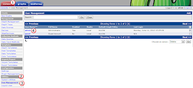
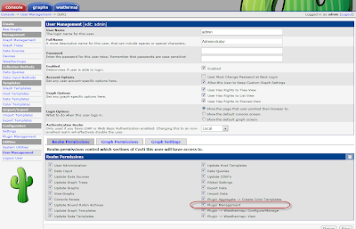
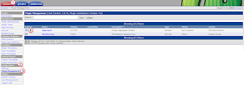
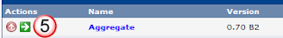
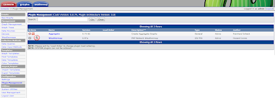
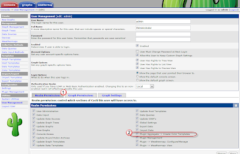

# Adding Plugins

- [Adding Plugins](#adding-plugins)
  - [Install Plugin Architecture :](#install-plugin-architecture-)
  - [Installing Plugins:](#installing-plugins)
    - [Legacy (non-2.x arch)](#legacy-non-2x-arch)
    - [Modern (2.x arch)](#modern-2x-arch)
  - [Reference:](#reference)

## Install Plugin Architecture : 
check the source directory to see what is the latest version of PA: 
http://www.cacti.net/downloads/pia/

Then download it on your cacti server and unpack it: 
```bash
cd /tmp
wget http://www.cacti.net/downloads/pia/cacti-plugin-0.8.7h-PA-v3.0.tar.gz
tar -zvxf cacti-plugin-0.8.7h-PA-v3.0.tar.gz
```

copy the contents of the plugin directory into you cacti directory, overwriting the original files.  
```bash
rsync --progress -av cacti-plugin-arch/files/* /usr/share/cacti/.
```

Then make sure that this did not muck up you directories  (other wise the graphs will stop being generated)
```bash
chown -R cacti /usr/share/cacti/rra
chown -R cacti /usr/share/cacti/log
chown -R cacti /var/lib/cacti/rra/
chown -R cacti /var/log/cacti/
```

Update the config file: 
```bash
vim /usr/share/cacti/include/config.php
```

and make sure that it has the following modification: 
```php
/* load up old style plugins here */
$plugins = array();
$plugins[] = 'thold';
```

Also update the DB with the following command: 
```sql
mysql -u root -p cacti < cacti-plugin-arch/pa.sql
```

From within Cacti's web page, under console(1), Utilities(2), User Management(3), select the Admin(4) user. 



Then make sure that under Realm Permissions(1) that Plugin Management(2) is checked off.  



## Installing Plugins: 

### Legacy (non-2.x arch)
Find the plugin you want from the repo: 
- http://docs.cacti.net/plugins

then download it, and install:  
```bash
cd /tmp
wget http://www.network-weathermap.com/files/php-weathermap-0.97a.zip
unzip php-weathermap-0.97a.zip /usr/share/cacti/plugins/.
```

then markup the config file to include the app.
```bash
vim /usr/share/cacti/include/config.php
```

and make the following change in red:  (for each new plugin, just add another "plugin" line)
```php
/* load up old style plugins here */
$plugins = array();
$plugins[] = 'thold';
$plugins[] = 'weathermap';
```

Reference the actual documentation on the plugin for more specific instructions you might need to do. 

### Modern (2.x arch)
Find the plugin you want from the repo: 
- http://docs.cacti.net/plugins

then download it, and install:  
```bash
cd /tmp
wget http://docs.cacti.net/_media/plugin:aggregate-070b2.tgz
gunzip plugin\:aggregate-070b2.tgz
tar -xvf plugin_aggregate-070b2.tar /usr/share/cacti/plugins/.
mv aggregate-070B2/ aggregate/ 
```

From the console(1), Configuration(2), and Plugin Management(3) window,  select the down arrow (4) to install the aggregate app



then select the green right arrow(5) to enable it



You will end up with the red stop button(6) confirming that the app is up and running.  (if you wanted to shut it down, press the stop button(6). 



Confirm that you have rights to the app by going under console(1), Utilities(2), User Management(3), select the Admin(4) user. 


Then make sure that under Realm Permissions(1) that Pluggin Aggregate(2) is checked off.  




## Reference: 
- [Installing the Plugin Architecture (PIA)](http://docs.cacti.net/manual:087:1_installation.9_pia): 
