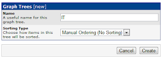

# Create Tree
The first thing you will want to do is create your Tree.  This is the "directory" structure where all your devices will be contained in.  The exactly way you layout your tree is up to you and your environment, but you should take a second to think out your layout because it's a bit of work to change things after everything is built out.   

In this example, we will layout the tree as such: 
```
IT
|
+-country1
|   +-- office1
|   |     +-- L3
|   |     +-- L2
|   |     \-- other
|   \-- office2
|   |     +-- L3
|   |     +-- L2
|   |     \-- other
+-country2
|   \-- office
|   |     +-- L3
|   |     +-- L2
|   |     \-- other
+-country3
    \-- office
          +-- L3
          +-- L2
          \-- other
```

To do this, under Console(1), Management(2), and Graph Trees(3), select the Add(4) button.  


Create the Name of the top level of the tree, and the method for ordering the data in the tree, and select Create.  



To enter in the different Countries, under the Tree Items(1) select Add(2).


Since this is a top level item, make sure the Parent Item is [root], then title and create the object.


Repeat the following two steps until you have created the correct number of top level items:


To place another header (grouping) inside of a parent, after selecting the Add button, under the Parent Item(1), select the parent (country) you want this new item to be inside of.


You can repeat the steps above to create the second and third tier groupings in the list to create the following, and then press Save to continue


