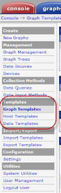
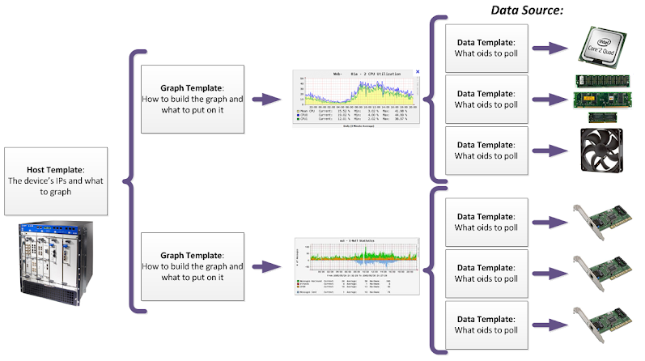
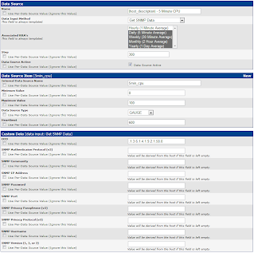
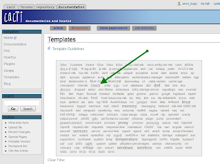
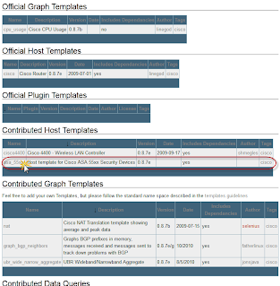
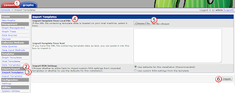
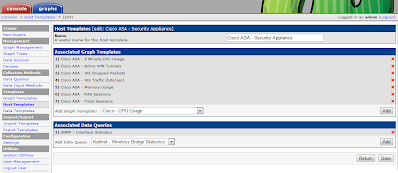

# Download & Install Templates

## Overview: 
Templates are saved ways to do things.  There are three different types of templates for cacti, Host Templates, Graph Templates, and Data Templates.  You can view all the defined templates in the console tab, under the Templates section. 

A general overview of what the templates do, and how they relate to each other can be seen in the following diagram.  

Data Templates define how to gather data for a specific thing.  This could be how to poll everything on a cisco router via snmp, or how to collect just the nic usage on a unix server via a perl script.  The data templates define how often to poll, where to store the data.  An example data template is shown below.

Graph Templates define how to grab data from data sources (data collected from data templates and stored in the rrdb) and how to present them in a graph.  This can include grabbing data collected from multiple data templates, defining the type of graph and setting upper and lower alerts for the data being observed.  An example of a graph template is shown below. 

Host Templates define a type of system (like a model/type of a juniper router) and what data templates should poll it, and what graph templates should describe it.  When you are entering all your equipment into cacti, for each one you simply define what data template to use with it, and all the other stuff is taken care of. An example of a host template is shown below: 

Once you have ensured that you have the right data, graph, and host templates for all your devices, you can then start adding them into cacti

While you can create your own templates, there are already many templates already created by folks that you can simply download and install.  There are a couple of places to find already created templates, the "official" location is http://docs.cacti.net/templates. 

## Downloading / Installing a Host Template
In this example, we will download all the needed templates for a Cisco ASA5500. 

### Get the template:
First we go to the cacti templates repo at http://docs.cacti.net/templates and select the "cisco" link 

Then under Contributed Host Templates, select the asa_55xx Host template for ASA 55xx Security Device.  

 
This will bring up that templates page where you can download the gzip file of the template.  Download the file, and then unzip it locally.

### Install the Template: 
In Cacti, under the console tab(1), Import/Export(2) section, select the Import Template(3) link.  Then under the Import Template from Local File(4) section, select the Choose File(5) button.  

Select the uncompressed template file on your local pc, and then select the Import(6) button.  

Once the template is installed, you will see that it also includes graph templates and data queries (data templates) with it.  

show how to monitor a firewall 

show how we can also download and add xlates to the device
