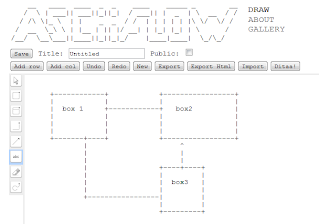
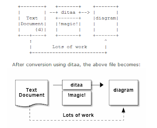
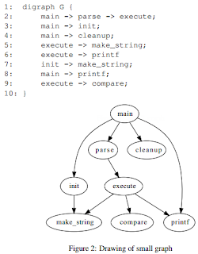

# Diagramming tools
There are other tools out there like visio, OmniGraffle, and even diagrams.net.  But these are open source apps.

## ASCII Flow: 
Both a [hosted](http://www.asciiflow.com/) and [downloadable app](https://github.com/lewish/asciiflow) for drawing quick ascii diagrams

## ditaa: 
Take ASCII art, and make pictures from it.  [Downloadable app](http://ditaa.sourceforge.net/) available. 

## Graphviz: 
Take code, and convert it to diagrams.  [Downloadable app](http://www.graphviz.org/) available.  

