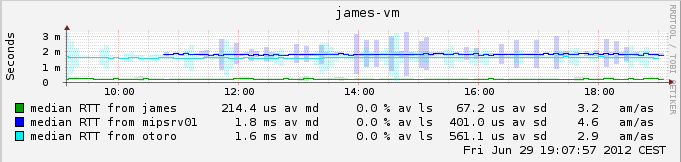

# SmokePing

## Overview:
Smokeping is a monitoring utility made by the same guy who built mrtg and rrd tool.  Generally speaking it will ping out and track response times in nice graphs.  It's special sauce (and where it gets its name from) is how it graphs.  As there is more variation in response times, it creates a "fog" on the chart to show where things are not consistent. 



It's actually a lot cooler then that, because its back-end (the actual pinger) can be fanned out, and you can have multiple pinging servers that all report back to a central collector. 

You can also front end this with cacti, so that all your graphs can be presented in one location.  (but you still need to setup the server and pingers.  Cacti just front-ends the graphs.)

## Install (centos):
Download and open the smokeping tarball:
```
wget http://oss.oetiker.ch/smokeping/pub/smokeping-2.6.8.tar.gz
gunzip smokeping-2.6.8.tar.gz
tar -xvf smokeping-2.6.8.tar
```

Install required dependencies
```
yum install rrdtool-perl.x86_64 fping curl dig mod_fcgid
```

Install perl modules:
```
perl -MCPAN -e shell
  install use CGI::Fast FCGI CGI LWP
  install use Config::Grammar Socket6 Net::Telnet Net::OpenSSH
  install use Net::DNS Net::LDAP IO::Socket::SSL Authen::Radius
  quit
```

Or by entering in the following: 
```
yum install perl perl-Net-Telnet perl-Net-DNS perl-LDAP perl-libwww-perl perl-RadiusPerl perl-IO-Socket-SSL perl-Socket6 perl-CGI-SpeedyCGI
```

Install the app
```
./configure --prefix=/opt/smokeping
/usr/bin/gmake install
```

smokeping then gets deployed into:
```
/opt/smokeping/
```

Copy the contents of smokepings web stuff into your webserver
```
mkdir /var/www/html/smokeping
cp -R /opt/smokeping/htdocs/* /var/www/html/smokeping/.
```

## Configure
make a copy of the config file, and rename it without an extension
```
cp /opt/smokeping/etc/config.dist /opt/smokeping/etc/config
```

then modify it with the following changes:
```
vim /opt/smokeping/etc/config
```

