# Basic Data Visualization

- [Basic Data Visualization](#basic-data-visualization)
  - [Overview:](#overview)
    - [Transforming Command Summary](#transforming-command-summary)
  - [Structuring Data for Visualization](#structuring-data-for-visualization)
    - [chart](#chart)
    - [useother, use null](#useother-use-null)
    - [limit](#limit)
    - [timechart](#timechart)
    - [span](#span)
    - [Multiple data](#multiple-data)
    - [Area with Chart Overlay](#area-with-chart-overlay)
    - [Multi-series Mode](#multi-series-mode)
    - [trendline](#trendline)
    - [iplocation](#iplocation)
    - [geostats](#geostats)
    - [geom](#geom)
    - [addtotals](#addtotals)


## Overview: 
You can't just do any search, and expect it to magically be able to work in a chart.  You need to use transforming functions within your search to manipulate data into tables.  


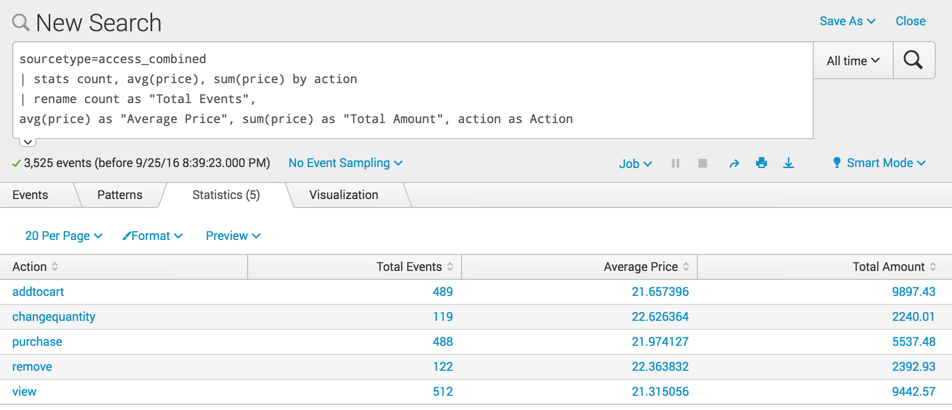 

Once that is completed, you can select the Visualization tab to view the results in some graphical manor.  

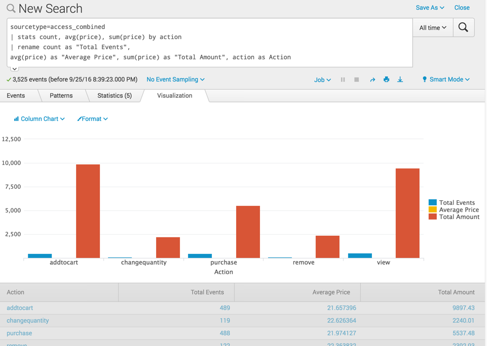 

### Transforming Command Summary

Feature                             | stats  | chart                | timechart
------------------------------------|--------|----------------------|----------
Multi-level breakdown (by clause)   | many	 | 2                    | 1
Limit # series shown	            | n/a	 | limit=n,  default=10 | limit=n,  default=10 
Filter other series                 | n/a	 | useother=0 	        | useother=0
Filter null values                  | n/a	 | usenull=0	        | usenull=0
set time value on x axis            | n/a	 | n/a	                | span


## Structuring Data for Visualization
With the `chart`  and `timeseries` search command, you can produce multi-series tables that can produce the following visualizations
- line
- area
- column
- bar
- bubble
- scatter
- pie

### chart
You can select any series of data to plot, and can select which axis to use.  The function defines the value of the Y-axis, the first field after `over` is the X-axis.  In the following `count` is the Y-axis, and for the X is `vendor_action` and `src_ip`.  

```
sourcetype=linux_secure-30d
(vendor_action=failed OR vendor_action="invalid user")
| chart count over vendor_action by src_ip
```

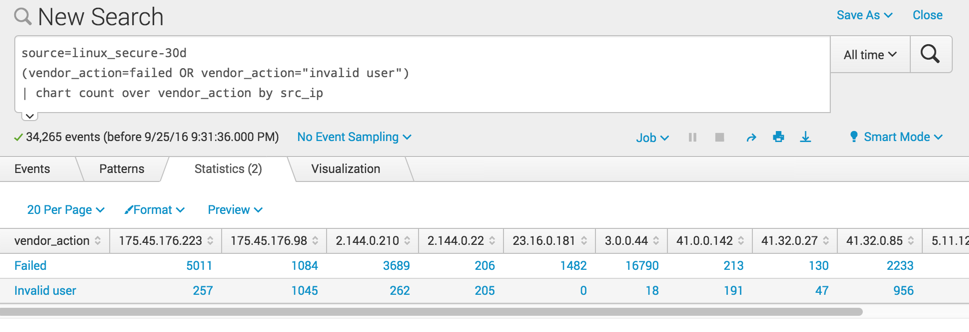 

which creates the following bar table.  

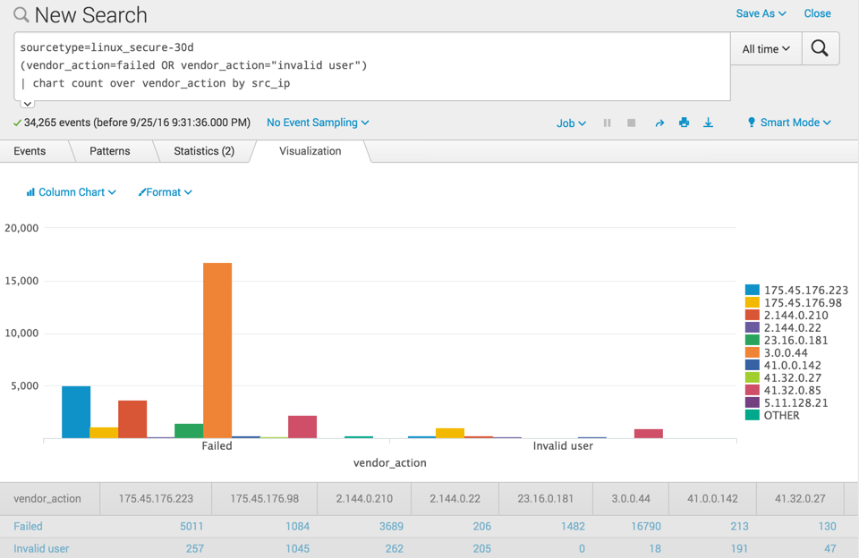 

### useother, use null
In the above example, we have a field labeled "other".  We can remove that value with the following:  
```
sourcetype=linux_secure-30d
(vendor_action=failed OR vendor_action="invalid user")
| chart count over vendor_action by src_ip useother=0
```

If we had null value data, we can also remove that with the `usenull=0` variable. 

### limit
Limit reduces the number of results displayed.  

In this example, we limit our search to only two countries (with the VendorID<4000 search)
```
sourcetype=vendor_sales-30d
VendorID<4000
| chart count over VendorCountry by product_name
```

Which gives us the following, and two many product names.  

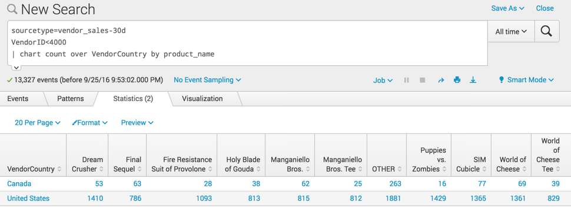 


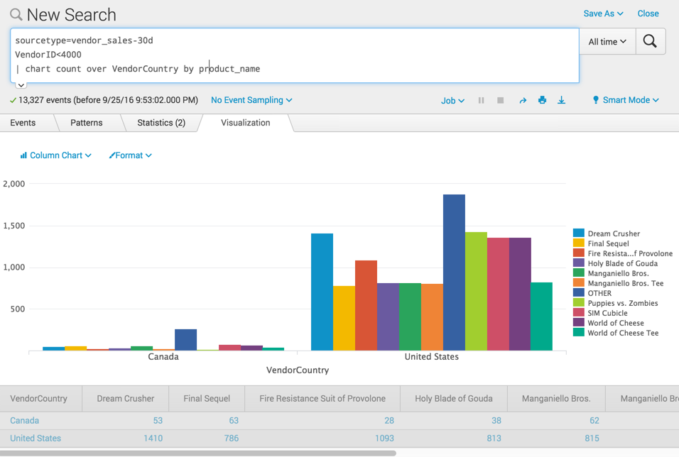 
 

We can reduce the product names with the `limit` command (and the `useother=0`).  this will limit the number of products for each country to 5, and remove the "other" products line that was too much larger then the others.  
```
sourcetype=vendor_sales-30d
VendorID<4000
| chart count over VendorCountry by product_name limit=5 useother=0
```

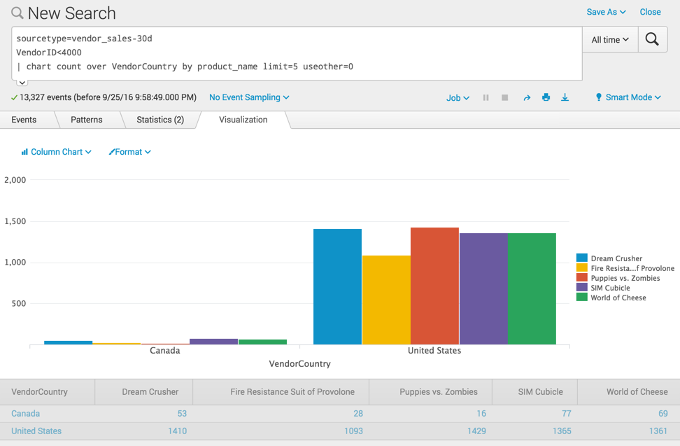 

### timechart
Y-axis is always time with timechart.  You can split data using the by clause for one field.
```
sourcetype=cisco_wsa_squid
| timechart count by usage
```

Timechart counts all the messages it finds, and by sums them into increments. 

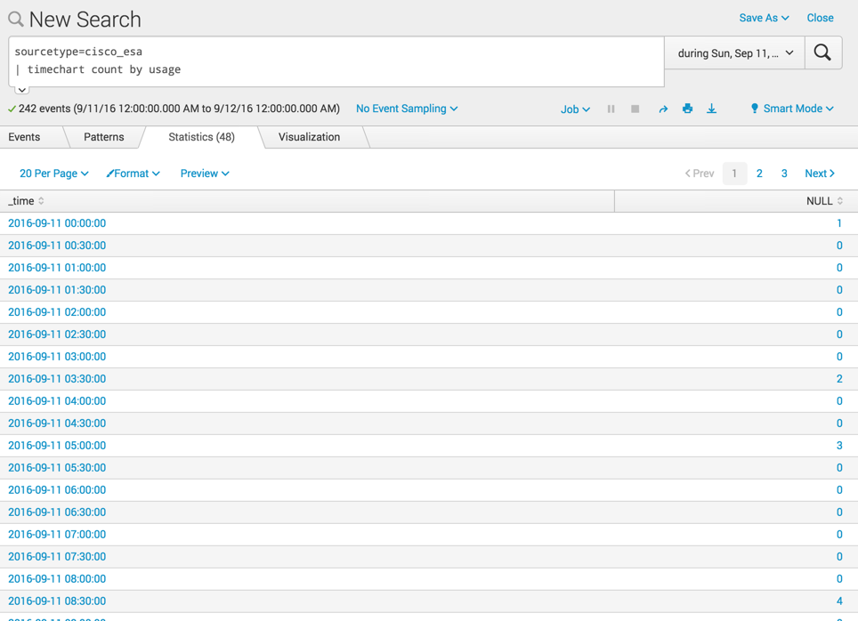 

Again the visualization tab will work because of the structure of the output. 

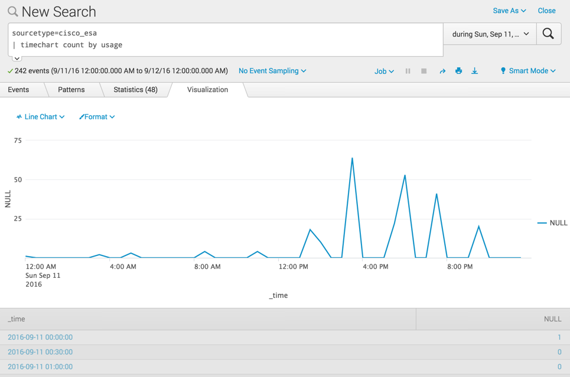 

### span
If you want to change the grouping of the data, you can use the span function.

```
source=cisco_esa
| timechart span=1h count by usage
```

If you look below, the time collections are all within 1 hour increments.  

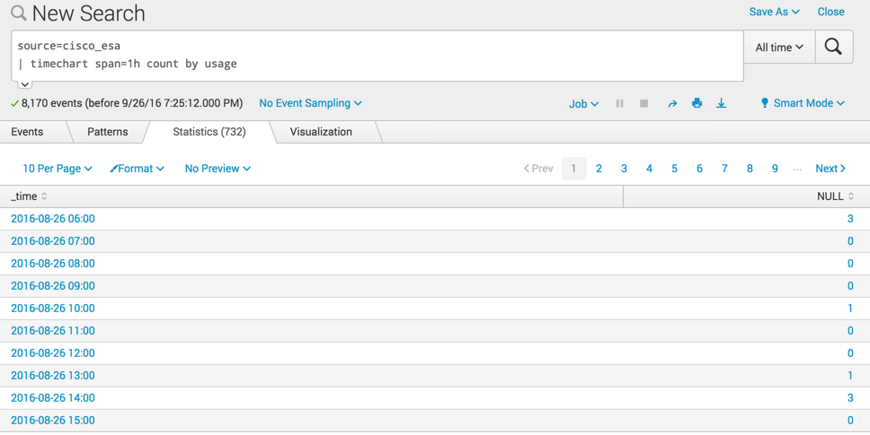 

### Multiple data
You can have multiple data rows in a timespan graph.  
```
sourcetype=linux_secure (invalid OR fail*)
| timechart span=15m count by vendor_action usenull=0
```

The results include three rows: time, "vendor_actions" = failed and invalid.

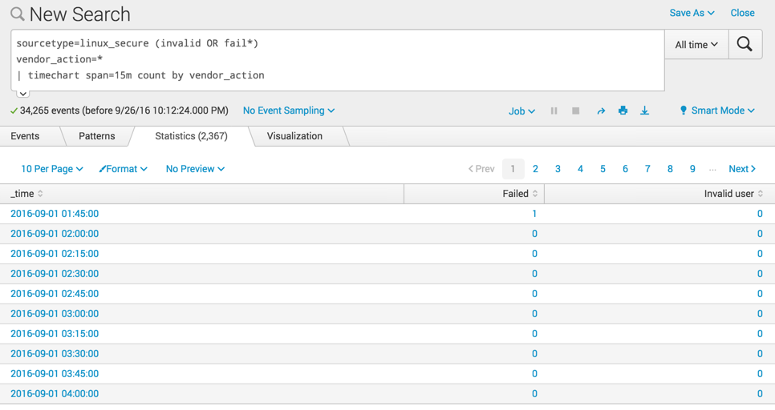 

the graph then is a line graph

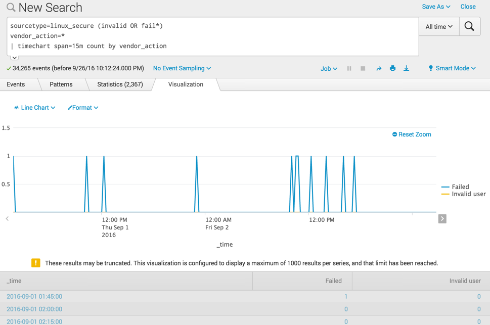 


### Area with Chart Overlay

but we can change it to an area to better see the two variables

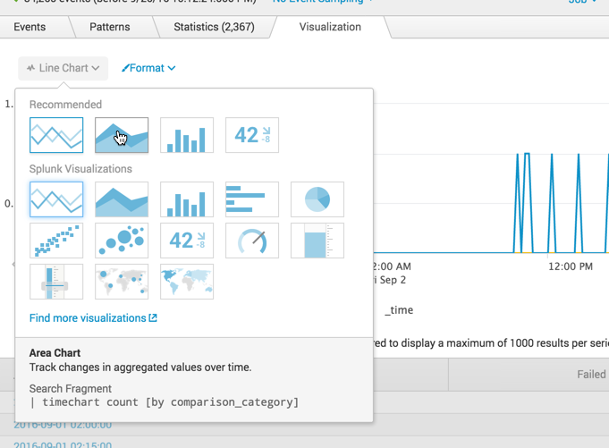 

And you can change the format to include an overlay for "invalid user".  

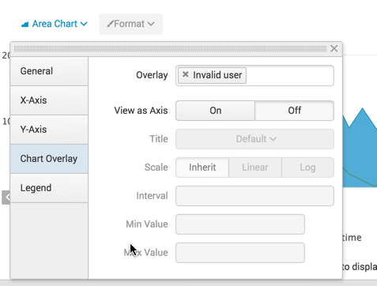 

The result gives you an area graph and a line graph added to it.  

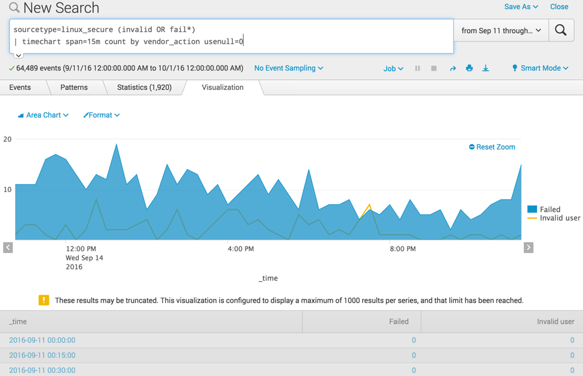 

### Multi-series Mode 

Or you can select Multi-series Mode


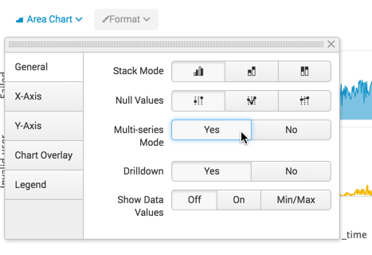 

And get two separate graphs on the same chart.  

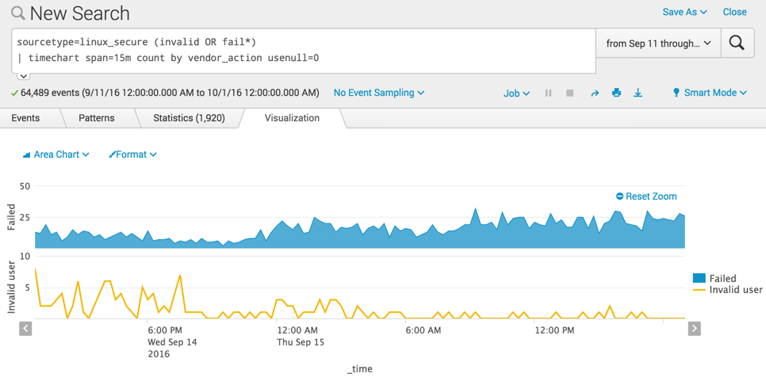 

### trendline
This creates a moving average of a specific field.  Use the overlay graph to add this to a current chart.  
```
sourcetype=access_combined
action=purchase status=200
| timechart span=2h sum(price) as sales
| trendline sma2(sales) as trend
```

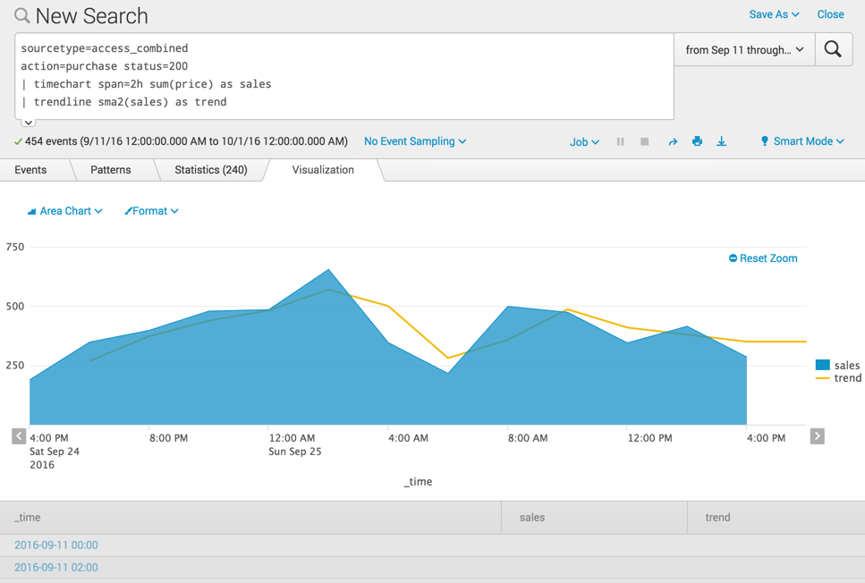 

### iplocation
Grabs latitude and longitude data from best guess data from IP addresses.  

### geostats
Put pie charts all over a map
```
sourcetype="linux_secure" src_ip!=10*
| iplocation src_ip
| geostats globallimit=12 count by user
```

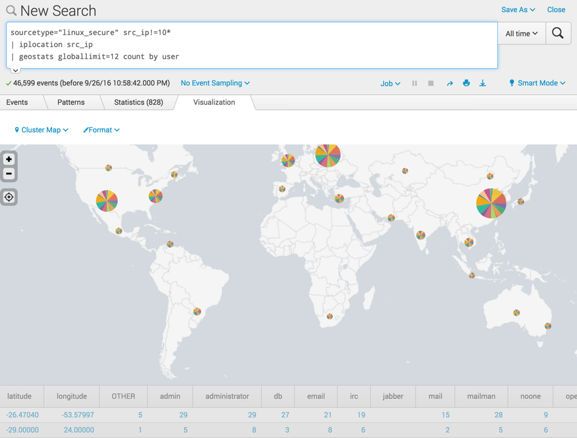 

### geom
Color in map regons based on value for that area (city/country)
```
sourcetype="vendor_sales"
VendorID > 4999 AND VendorID < 6000
| stats count as Sales by VendorCountry
| geom geo_countries featureIdField=VendorCountry
```

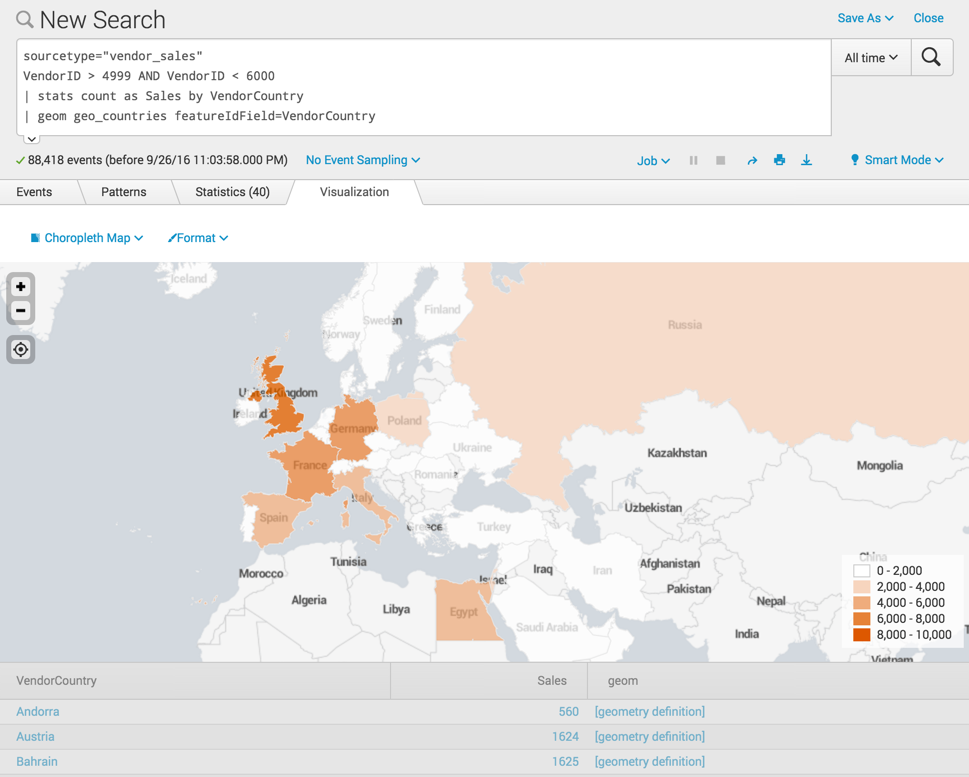 


### addtotals
compute the sum of all (or selected) fields for a row and place them at the bottom in a totals row, or to the side in a column.

`row=TRUE` puts the total in the right, `col=TRUE` puts the total row on the bottom.  

```
sourcetype="vendor_sales"
| chart count over product_name by VendorCountry 
| addtotals 
  fieldname="Total Per Prod"
  col=1 
  label="Total Per Country" 
  labelfield=product_name
```

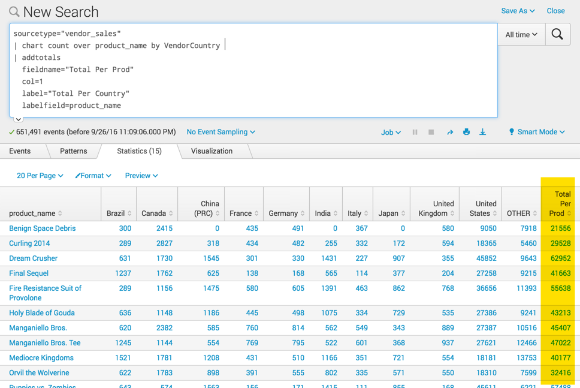 

