# Structuring Data

- [Structuring Data](#structuring-data)
  - [Finding Data:](#finding-data)
    - [Searching Specific Indexed Data:](#searching-specific-indexed-data)
      - [Specific Index](#specific-index)
      - [Index + field](#index--field)
      - [Index + field with specific data](#index--field-with-specific-data)
  - [Structuring Data:](#structuring-data-1)
    - [fields](#fields)
    - [table](#table)
    - [sort](#sort)
    - [de-duplicate](#de-duplicate)
    - [Rename Fields](#rename-fields)
    - [top](#top)
    - [rare](#rare)
    - [stats](#stats)
    - [as](#as)
    - [Multiple Variables:](#multiple-variables)


## Finding Data:

### Searching Specific Indexed Data: 
First we look at how to find specific within splunk. The following are search examples: 


#### Specific Index
Look through data that has been found and indexed as coming from a cisco firewall
```
sourcetype=cisco_firewall
```

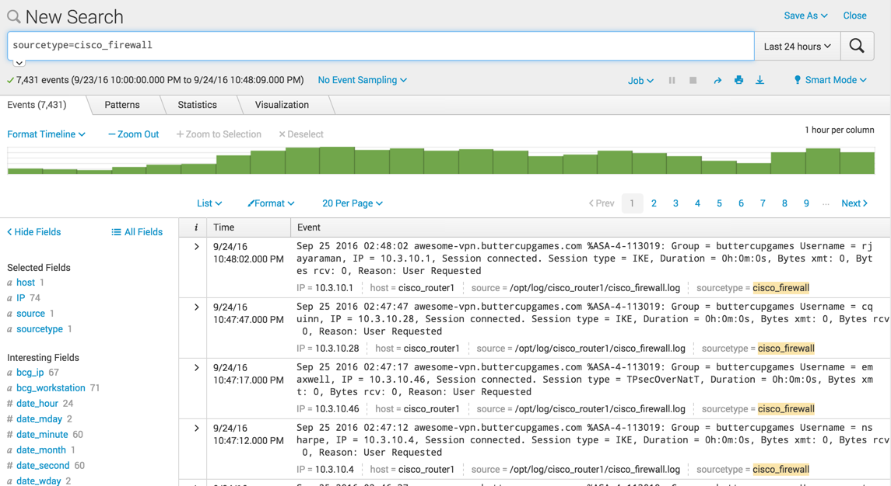 


#### Index + field
Only show data from `sourcetype=cisco_firewall`, that has the field IP in the message
```
sourcetype=cisco_firewall IP=*
```

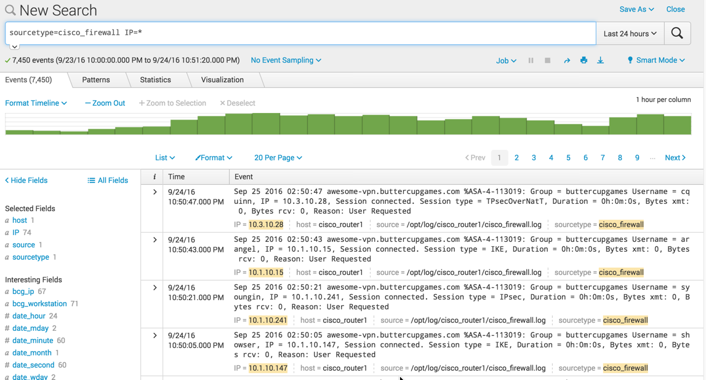 


#### Index + field with specific data
Only show data from `sourcetype=vendor_sales`, that has index `VendorCountry=Canada` in the messages.  
```
sourcetype=vendor_sales VendorCountry=Canada
```

 


## Structuring Data: 
Now we look at how to take data and manipulate and structure it by looking at a few commands.  

### fields
Fields let you extract specific data that can then be ma manipulated later faster.
```
sourcetype=linux_secure fail* invalid
| fields user, src_ip, app
```

Note: you can put multiple lines in the splunk search bar for readability with the shift+return combo.  

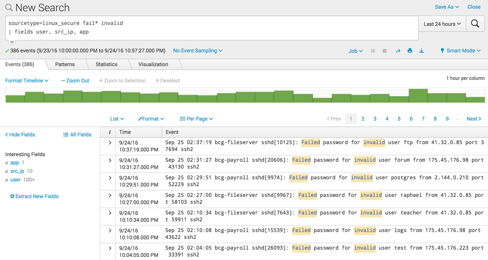 

### table
Display the results of a search in a simple table
```
sourcetype=linux_secure fail* invalid 
| table user, src_ip, app
```

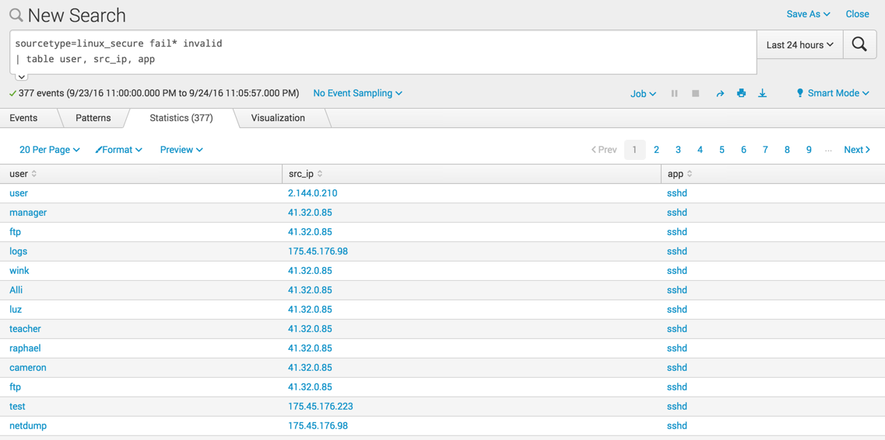 

### sort
You can sort the output of the table. 

In this example, with src_ip down and user up.  (default + = down, - = up)
```
sourcetype=linux_secure fail* invalid
| table user, src_ip, app
| sort src_ip, -user
```

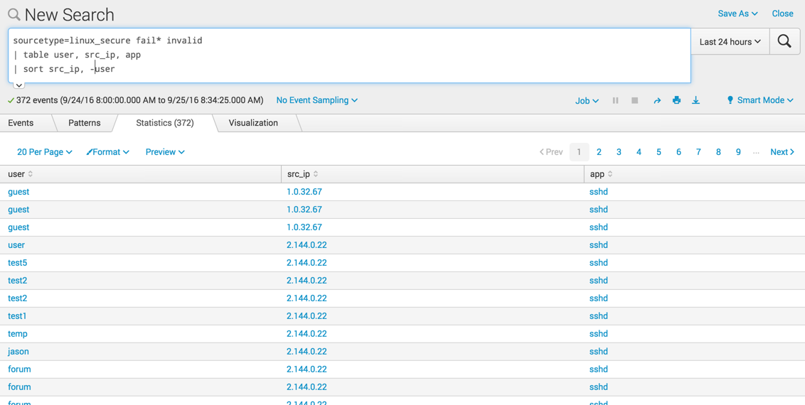 

### de-duplicate
remove any duplicates in any specific column
```
sourcetype=linux_secure fail* invalid
| dedup user, src_ip
| table src_ip, user, app 
| sort src_ip, user
```

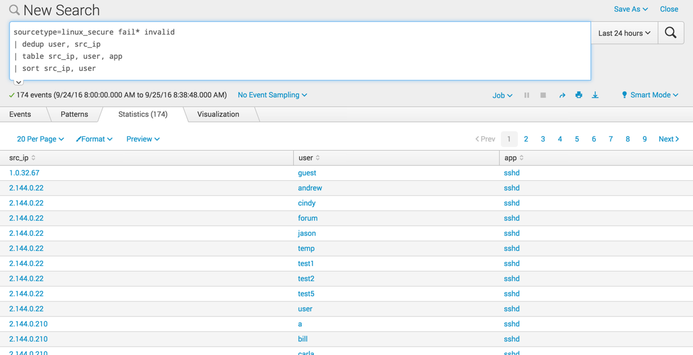 

### Rename Fields
For readability, you can rename any of the fields

```
sourcetype=linux_secure fail* invalid
| dedup user, src_ip
| table src_ip, user, app
| sort scr_ip, user
| rename app as "Application Used", user as "Name Used", src_ip as "Potential Attacker"
```

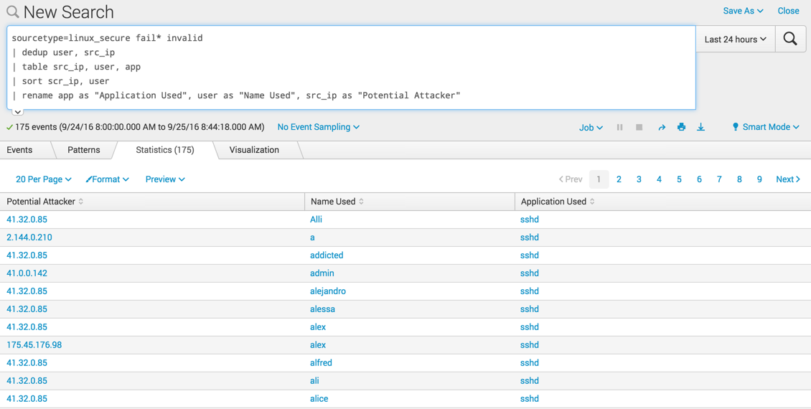 

### top
List the unique values and provide a list of the objects with the highest common value and a % of how often it's seen
```
sourcetype=access_combined referer_domain!="http://www.buttercupgames.com" 
| top referer_domain 
```

In this example, ignore any values with "`http://www.buttercupgames.com`"

if you want to remove either the count of percent, use the `showperc=0` or `showcount=0`.  

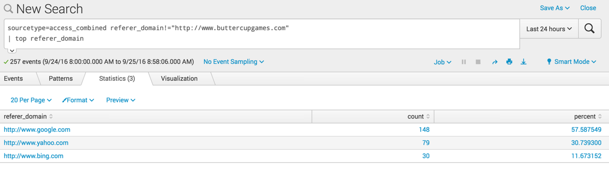 

### rare
The opposite of top is rare.  It shows the lowest common values.  Here we filter on only the lowest 3 
```
sourcetype=cisco_wsa_squid-30d.csv
| rare limit=3 cs_mime_type
```

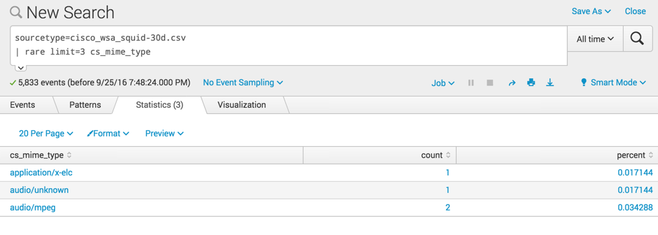 


### stats
If you need to calculate a statistics on data

functions include (but there are many more)
- count: count the number of matches
- distinct_count or dc: show count unique values (don't count all the dupes, just the first that matches)
- `sum`: sum up the values
- `ave`: average of the values
- `list`: show all values of a field
- `values`: show only unique values (don't show all, just the first that matches)

The following shows the count of events with values for the Username field, and groups them by Address_Description, or where they the users are located.  
```
sourcetype=history_access
| stats dc(Username) by Address_Description
```

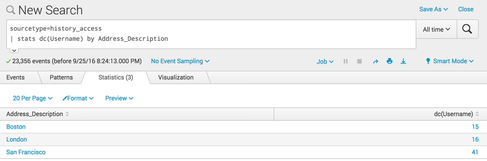 

### as
The fields are not always as clear as you would like for a table or chart and you can rename them within a module, rather then needing to use the rename command separately.  
```
sourcetype=history_access
| stats dc(Username) as "Badged in Users" by Address_Description
```

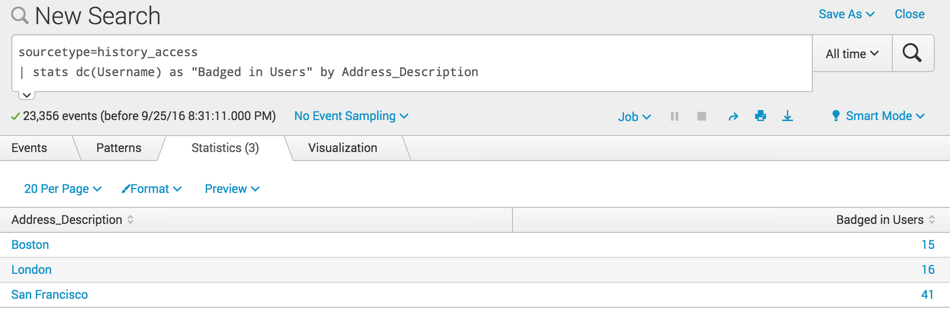 

### Multiple Variables:
You can include multiple variables within the stats command.  Here we list count, price (both averaged and summed) and action, and then we rename the variables for readablilty
```
sourcetype=access_combined
| stats count, avg(price), sum(price) by action
| rename count as "Total Events",
    avg(price) as "Average Price", 
    sum(price) as "Total Amount", 
    action as Action
```

 

