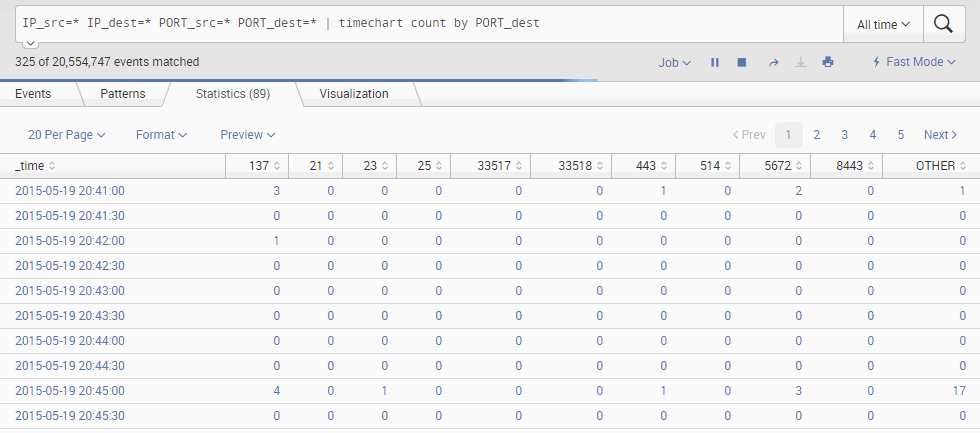
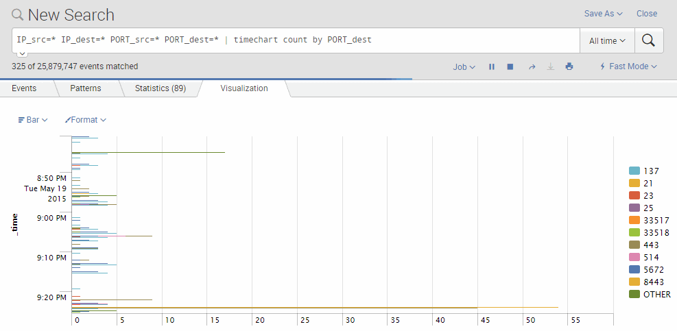

# Take indexed data and graph it

There are a bunch of different tools you can use to create different kinds of graphs and charts.  In this example, I'll use the most basic one called. timechart.  

In this example, I want to see all the different destination ports being blocked by my firewall, and I want to see how many times each of those ports have been blocked.  To do this, I use the `timechart count by PORT_dest` statement, but  i pipe the search data to it by searching for the following.  

```
IP_src=* IP_dest=* PORT_src=* PORT_dest=* | timechart count by PORT_dest
```
Under the **Statistics tab**, we get a list of all the ports being blocked and the time it happens.  

 

And under the **Visualization tab**, we see the chart that graphs this data.  

 

Note that there are many other types of graphing engines rather then just "timechart".  See "about transforming commands and searches" link below for other options.   

## References: 
- [About transforming commands and searches](http://docs.splunk.com/Documentation/Splunk/6.2.0/Search/Aboutreportingcommands) (v6.2.0)
- [Build a chart of multiple data series](http://docs.splunk.com/Documentation/Splunk/6.2.0/Search/Chartmultipledataseries) (v6.2.0)