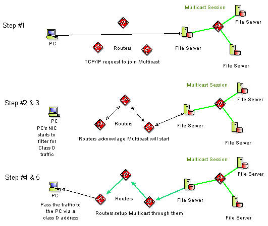

# Multicast Basics

## Bandwidth Advantages
Only one copy of a multicast message will pass over any link in the network, and copies of the message will be made only where paths diverge at a router

### Communication types
To really understand the advantages to multicasting, lets look at the different ways to transmit data over the network. Lets say we have a group of people that we want to send data to, and we call this group a "multicast group" then the three ways that we can transmit data to them is as follows:

Unicast: send one copy of each packet to each member of the multicast group. it requires extra bandwidth, because the same information has to be carried multiple times -- even on shared links.

Broadcast: Send one copy of each packet and address it to a broadcast address. the network must either stop broadcasts at the LAN boundary, or send the broadcast everywhere. Sending the broadcast everywhere is a significant usage of network resources if only a small group actually needed to see the packets.

Multicast: one copy of each packet and address it to the group of computers that want to receive it. Multicast can be implemented at both the data-link layer and the network layer.

## Joining a IP Multicast:
- The membership of a host group is dynamic; that is, hosts may join and leave groups at any time.
- There is no restriction on the location or number of members in a host group
- A host may be a member of more than one group at a time
- a single group address may have multiple data streams on different port numbers, on different sockets, in one or more applications

## What's needed to physically join a network:
1. Support for IP Multicast in the TCP/IP protocol stack.
2. Software supporting IGMP; to join a multicast group(s) and receive multicast traffic
3. NIC's which filter for LAN DLL addresses mapped from IP Multicast addresses
4. Application software

All intermediate routers between the sender(s) and receiver(s) must be Multicast-capable

If all the routers are not multicast compatible, then they have to do tunneling through them. With this approach, multicast datagrams are encapsulated in a standard point-to-point unicast datagram (which is used extensively in the MBONE).

parameters that the network layer must define in order to support multicast communications:

- Addressing: The system must have a network-layer address that can be used to communicate with a group of receivers rather than a single receiver. It also needs a system for mapping this address onto data-link layer multicast address.
- Dynamic registration: Needs to have a way for the computer tell the network that it is a member of a particular multicast group. Otherwise, the network cannot know which networks should receive traffic for a specific group
- Multicast routing: The network(routers etc.) needs to build packet distribution trees that allow sources to send packets to all receivers in a "stream" way. The goal being that each packet exists only one time on any given network.

## Different Multicast Filtering Networks

### Switches
- newer versions of LAN switching equipment monitor IGMP packets and direct IP Multicast packets only to group members
- Layer 3 switching, which means the switching is performed at the IP layer rather than the link layer. This equipment inherently supports IP Multicast.

### Satellite
- video-conferencing applications involving large volumes of data originating at multiple sources are not well suited
- one-to-many multicast is easily accomplished
- many-to-many multicast applications such as conferencing are not as easily accommodated
- when transmitting TCP/IP protocols, a back channel is needed, normally setup as a uni-directional satellite with a terrestrial back channel

### Frame Relay
- frame relay network is connection oriented
- has logical frame relay channels (permanent virtual circuits, PVCs)
- "Committed Information Rate" (CIR), which is the data rate for which bandwidth is reserved
- customer can lease a PVC between two points or can lease multiple PVCs between a sender and multiple receiving sites, thus enabling multicast.
- network topology for a frame relay PVCs should be "hub and spoke" with a router overlay. This makes more hops to get to a particular location, but it distributes the replication in the network to the multiple hubs rather than all at the central site.
- There is "multicast frame relay," but most frame relay service providers do not offer multicast as a solution in their frame relay offerings.

### SMDS
- SMDS is a public data-link service that is provided by regional and long-distance carriers. It's a connectionless high-speed terrestrial service.
- Transfer data at rates of between 1.544 Mbps and 44.736 Mbps over T1 and T3 circuits.
- SMDS supports multicast natively, and IP Multicast as an overlay is easily accomplished. But since SMDS carriers typically tariff the service based on SMDS traffic as measured by a switch inside the network, then if you receive a multicast, you might be charged for traffic inside the SMDS network cloud you do not receive.

### ATM
- Connections are set up using either permanent virtual circuits (PVCs) or switched virtual circuits (SVCs).
- PVCs are intended to be relatively permanent (i.e., remaining for months or years), while SVCs are set up dynamically as needed and are likely to be disabled immediately afterward.
- ATM supports multicast at the link layer.
- point-to-multipoint switched virtual circuit (SVC) between itself and a set of known receivers, via UNI 3.0/3.1
- sender has complete control over the multicast VC. It would be somewhat cumbersome for a receiver to initiate joining the group
- works naturally for one-to-many multicast, but not for many-to-many multicast wherein a group may have multiple senders.
- ATM multicast is sender initiated, since the sender must set up the point-to-multipoint PVC. On the other hand, IP Multicast is receiver oriented; a receiver can join a multicast group without the sender even being aware of its existence
- (MPOA) working group is addressing this issue;
- IP Multicast over ATM multicast now, even before the standards are completed, by using point-to-multipoint virtual circuits for one-to-many multicast and by overlaying multiple point-to-multipoint virtual circuits to enable many-to-many multicast.

## IP Multicast Addressing
- IP Multicast uses Class D Internet Protocol addresses, those with 1110 as their high-order four bits, to specify multicast host groups (group addresses range from 224.0.0.0 to 239.255.255.255)
- Two types of group addresses are supported: permanent and temporary (as assigned by the Internet Assigned Numbers Authority -IANA)

### Examples of permanent addresses

224.0.0.1 the "all-hosts group" used to address all IP Multicast hosts on the directly connected network,

224.0.0.2, which addresses all routers on a LAN.

The range of addresses between 224.0.0.0 and 224.0.0.255 is reserved for routing protocols and other low-level topology discovery or maintenance protocols. Other addresses and ranges have been reserved for applications, such as 224.0.13.0 to 224.0.13.255 for Net News. See: RFC 1700, "Assigned Numbers". To create and detect MBONE session address/port assignments, see: " The Session Announcement Protocol and Session Description Protocol Internet drafts ".

- Multicast datagrams are sent using the same "Send IP" operation used for unicast datagrams.
- reception of IP Multicast datagrams is much more complex

### Steps to take to connect to a multicast
1. user’s host application requests membership in the multicast host group associated with a particular multicast (e.g. "I want to view today’s live press conference with the President")
2. This membership request is communicated to the LAN router and, if necessary, on to intermediate routers between the sender and the receiver.
3. As another consequence of its group membership request, the receiving host’s network interface card starts filtering for the LAN-specific hardware (data-link layer) address associated with the new multicast group address
4. WAN routers deliver the requested incoming multicast datagrams to the LAN router, which maps the host group address to its associated hardware address and builds the message (for example, an Ethernet frame) using this address
5. The receiving host’s network interface card and network driver, listening for these addresses, pass the multicast messages to the TCP/IP protocol stack, which makes them available as input to the user’s application

Whereas an IP unicast address is statically bound to a single local network interface on a single IP network, an IP host group address is dynamically bound to a set of local network interfaces on a set of IP networks

An IP host group address is not bound to a set of IP unicast addresses. Multicast routers don’t need to know the list of member hosts for each group - only the groups for which there is one member on the subnetwork

## Time To Live (TTL):
Each IP Multicast packet uses the time-to-live (TTL) field of the IP header as a scope-limiting parameter.
The TTL field controls the number of hops that a IP Multicast packet is allowed to propagate

This can provide a convenient mechanism for confining multicast traffic to within campus or enterprise networks.

Several standard settings for TTL are specified for the MBONE: 1 for local net, 15 for site, 63 for region and 127 for world

## Internet Group Management Protocol (IGMP)
It is used by multicast routers to learn the existence of host group members on their directly attached subnets. It does so by sending IGMP queries and having IP hosts report their host group memberships
Messages are encapsulated in IP datagrams with two packet types: Host Membership Query and Host Membership Report

It has the same simple fixed format, containing some control information in the first word of the payload field (version and type), and a class D address in the second word (code).

Version | Type | Code | Checksum
--|--|--|--
(bits 0-3) | (bits 4-7) | (bits 8-15) | (bits 16-31)

Multicast Group Address (Class D)

Multicast Routers periodically send out a "multicast IGMP HMP - Host Membership Query" to all IP end nodes on its LAN. This asks the clients to report back all the multicast groups they are using.

There are two steps that prevent all the multicast clients (or hosts) from all sending back their used groups all at once, and then clogging the bandwidth.

1. Only one host, per subnet, needs to respond to the HMP (the response being called a HMP - Host Membership Report), for each group. Ie: if there are only 3 groups, and I am part of group 1 and 3, then the only response needed after mine, would be one other host that was part of group 2 (If they were part of all the groups, they still would only report on group 2.)
2. To prevent everyone from responding at once, the response is delayed by some random time.

Each host keeps track of its host group memberships, and when the last process on a host leaves a group, that group is no longer reported by the host.

IGMP updates are used by multicast routing protocols to communicate host group memberships to neighboring routers, propagating group information through the internetwork

## Multicast Routing Concepts
- To avoid duplication of effort, a single router is selected (via IGMP) as the Designated Router for each physical network.
- For efficient transmission, Designated Routers construct a spanning tree that connects all members of an IP Multicast group.
- A spanning tree has just enough connectivity so that there is only one path between every pair of routers, and it is loop-free
- Since multicast groups are dynamic, with members joining or leaving a group at any time, the spanning tree must be dynamically updated. Branches in which no listeners exist must be discarded (pruned).

## Two Basic Approaches to IP Multicast Routing: Dense & Sparse
The first approach is based on the assumption that the multicast group members are densely distributed throughout the network and bandwidth is plentiful
- ``dense-mode'' multicast routing protocols rely on periodic flooding of the network with multicast traffic to set up and maintain the spanning tree
- Dense-mode routing protocols include Distance Vector Multicast Routing Protocol (DVMRP), Multicast Open Shortest Path First (MOSPF), and Protocol-Independent Multicast - Dense Mode (PIM-DM).

The second approach to multicast routing is based on the assumption that the multicast group members are sparsely distributed throughout the network and bandwidth is not necessarily widely available

- ``sparse-mode'' multicast routing protocols must rely on more selective techniques to set up and maintain multicast trees.
- Sparse-mode routing protocols include Core Based Trees (CBT) and Protocol-Independent Multicast - Sparse Mode (PIM-SM).

There are a number of exciting protocols presently being developed by the Internet community, IETF working groups and industry vendors to support new applications of IP Multicast.

- RTP, the Real-Time Transport Protocol, provides end-to-end network transport functions suitable for applications transmitting real-time data, such as audio, video or simulation data, over multicast or unicast network services
- RSVP, the ReSerVation Protocol, enhances the current Internet architecture with support requests for a specific quality of service (QoS) from the network for particular data streams or flows.
- RTSP, the Real-Time Streaming Protocol is an application-level protocol for control over the delivery of data with real-time properties to enable controlled, on-demand delivery of real-time data, such as audio and video.

## Other Routing protocols

### DVMRP (RFC 1075)
- uses a technique known as Reverse Path Forwarding
- router receives a packet, it floods the packet out of all paths except the one that leads back to the packet's source
- If a router is attached to a set of LANs that do not want to receive a particular multicast group, the router can send a "prune" message
- DVMRP will periodically reflood in order to reach any new hosts that want to receive a particular group.
- DVMRP implements its own unicast routing protocol in order to determine which interface leads back to the source of the data stream. This unicast routing protocol is very like RIP and is based purely on hop counts
- DVMRP has significant scaling problems because of the necessity to flood frequently.
- DVMRP has been used to build the MBONE

### Multicast Extensions to OSPF (RFC 1584)
- Multicast OSPF (MOSPF) was defined as an extension to the OSPF unicast routing protocol. OSPF works by having each router in a network understand all of the available links in the network. Each OSPF router calculates routes from itself to all possible destinations.
- MOSPF works by including multicast information in OSPF link state advertisements
- MOSPF builds a distribution tree for each source/group pair and computes a tree for active sources sending to the group
- MOSPF works only in internetworks that are using OSPF
- MOSPF is best suited for environments that have relatively few source/group pairs active at any given time. It will work less well in environments that have many active sources or environments that have unstable links.

### PIM (Internet Draft "Protocol-Independent Multicast [PIM]: Protocol Specification")
- Protocol-Independent Multicast (PIM) works with all existing unicast routing protocols. PIM can be integrated into existing networks that are running the Interior Gateway Routing Protocol (IGRP), Enhanced IGRP, Integrated Intermediate System-to-Intermediate System (IS-IS), Open Shortest Path First (OSPF), or the Routing Information Protocol (RIP).
- two different types of multipoint traffic distribution patterns: dense and sparse
- PIM works with whatever unicast protocol is being used; PIM does not require any particular unicast protocol

#### Dense mode
- Dense-mode PIM was designed for applications that send traffic to high concentrations of LANs
- dense-mode PIM works by flooding incoming multicast traffic out of every interface except the one through which the source can be reached.
- Routers that have no need for a specific data stream will reply with a "prune" message, which causes the router that performed the flooding to "prune" the relevant interface of the replying router from its flood list.
- Dense-mode PIM is best suited for broadcast applications such as LAN TV, corporate broadcasts, and resource location.
- Senders and receivers are in close proximity to one another
- Few senders and many receivers
- volume of multicast traffic is high
- stream of multicast traffic is constant
- Dense-mode PIM uses Reverse Path Forwarding and looks a lot like DVMRP

Designed for use with many receiving LANs, dense-mode PIM determines routes for multicast traffic using a two-step process. First, it floods traffic out all interfaces except for the packet's point of arrival. Second, the receiving routers respond with prune messages if they have no need for the data stream. (c) Cisco

#### Sparse multicast

- Sparse-mode PIM addresses the needs of environments where there might be many data streams at a given moment, but each stream goes to a relatively small number of the LANs in the internetwork.
- Sparse-mode PIM is best suited for desktop conferencing and collaborative computing applications.
- few receivers in a group
- Senders and receivers are separated by WAN
- traffic is intermittent
- Sparse-mode PIM works by defining a Rendezvous Point. When a sender wants to send data, it first sends to the Rendezvous Point. When a receiver wants to receive data, it registers with the Rendezvous Point. Once the data stream begins to flow from sender to Rendezvous Point to receiver, the routers in the path will optimize the path automatically to remove any unnecessary hops.
- PIM is able to simultaneously support dense mode for some multipoint groups and sparse mode for others
- Sparse-mode PIM assumes that no hosts want the multicast traffic unless they specifically ask for it.

With sparse-mode PIM, routers can locate optimal paths for small, dispersed groups of receivers by naming a rendezvous point. Both sending and receiving routers register with the rendezvous point, allowing the sender to find each receiver. As traffic begins to flow between them, routers along the way dynamically optimize the path. (c) Cisco

## ATM Issues
- Multicasting is the process whereby a source host or protocol entity sends a packet to multiple destinations simultaneously using a single, local 'transmit' operation
- the ATM Forum's currently published signalling specifications (UNI 3.0 [8] and UNI 3.1 [4]) does not provide the multicast address abstraction
- The key limitation is that the sender must have prior knowledge of each intended recipient, and explicitly establish a VC with itself as the root node and the recipients as the leaf nodes
- The default at this time is that VCs are established with a request for Unspecified Bit Rate (UBR) service, as typified by the IETF's use of VCs for unicast IP, described in RFC 1755
- Multicast Address Resolution Server (MARS) is an extended analog of the ATM ARP Server

- It acts as a registry, associating layer 3 multicast group identifiers with the ATM interfaces representing the group's members
- To provide for asynchronous notification of group membership changes, the MARS manages a point to multipoint VC out to all endpoints desiring multicast support
- two different approaches to ATM level multicasting of layer 3 packets - through meshes of point to multipoint VCs, or ATM level multicast servers (MCS). The MARS architecture allows either
- Each MARS manages a 'cluster' of ATM-attached endpoints
- Cluster is the set of endpoints that choose to use the same MARS to register their memberships and receive their updates
- network administrators MUST ensure that each Logical IP Subnet (LIS) is served by a separate MARS, creating a one-to-one mapping between cluster and unicast LIS
- 'Cluster Member' will be used in this document to refer to an end point that is currently using a MARS for multicast support. Thus potential scope of a cluster may be the entire membership of a LIS

### VC Meshes and Multicast Servers
See RFC2022 Section 3.4 for generic signalling functions, for connecting with VC's and MARS's.

- for a multicast VC mesh, each source establishes its own independent point to multipoint VC (a single multicast tree) to the set of leaf nodes (destinations)
- Interfaces that are both senders and group members (leaf nodes) to a given group will originate one point to multipoint VC, and terminate one VC for every other active sender to the group. This criss-crossing of VCs across the ATM network gives rise to the name 'VCmesh'.
- The leaf nodes of the multicast server's point to multipoint VC must be established prior to packet transmission, and the multicast server requires an external mechanism to identify them. A side-effect of this method is that ATM interfaces that are both sources and group members will receive copies of their own packets back from the MCS
- The simplest MCS pays no attention to the contents of each AAL_SDU. It is purely an AAL/ATM level device. More complex MCS architecture (where a single end point serves multiple layer 3 groups) are possible

#### Tradeoffs:
VC Mesh Advantages/Disadvantages
- If we focussed on the data path we might prefer the VC mesh because it lacks the obvious single congestion point of an MCS.
- mesh lacks the intermediate AAL_SDU reassembly that must occur in MCSs
- The underlying ATM signalling system also has greater opportunity to ensure optimal branching points at ATM switches along the multicast trees originating on each source.
- resource consumption will be higher
- when membership change occurs in a VC mesh, signalling events occur at the UNIs of every traffic source - the transient signalling load scales with the number of sources.
- Every group member's ATM interface must terminate a VC per sender (consuming on-board memory for state information, instance of an AAL service, and buffering in accordance with the vendors particular architecture).

Multicast Servers Advantages/Disadvantages
- multicast server only 2 VCs (one out, one in) are required, independent of the number of senders
- allocation of VC related resources is also lower within the ATM cloud when using a multicast server
- If we focus on the signalling load then MCSs have the advantage when faced with dynamic sets of receivers.
- Every time the membership of a multicast group changes (a leaf node needs to be added or dropped), only a single point to multipoint VC needs to be modified when using an MCS.
- enerates a single signalling event across the MCS's UNI.
- MCSs introduce a 'reflected packet' problem, which requires additional per-AAL_SDU information to be carried in order for layer 3 sources to detect their own AAL_SDUs coming back.
- MARS architecture allows system administrators to utilize either approach on a group by group basis.

