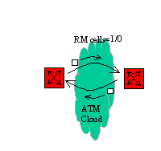

# A Guide to ATM
A Basic Primer

Written By Charlie Mercier
Graphics and HTML by Joshua McCloy

    
<b>Table of Contents</b>

- [A Guide to ATM](#a-guide-to-atm)
  - [1. ATM Layers](#1-atm-layers)
    - [1.a. ATM Adaption Layer](#1a-atm-adaption-layer)
    - [1.b. ATM Layer](#1b-atm-layer)
    - [1.c Physical Layer](#1c-physical-layer)
    - [1.d SONET and ATM](#1d-sonet-and-atm)
    - [1.e NON-SONET](#1e-non-sonet)
  - [2. Virtual Connections](#2-virtual-connections)
    - [2.a Permanent Virtual Connections (PVC)](#2a-permanent-virtual-connections-pvc)
    - [2.b Switched Virtual Connections (SVC)](#2b-switched-virtual-connections-svc)
    - [2.c Virtual Paths \& Virtual Channels](#2c-virtual-paths--virtual-channels)
    - [2.d Multipoint Connections](#2d-multipoint-connections)
    - [2.e Service Parameters (QoS)](#2e-service-parameters-qos)
      - [PCR](#pcr)
      - [SCR](#scr)
      - [MBS](#mbs)
      - [MCR](#mcr)
      - [CTD](#ctd)
      - [CLR](#clr)
    - [2.f Service Categories](#2f-service-categories)
      - [CBR - Constant Bit Rate](#cbr---constant-bit-rate)
      - [VBR-RT - Variable Bit Rate/Real-time](#vbr-rt---variable-bit-ratereal-time)
      - [VBR-NRT - Variable Bit Rate/Not Real-time](#vbr-nrt---variable-bit-ratenot-real-time)
      - [UBR - Unspecified Bit Rate](#ubr---unspecified-bit-rate)
      - [ABR - Available Bit Rate](#abr---available-bit-rate)
    - [2.g Details on ABR](#2g-details-on-abr)
  - [3. ATM Support Functions:](#3-atm-support-functions)
    - [3.a Benefits of SVC's](#3a-benefits-of-svcs)
      - [Eases Network Management](#eases-network-management)
      - [Future Securities](#future-securities)
      - [Conserves Network Bandwidth](#conserves-network-bandwidth)
      - [Equivalent Capacity](#equivalent-capacity)
      - [Oversubscription](#oversubscription)
      - [CAC](#cac)
      - [Interoperability](#interoperability)
      - [Recording](#recording)
      - [Auto QoS Setup](#auto-qos-setup)
    - [3.b ATM Signaling](#3b-atm-signaling)
      - [Negotiation:](#negotiation)
      - [UNI 3.0, 3.1, \& 4.0](#uni-30-31--40)
      - [Exchanges in a Point-to-Point Call](#exchanges-in-a-point-to-point-call)
    - [3.c Addressing](#3c-addressing)
  - [4. ATM Meet points](#4-atm-meet-points)
    - [4.a PNNI](#4a-pnni)
      - [Link state routing:](#link-state-routing)
      - [Network hierarchy:](#network-hierarchy)
      - [IISP](#iisp)
    - [4.b B-ISDN](#4b-b-isdn)
    - [4.c Testing Standards](#4c-testing-standards)
  - [5. ATM Management](#5-atm-management)
      - [ILMI](#ilmi)
      - [Management by monitoring](#management-by-monitoring)
  - [6. Circuit Emulation](#6-circuit-emulation)
    - [6.a Structured Circuit Emulation](#6a-structured-circuit-emulation)
    - [6.b Unstructured Circuit Emulation](#6b-unstructured-circuit-emulation)
    - [6.c VTOA - Voice and Telephony over ATM](#6c-vtoa---voice-and-telephony-over-atm)
  - [7. IETF Standards](#7-ietf-standards)
      - [RFC 1483](#rfc-1483)
      - [LLC/SNAP](#llcsnap)
      - [VC multiplexing](#vc-multiplexing)
      - [RFC 1577](#rfc-1577)
      - [LANE](#lane)
      - [Proxies (edge switches)](#proxies-edge-switches)
      - [LUNI](#luni)
      - [LES](#les)
      - [BUS](#bus)
      - [LECS](#lecs)
      - [LANE Services](#lane-services)

## 1. ATM Layers

This is a rough comparison, since ATM does not fit perfectly into the OSI model

Example of errors
- Adaption Layer only exits at edge devices. Not exactly layer 2 functions.
- ATM Layer could be said to have layer 3 functionality, because it handles end-to-end connection control.

ATM is the Transport layer for B-ISDN.

(B-ISDN is defined for SONET-based ATM public carrier services) ITU Defined.

### 1.a. ATM Adaption Layer

Defines how higher-layer information such as voice/video & data are prepared into the 53 byte ATM payload

AAL 1 - Traditional voice
- used in CES (Circuit Emulation Services)
- for mapping traditional TDM (Time Division Multiplex) streams into ATM without a statistical gain
- Packetized Voice (AAL5) seems to be more used, easier for compression, etc.
- STEALS 1 byte from the 48-byte user payload of the cell to support transport of sequencing info

AAL 2 - Packetized VIDEO
- undefined

AAL3/4 - Multiplexed Data
- Provides multiplexing of multiple data streams over a single ATM VC (virtual connection)
- Similar to SMDS & thus easy to implement. (SMDS is a connector less broadband service designed by Bellcore that also uses a 53-byte cell but cannot handle multiple traffic types.
- Robs 4 bytes from the 48-byte user payload

AAL 5 - Data
- ATM Forum originally defined for very efficient transport of TCP/IP data
- Little overhead
- BETTER ERROR DETECTION

48-byte AAL5 PDU (Protocol Data Unit)

| User Data | PAD | UU | CPI | LENGTH | CRC |
|-----------|-----|----|-----|--------|-----|

Description of the packet: 

| # | Name | Size | Description | 
|---|------|------|-------------|
| 1 | User | 1-65,535 octets long | Data | 
| 2 | PAD  | 0-47 octets long | padding to size the PDU to a multiple of 48 bytes | 
| 3 | UU   | 1 byte | user to user, one byte to invisibly be sent between users | 
| 4 | CPI  | 1 byte | Common Part Indicator - identify subsequent fields (not used) | 
| 5 | length | 2 bytes | length of transmitted user data (to tell the difference between user data & PAD) | 
| 6 | CRC | 32-bit | Cyclic Redundancy Check over the entire PDU |  

ITU broke down adaption layer into two sublayers:

### 1.b. ATM Layer
Accepts the 48 byte package from the Adaption Layer & adds a 5-byte addressing header to make the 53-byte cell.

ATM Cell Header

| GFC | VCI | VPI | PTI | CLP | HEC | (Payload Data) |
|-----|-----|-----|-----|-----|-----|----------------|

Description of Cell: 

| # | Name | Size | Description | 
|---|------|------|-------------|
| 1 | GFC | 4-bits | to logically share congestion information (not well defined) |
| 2 | VCI | 16-bits | to identify the virtual channel address. * |
| 3 | VPI | 8-bits | to identify the virtual path address. * |
| 4 | PTI | 3-bits | distinguishes difference between user data and maintenance traffic |
| 5 | CLP | 1-bit | identifies a high or low priority for the bit.|
| 6 | HEC | 8-bit | to correct single bit errors & to identify multiple bit errors. |

- ATM layer multiplexes cells from various connections into a single-cell stream for the physical layer.
- This includes adding idle cells to fill the transmission path for synchronous transmissions systems like SONET.

- Switch from one physical connector to another. ATM Layer provides translations between the two VC associated with the physical links.
- Communication between ATM Layer & AAL Layer (ATM Adaption Layer)

Note also how SONET plays a part with ATM Layer

### 1.c Physical Layer
ATM forum has defined 13 different physical interface specifications with 9 more underway.

Two sub layers of the physical layer:

 

Functions performed by the Physical Medium

1. **HEC generation and verification**: HEADER ERROR CONTROL sequence. Finds and corrects single bit errors and detects multiple bit errors. (ONLY FOR THE 5-byte HEADER of the cell)
2. **Cell Scrambling and De-scrambling** : Cell scrambling mixes up the cell payload to avoid long strings of ones and zeroes and other bit patterns that may confuse underlying transmission equipment such as fiber-optic terminals.
3. **Cell Mapping**: Defines how the ATM node loads the cell bits into the transmission frame.
4. **Cell Delineation**: Identifies the cell boundaries within the transmission frame using the HEC field in the cell header.

- ATM over T1
  - AAL throughput 1.39 Mbps (from 1.544 Mbps) only allowing 21 voice channels.
  - because of loss, frame relay will always be better over T1's
- ATM over T3
  - PLCP AAL throughput of 36.1 Mbps (from 45Mbps)
  - Direct Mapping AAL throughput of over 40 Mbps (from 45 Mbps)
  - PLCP: Physical Layer Convergence Protocol, uses a lot of overhead from the T3 bit stream.
  - Direct Mapping Scheme - most popular because of low overhead.

### 1.d SONET and ATM
- SONET - Standard Optical Interface for Transmission Systems
- Physical infrastructure of choice for carrier ATM Networks
- SPECIFIED PHYSICAL LAYER for ITU's B-ISDN definition
  - B-ISDN - Broadband-Integrated Services Digital Network
- Physical Layer for ATM
- Allows conversion from one transmission protocol to another: e.g. T1 to E1
- SONET SPEEDS:
  - OC-1 = 51.84 Mbps
  - OC-3 = 155.52 Mbps
  - OC-12 = 622.08 Mbps
  - OC-48 = 2.4 Gbps
  - OC-192 = 9.6 Gbps
- Does not use bit-stuffing, by adding pointers to identify the starting bit of the payload.
- Does not need Multiplexers to take out part of a signal out of a transmission signal
- Overhead channels that ease management, repair & recovery from failure

### 1.e NON-SONET
- Asynchronous systems use bit-stuffing:
  - inserts bits into transmission stream making it impossible to identify smaller streams.
  - i.e. YOU CAN'T GET A T1 OUT OF A T3

## 2. Virtual Connections

- logical connections allow many end-to-end circuits to share the same physical resource.
- shared physical resources:
  - buffers in the switch
  - bandwidth capabilities of trunk between switches
- ATM cell carries 48 bytes of payload & 5 byte header. 53 bytes total

- In IP the address is UNIQUE throughout the entire network (internet) thus the entire address has to be sent with each frame (this takes up a lot of space).
- With ATM, the switches assign the identifiers locally, using the identifiers to keep track of the virtual/logical connections.

### 2.a Permanent Virtual Connections (PVC)

- Connections loaded manually into the ATM switches are called PVC's
- Net operators must load all the connections into the switches' switching tables, before any ATM traffic can be forwarded.

### 2.b Switched Virtual Connections (SVC)

- Connections setup automatically on a call-by-call basis
- Simplify the design of the Network by automatically setting up connections, but make the networks more difficult by the methods (LANE, CLASSICAL IP) of which to make these SVC's.

### 2.c Virtual Paths & Virtual Channels

- The two parts of the address identifier in the cell header

VPI - Virtual Path Identifier (8-bit typical)
  - higher order address
  - can contain multiple virtual channels
  - each path is single directional (each direction has its own address)
  - allow a way to group VCI's together.

VCI - Virtual Channel Identifier (12-bit typical)
  - are transmitted within a VPI
  - Not necessary, can have a connection with only VPI

VCC - Virtual Channel Connections
  - connection relying on both VPI & VCI addresses
  - single connection known as a channel

VPC - Virtual Path Connections
  - connections relying solely on the VPI addresses
  - simplify connection management for the Network operator by grouping channel connections together.
  - group of connections switched as one unit and known as a path

### 2.d Multipoint Connections

- Point-to-point connections are duplex, which means traffic can flow in both directions
- Point-to-multipoint provides a simplex connection; traffic can only pass in one direction

### 2.e Service Parameters (QoS)
- for PVC's, QoS is hard-coded at setup
- for SVC's, QoS is assigned by senders

#### PCR 
maximum number of cells per second

the connection can transfer through the Network.

- CDV - change in inter-arrival times of each cell.
- CDVT - Cell Delay Variation Tolerance is max allowed CDV

#### SCR
average number of cells per second that the connection can transfer

#### MBS
the maximum length of time that can transfer at Peak Cell Rate

#### MCR 
the smallest cell transfer rate that the connection must make

#### CTD 
the time delay experienced by cells using the connection as measured on an end-to-end basis

#### CLR 
the allowed percentage of cells that the connection can lose in the Network as measured on an end-to-end basis

### 2.f Service Categories
see list of service categories & associated parameters in their Traffic Management 4.0 document. (ATM Forum website)

#### CBR - Constant Bit Rate
  - Set SIZED PIPE (NOT flexible)
  - Supports Connections requiring a steady, predictable throughput with minimal delay and very low loss.
  - Service Parameters to specify:
    - PCR; Peak Cell Rate
    - CDVT; Cell Delay Variation Tolerance
    - SCR; Sustained Cell Rate
    - MBS; Maximum Burst Rate
    - CTD; Cell Transfer Delay
    - CLR; Cell Loss Ratio 

#### VBR-RT - Variable Bit Rate/Real-time
  - Variable sized Pipe with focus on making sure delay is to a minimum
  - supports somewhat bursty traffic requiring a strictly bounded delay
  - Service Parameters to specify:
    - PCR; Peak Cell Rate
    - CDVT; Cell Delay Variation Tolerance
    - SCR; Sustain Cell Rate
    - MBS; Maximum Burst Size
    - CTD; Cell Transfer Delay
    - CLR; Cell Loss Ratio

#### VBR-NRT - Variable Bit Rate/Not Real-time
  - Variable sized Pipe with less focus on delay
  - somewhat supports connections having less stringent delay requirements,
  - but still requiring low cell loss
  - Service Parameters to specify: (same as VBR-RT)

#### UBR - Unspecified Bit Rate
  - Standard, generic network connection
  - has no performance requirements
  - Service Parameters to specify:
    - PCR; Peak Cell Rate

#### ABR - Available Bit Rate
  - Puts up with anything
  - Supports high throughputs at low loss of very bursty traffic
  - through network congestion control mechanisms
  - Works with NON-Realtime traffic with no commitments for delay
  - Service Parameters to specify:
    - PCR; Peak Cell Rate
    - CDVT; Cell Delay Variation Tolerance
    - MCR; Minimum Cell Rate
    - CLR; Cell Loss Ratio

### 2.g Details on ABR
  - Four different types of feedback mechanisms for ABR - Available Bit Rate.
  - if traffic along a route becomes congested, these are ways that the switches can inform themselves what routes not to create for new traffic.

- Simplest & least flexible
- Uses Explicit Forward Congestion Indicator (EFCI) bit in Cell Header (see ATM Cell Header above)
- Sends downstream a 1 or 0 in the cell's header
- Traffic update only flows downstream (not both ways).

- inserts resource management (RM) cells in the connection's information cell stream
- the receiver of these cells returns the cells via the same route
- creates a closed loop congestion feedback
- Problems:
    - Feedback mechanism is binary, network congestion or not
    - Feedback loop can be large in big Networks
    - reaction time can create errors
    - by the time congestion is recorded, it can be gone.

- Same as with method #2, except notification is not binary
- the RM cells provide the exact rate to which the ABR connection is supposed to modify its traffic
- the "more" information reduces the amount of overreaction, and allow better use of network's bandwidth

Virtual Source/Virtual Destination (VS/VD)

- Feedback mechanism operates in only a subset of the end-to-end Network
- does not require all nodes to be ABR aware
- shortens the length of the Feedback loop
- the originating switch reacts to Network feedback,
- by buffering traffic until congestion passes
- great deal of cell loss, but still possibly less than without (VS/VD)
- ABR service is valuable in meeting two critical design objectives:
    - helps soften the networks peak loads
    - increases average network utilization

Good Switch & Network design can substantially increase the throughput of a Network.

Things that will increase the useful throughput of a Network:

Large Buffers
- Allow switches to hold date without loss until traffic congestion passes.

Per VC Queuing
- Allows a switch to independently hold the cells of a connection without impacting other connections

Fair-Weighted Queuing
- Fairly servicing all virtual connection queues destined to a particular outgoing link, while providing each with the request QoS

Packet Discarding
- drops whole packet in a network, not just random cells.
- used for relieving congestion
- Network destroys only higher-layer packets during congestion instead of corrupting multiple packets with random cell loss

## 3. ATM Support Functions:
NOTE ATM Forum's specifications for connecting switches is known as PNNI (Private Network-Network Interface). See [their web site](http://www.atmforum.com/) for documents.

### 3.a Benefits of SVC's
#### Eases Network Management
- don't require Network administrators to set up each individual connection,
- they are set up automatically as needed

#### Future Securities
- currently require end-user equipment to accept the requesting call before the connection is made.
- future support advance feature offering of voice-based VPN's (Voice-based Public Networks)
    - closed user groups
    - account code screening
    - billing flexibility

#### Conserves Network Bandwidth
- with a PVC, you set up a connection with specific traffic requirements, and whether or not you use them,
- the switch will make sure that bandwidth is saved for that PVC.
- SVC's are set up while needed & then torn down, thus the bandwidth asked for is used
- only while the connection is up & then frees up that bandwidth when it's done.

#### Equivalent Capacity
- switch algorithm for reserving bandwidth
- takes bandwidth Parameters (PCR, SCR, MBS, MCR) of the request connection and computes a single number describing it's bandwidth needs. (called the equivalent capacity)
    - CBR: Reserves the Peak bandwidth
    - VBR: Reserved bandwidth (vendor's choice) normally Peak
    - ABR: MCR reserved (Minimum Cell Rate)
    - UBR: No bandwidth reservations

#### Oversubscription 
- When the sum of the bandwidths on a logical connection exceeds the actual physical throughput.
- i.e. a whole bunch of UBR's that don't normally have a problem, but if two peaked at the same time, the pipe could not carry it.

#### CAC 
- Connection Admission Control 
- on a call by call basis, the network switches determine whether they have sufficient capacity to support the requested connection. (for SVC's)
    - Note that a physical connection with SVC's is more utilized, because the SVC's are only used while they transmit data, and then they are torn down, allowing room for another connection.
    - Note if an SVC request fails because a physical port is full, a second request will normally go through because an SVC will probably tear down giving room.

#### Interoperability
- LANE & MPOA both require SVC's
    - LAN Emulation supports LAN Networks at the MAC (Media Access Control) Layer, Layer 2.
    - Multiprotocol over ATM supports LAN Networks at Layer 3 protocols.

#### Recording
- SVC's enable Network operators to gather details on usage of the Network.
    - Billing on connection time
    - Designing better networks from statistics rather than hunches

#### Auto QoS Setup
- switch can ask for specific QoS settings based on the source & the application.
- this is not yet in production, though. . .

### 3.b ATM Signaling
Broken into 4 steps that are the same for a PSTN (Private Switched Telephone Network):
1. Call Request
2. Call Routing
3. Call Accept
4. Call Tear-down

As well as the possible scenarios that voice networks deal with, like:
- called party busy
- network congestion
- misdialed digits

And special ATM problems like:
- Service categories (QoS)
- flexible bandwidth

#### Negotiation: 
allows a source to request different QoS spec's if its requirements cannot be met.

Call Routing is not part of signaling specifications, unlike IP:

In IP, each cell has to transmit its to & from information.

ATM only sends this once, at call setup, and from then on it only sends the data until it is done.

#### UNI 3.0, 3.1, & 4.0

Describes the signaling exchange messages and procedures for ATM. - Their definitions come from (derived from) ITU's recommendations that cover signaling in an B-ISDN Network. See ITU's signaling version: Qo2931

  - UNI 3.0: ATM Forum completed its specifications for 3.0 before ITU did, and thus guessed at the outcome - they were wrong.
  - UNI 3.1: So they came out with a corrected ITU version UNI called UNI ##3.1, which is NOT compatible with 3.0
  - UNI 4.0: Part of the Anchorage Accord, and ALL future signaling versions will be backward compatible with 4.0

#### Exchanges in a Point-to-Point Call

- User & Network exchange signaling across the UNI over
- a predefined connection: VPI=0, VCI=5
- the signaling will carry different information elements based on the message type
- the signaling protocol runs on top of SSCOP: Service Specific Convergence Protocol
    - SSCOP guarantees message delivery through windowing & retransmission.
- the resultant signaling exchange is the assignment of a series of linked VPI/VCI's (duplex) to support the requested communication

### 3.c Addressing
ATM Forum has defined addressing schemes for both Private & Public Networks

Public Network Addressing includes support of 15-digit E.164 addresses
- E.164 is an addressing scheme defined for ISDN & B-ISDN by ITU. It enables interoperability between public ATM Networks & Public Switched Telephone Networks (PSTN)

To ease the problems in assigning addresses in private networks so that they will work with public networks,

The ATM Forum has defined a special addressing scheme for private networks
- Private ATM addresses are 20 bytes in length, modeled after OSI's Network Services Access Point (thus came the name NSAP address) - Note it is modeled after NSAP, the address is not really an NSAP Address
- NSAP Address is made up of both the host-switch information and end station identifiers.
    - thus every station's address includes its host routing info.
    - the end station identifier is normally the MAC address (Layer 2 address)

All ATM Forum compliant Networks must be capable of a call setup with supporting one of the ATM Address types:
- DCC Addressing:
    - Data Country Codes - address administrator is the ISO National Member Body in each country
- ICD Addressing:   
    - International Code Designator - the address administrator is the British Standards Institute, ICD codes identify particular international organizations
- E.164 Addressing:
    - Private networks may use an assigned E.164 address from a public service provider & identify local nodes by the lower order bits.

ILMI:
- Interim Link Management Interface - ATM defined method for automated address registration. Any device joining the Network immediately exchanges address information with its host switch to determine its complete ATM address.

Multipoint connections:
- UNI 3.0/3.1 addresses can only identify a single endpoint
- Signaling 4.0 adds GROUP ADDRESS Capabilities
- In 3.0/3.1, a multipoint connection is made through incremental requests by the root to each leaf.
- In Sig 4.0, the root can make a connection to a group address that establishes all the connections at once.
    - Also leaves will be able to setup their own multipoint transmissions

Any Cast Addressing:
- like multicast addresses the address is not an address of a specific device, but rather an address that the network knows how to attach to one or more specific devices
- the idea is that the network will connect you to the closest device on the network that you need to talk to. -i.e. LES/BUS

## 4. ATM Meet points

PNNI 
- Private Network-Network Interface (or Private Node-Node Interface)
- Protocol for interconnecting private switches
- Preferred method for connection switches within a single carrier network

B-ICI 
- Broadband-ISDN Inter-Carrier Interface
- Defines an interface for connecting different carrier networks

### 4.a PNNI 
- ATM Forum defines methodologies for sharing routing information and establishing connection with the requested QoS

PNNI consists of two protocols:
- routing protocol: Distributing network topology information between switches and groups of switches
- signaling protocol: Propagate UNI and other signaling messages throughout the network

OSPF - Open Shortest Path First: Routing scheme that PNNI uses.
- since the routing protocol is so complex, it is designed to be implemented in phases.
- Note: more processing power is needed as networks grow larger to maintain reasonable call setup times.

#### Link state routing:
- employs distributed map database model. Each switch describes its local environment & propagates this model through the network
- reachability: addresses accessible via switch
- QoS: bandwidth, guaranteed cell delay, jitter, etc.

#### Network hierarchy:
- Allows for larger networks
- bottom of hierarchy organizes switches in groups called peer groups
- All switches in peer group have complete knowledge of each other's reachability & QoS metrics
- Bottom peer group is analogous to a single area in the OSPF protocol
- single peer group can support hundreds of switches
- to calculate the best path for a requested connection, the connection request must pass to the lowest level hierarchy that contains both the source & the destination address.
- * Be sure to note that hierarchical routing does NOT mean hierarchical switches
- the objective of the routing process is to simply discover the best sequence of switches to submit the cell request for establishing the requested connection
- the result of the PNNI routing process is a source route that lists the combination of ATM switches and links through which a particular connection can reach its destination.
- the originating switch inserts this info into a signaling request & forwards it through the network
- since this info might not be up-to-date (a link might be full, or down), a process called CRANKBACK sends a message to the preceding node to try an alternate route.
- the result is an end-to-end connection following the switches and links identified by the routing process.
- See Diagram of Process

#### IISP
- interim step of fully functional PNNI; allows interoperability of vendors switches
- very limited
- only provides static routing and associated switch-to-switch signaling
- switches cannot share routing signaling information
- cannot guarantee QoS

### 4.b B-ISDN 
- InterCarrier Interface (B-ICI)
- interface between two carriers
- initial versions like UNI, providing PVC services with limited other functionality
- V.2.0 supports SVC's
- V.3.0 supports PNNI aspects

### 4.c Testing Standards
(ATM Forum tests)Conformance Test Suites
- Check that the tested equipment meets all the mandatory requirements of the written specifications

Interoperability Test Suites
- test interoperability between two pieces of equipment

Protocol Implementation Conformance Statements (PICS)
- A checklist of all the requirements, conditional requirements, and options of a specification
- Provides question to determine whether a vendor complies to the standard

All tests are available in abstract or executable form
- abstract tests are similar to un-compiled source code.
- a single test might have two abstract test suites: Testing UNI signaling -- USER SIDE & NETWORK SIDE

## 5. ATM Management
- defined by ATM Forum & IETF

5 defined interfaces of the ATM Network Management Model:
- M1: Switch to Corporate Network Management System
- M2: Corporate ATM Network to Corporate Network Management System
- M3: Corporate Network Management System to Carrier Network Management System
- M4: Carrier Network Management System to Public ATM Network
- M5: Carrier Network Management System to Carrier Network Management System

#### ILMI 
- Integrated Layer Management Interface
- Integrated Link Management Interface
    - protocol for sharing management information between user and network based on a limited subset of SNMP capabilities (fault & performance info)
    - can automate the discovery of new inter-switch connections & new users and supports the exchange of addressing information during switch initiation
- ATM Networks share management information over pre-assigned VC's through specifically defined Operation, Administration, and Maintenance (OAM) cells.
- Eventually OAM cells will enable ATM Network devices to gather end-to-end statistics, reducing the number of MIB's (Management Information Bases), which are simply databases in equipment and network management systems which store collected statistics and network information

#### Management by monitoring

- AMON - ATM monitoring: AMON supports duplication of a virtual ATM stream through a non-intrusive, real-time external monitoring device
- RMON - Remote monitoring: RMON provides embedded probes in ATM equipment for capturing real-time information on the operation of the network

## 6. Circuit Emulation
Pushing DS#'s or T#'s through AN ATM CLOUD!
- ATM Forum provides standards
- Circuit Emulation does not provide compression
- Standard only specifies how to encapsulate a TDM circuit into ATM cells using AAL1 adaption
- Emulation results in a stream that is slightly larger than the original TDM stream (because of the AAL1 conversion)
    - A T1 @ 1.5 Mbps requires 1.7 Mbps of an ATM's bandwidth
- Emulation continually encapsulates the incoming TDM stream, regardless of whether the stream is carrying data or not.

### 6.a Structured Circuit Emulation
- preserves the individual channels of the TDM Stream (such as DS0's or T1)
- Network may be able to deliver each of the channels to different destinations on the ATM Network
- also supports fractional T1 or T3 channels

### 6.b Unstructured Circuit Emulation
- Does not preserve individual channels
- Delivers entire stream to destination

### 6.c VTOA - Voice and Telephony over ATM
- much more advanced step then TDM's
- ATM Forum standards
- Emulated circuits are normally carried over CBR's

## 7. IETF Standards

#### RFC 1483 
- Multiprotocol Encapsulation over ATM AAL5
- An encapsulation method used by all the specifications defining interoperability between ATM & other inter-networking protocols
- Includes two multiplexing methods for carrying multiple packet types on the same connection.
- protocol prefixes each packet with a multiplexing field to identify packet type & application and the adds the appropriate AAL5 trailer.

#### LLC/SNAP 
- Logical Link Control / Sub-Network Access Protocol
- enables single connections to support multiple packet types

#### VC multiplexing
- A connection carries only one protocol, packets don't need to carry a multiplexing field
- packets do need a PAD field
- USED FOR LANE

#### RFC 1577 
- Classical IP and ARP over ATM
- Provides a way to carry IP directly over ATM within a single Logical IP Subnet (LIS)
- single ATM station can actually be a member of several different subnets spread across the network
- must use a router between subnets
- 1577's job is to convert IP address to ATM address
    - if network uses PVC's, each endstation must have all the workstations
    - on that subnets conversion from IP to ATM
    - if network uses SVC's, then it uses an ARP mechanism to automate
    - the discovery of ATM end device addresses
- uses LLC/SNAP
- an ATM ARP server is a resource within an LIS that maintains a database for mapping IP addresses to ATM addresses
    - ENDSTATIONS query the ARP server to determine IP to ATM address conversion

if 1 wants to talk to 2, then it asks the ARP server for the ATM address, and then goes there itself (then caches the address for future use).

Advantages to RFC 1577:
- Better performance
- Better suited to equipment that only does PVC's

Disadvantages to RFC 1577:
- Does not include multicast traffic, until MARS.
- can only carry IP, no multiprotocol

#### LANE 
- LAN Emulation
Runs at Layer 2 - can handle multiple protocols.

Key issues that LANE can handle:
- Mapping between ATM & LAN address
- Discovering unknown addresses
- broadcasting of packets
- Welcoming new users to network

#### Proxies (edge switches)
- they pass packets between the attached traditional LAN's and the
- ATM network in both directions (this is called bridging)

#### LUNI 
- LANEmulation User Network Interface
- Communication between LEC & LECS is over LUNI

#### LES 
- LAN Emulation Server
- Provides the address discovery and mapping functions for mapping between ATM & LAN addresses and discovery of unknown address

#### BUS 
- Broadcast and Unknown Server
- Provides broadcast of broadcast packets and packets for which the LES has not yet determined the destination address. If the network is designed, it's a more efficient network design, with only one broadcast device, instead of every node in a network (ARPing).

#### LECS 
- LAN Emulation Configuration Server
- provides the welcoming of new users to the network, the LECS assigns the ELAN to the LEC, and tells it how to communicate to it.

To communicate with other clients on the LANE server
- Clients (LEC's) set up SVC's (Switched Virtual Circuit) using UNI 3.0, 3.1 signaling.
- uses UBR (Unspecified Bit Rate) connections
- Clients cache ATM/MAC addresses associated with frequently connected clients
- if a client does not have a destination ATM/MAC address, then it must depend on the LES to discover it for him.

LANE benefits over RFC 1577:
- support for all higher networking layer protocols.
- support for multicast communications
- easier network management
- Foundation for a more toward MPOA
- Provision of virtual LAN services

#### LANE Services

LANE 1.0 - approved '95
- specifications for the interface between the clients & servers

LANE 2.0
- support server redundancy (communication between servers) via LENNI or LNNI (LAN Emulation Network-Network Interface)
- UNI 4.0 signaling
- support of multiple quantities of service
- improved handling of heavy broadcast traffic
- MPOA (cut-through routing)
- Global directory services
- Automatic broadcast limiting - BUS keep ALL ARP information