# ARIN-How to request a /23

## Overview: 
Getting IP's from your internet carrier and using them is a great way to get online and fast.  The problem is that if you have customers that point to your IP address, then migrating to a different internet carrier (maybe for better prices or better service) can be extremely difficult.  You might need to talk to each of your customers and convince them to change their firewall logs before you can switch carriers.  It also looks less professional when someone does a [whois](http://en.wikipedia.org/wiki/Whois) on your IP address and sees that it does not belong to you, but to your carrier.  

Because of this and many other reasons, it is really helpful for your company to have your own IP addresses.  

This document goes over the process of asking ARIN for IP's for services located in the Americas.  

Note that there is a cost for IP's, and they are outlined on [ARIN's Fee Schedule page](https://www.arin.net/fees/fee_schedule.html).  

## Homework: 
Before you request for any IP's make sure that you read over what information ARIN is looking for you to provide, and make sure that you put together a complete and compelling argument on why you *must* get any IP's.  

### Things to consider/review: 
- End-user Initial IPv4 Assignments: Read ARINs guide on what to supply when requesting IP's from them
- Go big!: If all you need is a /24, consider asking for a /23 instead.  (it's *much* harder to double-dip and ask for more IP's in the future.)
- You really need it.  Make sure you do your homework and put together a very good argument on why you need all those IP's.  If you only have one webserver and one vpn box, that's not going to hack it.  Show how you can fill up that IP space
- Doing BGP?  If you are, submit both requests together, and call ARIN telling them to please bind the two tickets together.  That way the same tech will review both documents.  You need at least a /24 if you want to do BGP, so that will help explain why you need the IP's.  

## Start the Request: 

Log into your ARIN web account, and select Organization Data (1).  Then select the ORGID that is registered to your account that you would like to add IP's to.  (Note that you already need to have created a web account, a POC and ORGID before hand.)

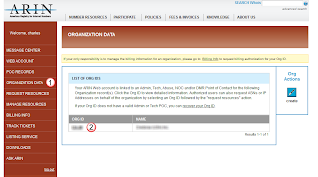

In the right side of the ORG ID page, are the additional actions buttons, select the Request Resources button.

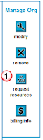

In the Resource Requests page, select the End-user IPv4 Request link.  (ISP's would be for network carriers who will be giving out IP's to other companies.)

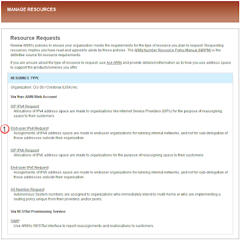

## Fill out form: 

### Registration 
Enter in the size of the network rage you are requesting.  Go big!  If you think you might be able to use a /23-22, ask for it!  Because if you need to go back in the future and ask for more IP's it will be really difficult. 

Also provide a "name" to use for this IP range.  If you end up getting a couple ranges in the future, you will want something that will help you remember what this is, and how it is different from a different range. 

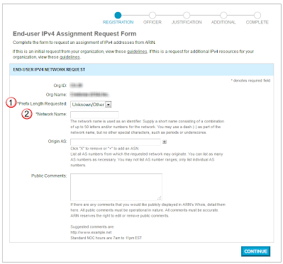

### Officer
To make sure that IT tech's are not just grabbing IP space willy-nilly, ARIN requires that a "C" level person from your company confirm that this IP request is actually legitimate.  Fill that persons info in, and make sure that they are aware, and looking for an email confirmation email from ARIN.  

You should track this, and make sure that your executive is not sitting on this email and slowing or preventing you from being able to get your IP's. 

### Justification
It's really important that you don't just fill in the following thoughtlessly.  This is the make-or-break section.  I would suggest that you go over the initial Homework section, and make sure that you make a compelling argument for why you need these IP's.  Then go back and fill this section out.  

First describe your company so that the folks at ARIN have a base for understanding what your company does.  (Maybe your company's "About" page is all you need.  Maybe you can add a bit of color to make it look less like some clueless B-Student put together a fluffly nebulous description of the company that only confuses everyone.)  

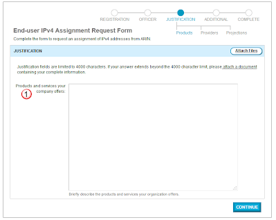

Explain who your current carriers are, and how you are using up your current IP's. (attach any spreadsheets, and contracts/bills as needed)

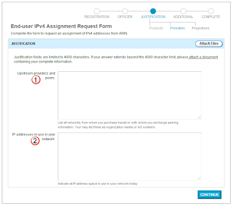

List how you will use up your IP space, both showing all the IP's you will use right away, and also showing how many *more* you will use up in the end of 12 months.  

Again, don't be stingy.  Document the hell out of all the IP's that you will use, (including network and broadcast) and list them explicitly.  

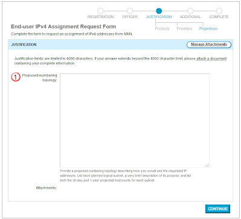

### Additional
Add in any additional information you might want to note and submit.  This might include that you are also requesting an ASN for this range or something of that nature.   

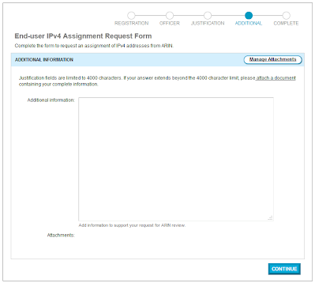

### Complete
When done, you will be given a ticket number that will help you track the request.  

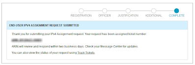

Make sure you track this and respond promptly to any requests for information   

## Approval:
Check your email and the Message Center in the ARIN website.  You should get a notification stating that you have been approved, or that you need to provide more information   

## Billing: 
Once your approval message from ARIN arrives, it will include a link to the billing page.  

In the first page, provide the ARIN ticket, your company and ORG-ID (the one associated to your userID).  List how big you network block is, and how you company wants to be billed.  (normally via invoice).  

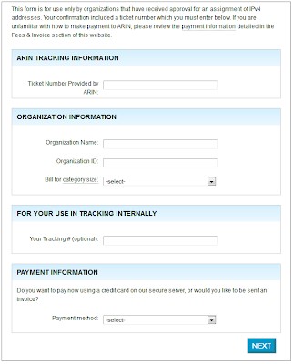

Next fill in your billing departments contact info.  You can either enter in the contact's first and last name, or enter "billing" "department" for the first and last names.  

You can have invoices sent to you in three methods: email, fax, or ground mail.  

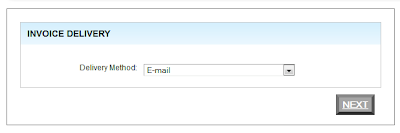

When you are complete, you will get the opportunity to review everything to ensure that you filled it in properly.  

Note that if you are wanting to be invoiced, you need to print out the "RSA" (Registration Service Agreement) and send that back to ARIN.  

After submitting the above request, you will get a confirmation page like the following.  

