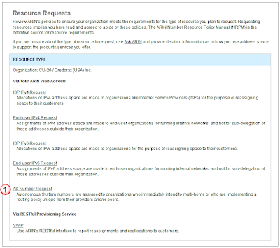
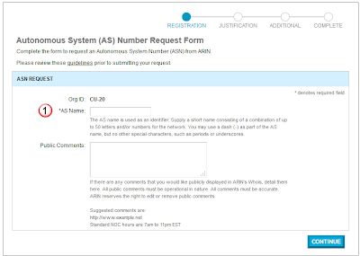
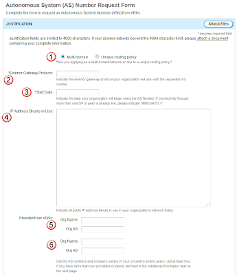
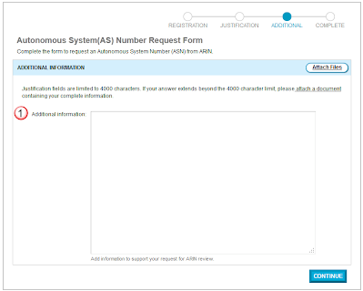
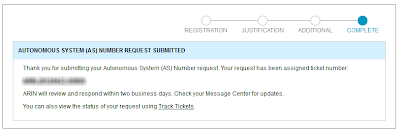
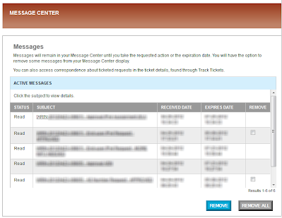
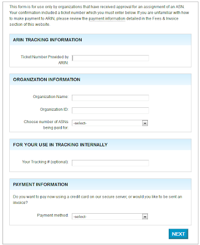
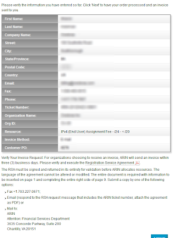
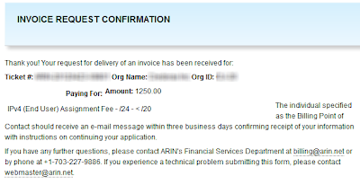

# ARIN-How to request an ASN

## Overview: 
You can connect your systems either with one or many upstream internet providers.  Connecting with one provider is very simple, since there is only one default gateway, but multiple providers can provide some bit of headache when getting multiple in and outbound paths to work together.  

One of the most flexible ways to deal with this is by using the BGP routing protocol.  The first hurtle with using the BGP routing protocol is that you need to ask ARIN (or another registrar) for an [Autonomous System Number](https://en.wikipedia.org/wiki/Autonomous_system_(Internet)) (ASN) so that you can advertise your IP space.   Actually, the other issue is that you will also need a /24 network block to be able to advertise your IP space.  You can do that either by borrowing IP's from one of your upstream providers, or by also [requesting it from ARIN](arin-how-to-request-a-23.md).  

## Homework: 
Before you request an ASN make sure that you read over what information ARIN is looking for you to provide, and make sure that you put together a complete and compelling argument on why you *must* get an ASN.  

### Things to consider/review: 
- [AS Numbers](https://www.arin.net/resources/guide/request/): Read ARINs guide on what to supply when requesting an ASN from them
- You really need it.  Make sure you do your homework and put together a very good argument on why you need an ASN.  If you don't have two upstream providers, there is really very little reason for you to get an ASN, so craft your argument well, and make it convincing!
- Got IP's?  The ASN is a way to advertise IP's in blocks of /24's or better.  You will need to show that you either have at least a /24 or are in the works to get one.  

## Start the Request: 
Log into your ARIN web account, and select Organization Data (1).  Then select the ORGID that is registered to your account that you would like to add IP's to.  (Note that you already need to have created a web account, a POC and ORGID before hand.)

In the right side of the ORG ID page, are the additional actions buttons, select the Request Resources button.

In the Resources Requests page, select the AS Number Request link.  

## Fill out the Form: 

### Registration
Enter in the Name you will want to use to reference this ASN.  It won't be in the routing tables, but if you end up getting multiple ASN's it will help you keep track of what one is over the other.  

### Justification
As far as why you will need the ASN, select that you will be multi-homed (1), that you will be using BGPv4 (2), and that you will start immediately (3).  

Also explain what IP's you are currently using (4).  If you are also requesting a /24 from ARIN, point this out too.  

Then define your two carriers, and their ASN's (5, 6)

### Additional 
Add any additional information information related to this request that might help ensure that ARIN provides the ASN.  Include bills or contracts to show that you have two upstream providers so that they know that this will be used right away.  

### Complete
When you are complete, you will get a ticket number to track this issue.  If you have also created a request for IPs, call up ARIN's helpdesk, and let them know to bind both these tickets together.  That should help the tech working this to better understand what's going on.  

## Approval: 
Check your email and the Message Center in the ARIN website.  You should get a notification stating that you have been approved, or that you need to provide more information

## Billing: 
Once your approval message from ARIN arrives, it will include a link to the billing page.  

In the first page, provide the ARIN ticket, your company and ORG-ID (the one associated to your userID).  List how many ASN's your getting, and how you company wants to be billed.  (normally via invoice).  

Next fill in your billing departments contact info.  You can either enter in the contact's first and last name, or enter "billing" "department" for the first and last names.  

You can have invoices sent to you in three methods: email, fax, or ground mail.  

When you are complete, you will get the opportunity to review everything to ensure that you filled it in properly.  

Note that if you are wanting to be invoiced, you need to print out the "RSA" (Registration Service Agreement) and send that back to ARIN.  

After submitting the above request, you will get a confirmation page like the following.  

