# Basics Of BGP
In this doc we will look at the basic steps in getting BGP up and running. This doc is slanted on working with BGP on cisco routers, so it discusses more what to do, and less on the theroy. See the Appendix at the end of the doc for further reading on BGP.

With this doc, you should get an understanding on the following topics:

- Basic BGP commands
- Understanding BGP route advertisement
- Difference between stub and transit autonomous systems
- Synchronization
- Next hop address concern
- Peer groups
- BGP confederations

## BGP Commands:
### Enable the BGP Router
The first two commands enable bgp routing on the router, and tell the router what networks it should tell the rest of the world that it has. Note that this still is not enough to start talking to its neighbors, but is enough to officially be running bgp.

BGP Commands
```
! -- enable bgp on the router
router bgp 100    
  network 192.168.1.0
  network 192.168.2.0
```

A quick highlight on some of the commands listed above include:

- `router bgp 100` This command does not start bgp on an interface, instead it just starts the bgp router engine. So enabling this command does not get the router to start sending bgp route statements.
- `network 192.168.1.0` This command as well does not start sending out routes to the outside world. Instead, it tells the bgp router what network it will advertise. This is then added to the RIB (Router Information Base), which can then be passed to ibgp route engines (like rip or ospf).

### eBGP vs. iBGP Neighbors
Generally speaking, the difference between an internal BGP neighbor (iBGP) and and external BGP neighbor (eBGP), is by the remote peers AS number. If the the AS of the remote peer is the same, then the peer is considered an iBGP peer, and if the AS is different, then it is considered an eBGP peer.

External peers also fall under different "autonomous" organizations, thus external peers are under separate administrative control.

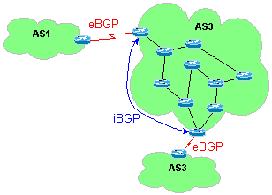

### Connecting BGP Neighbors
BGP uses tcp to communicate between its neighbors.

This basically means that BGP must rely on another routing protocol for it to work. This is not normally a problem for eBGP peers, because they are normally adjacent to each other, or they rely on static route statements to find each other. Frequently though, with iBGP, peers are on other sides of large networks, with many routers in between. So for the peers to be able to communicate with each other, there needs to be another routing protocol like RIP or OSPF in place to tell the two routers how to get to each other.

The fact that BGP uses tcp as it's transport layer, also means that the two bgp peers first need to enable a successful tcp connection, before any routing traffic can be sent between the two.

### Using a Loopback Interface
A loopback interface is a virtual interface on cisco routers which is treated as a physical (real) interface. Since the interface is virtual, it is not assigned to a physical interface, and thus not reliant on that interface to stay up to be considered up.

#### Use the Loopback with iBGP Peers
If you have a router with many physical interfaces, the loopback interface is assigned to all up interfaces, and can always be connected to regardless of an interface failure.


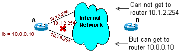

Another good thing about lookback interfaces is that BGP (and OSPF) will use it first as the routers ID. Without using loopbacks you can run into some confusion when troubleshooting network problems, because BGP will use the routers lowest ip as the routers ID, but OSPF will use the routers highest ip as the router ID. Thus one router will endup with two id's, one for OPSF, and one for BGP. This dual router id will not cause routing problems, but it might slow down the tech troubleshooting other problems.

#### DO NOT use the Loopback with eBGP Peers
Don't use, or use loopbacks with care when dealing with external BGP peers. If you are singly connected to a specific peer, you probably want the ip your peer associated with you to be your physical interface ip. Thus if that interface goes down, there is no confusion that your router is down. Otherwise, if the interface goes down, the peer might still be able to route to your loopback through another provider.

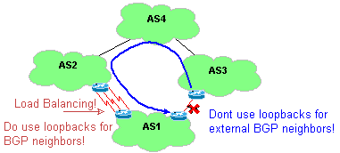

But if you have more then one link between you and your peer, and you are doing load balancing between those routers, then you would want to use a loopback, allowing failover incase one of the interfaces goes down.

#### Enabling Loopback Interface
To create a loopback interface, use the interface command as if you were creating any other interface.

1.4.3 - Create a loopback interface
```
! -- create the loopback interface
interface loopback 0
  ip address 10.99.13.1 255.255.255.255
exit  
```

### Specify the Interface to Advertise
We mentioned how using a loopback interface helped iBGP. It did this by increasing reliability by using all of the available interfaces to the router. It also helped by using the loopbacks interface address as the routers routerID for both bgp and ospf.

On the bad side, we already mentioned that we could have a problem, where one of your multiple bgp links go down, it might "reconnect" through another bgp peer, and look up while it is actually down (see above diagram.).

Another problem is the fact that the router that receives the bgp update, looks at the "from" ip address in the bgp message packet, and matches that with the neighbor statement. If they don't match, then the bgp packet is discarded.

So if the neighbor is the peers loopback address, then bgp will break. Because the packets will come from the routers interface ip address and not the loopback. To solve this we need to add the source loopback flag to the neighbor statement below.

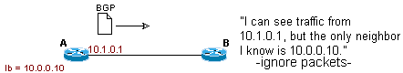

This command lets eBGP routers use loopback address instead of interface address.

1.4.4 - Interface to Advertise
```
! -- specify the interface to advertise
neighbor 10.100.1.1 update-source loopback 0
```

### Establishing BGP Neighbors
To specify a bgp peer, use the neighbor remote-as statement. This command will work both with ebgp and ibgp peers. The router will decide if the peer is external or internal by if the AS is the same or not.

1.5 - Enable BGP Peer
```
! -- specify the bgp peers
neighbor 172.16.10.5 remote-as 50
neighbor 192.168.2.50 remote-as 100
```
A quick highlight on some of the commands listed above include:

- `neighbor 172.16.10.5 remote-as 50` the peer ip is 172.16.10.5, and it's AS is 50 (a external BGP peer)
- `neighbor 192.168.2.50 remote-as 100` the peer ip is 192.168.2.50, and it's AS is 100, the same as ours, thus an internal BGP peer.

### Minimizing Routing Updates
The bgp protocol works in such a way that you get traffic sent to you, if you tell your peers how to get to you.

You might have a router that you want to use to only send out traffic, and not receive any. Or you might want that router to just listen to the BGP updates to monitor the topology. In either case, you don't want the internet to send any traffic to this specific bgp router.

To do this, you prevent the router from sending out updates, thus keeping the internet from sending it any traffic.

Using the passive-interface command will prevent a bgp interface from sending out any routing information

1.6 - Preventing Incoming Internet Traffic
```
! -- prevent a bgp interface from receiving internet traffic
passive-interface fa0/0
```
Where fa0/0 is the bgp interface.

There are three other ways to accomplish this. They are:

- remove the routing protocol network commands for an interface with an address from a separate network
- filter routing updates with access lists
- use redistribution with a distribution list to minimize advertised routes.


### Putting It Together
Here we will show how the commands used in this section can be used in a real bgp network. The following is a diagram of the example network.

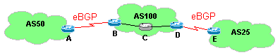

All the configs for all the routers can be found here. Below is the example configs for the Router "B".

In this example, the router does not wants to be a non-transit for AS50, thus it doesn't tell it's neighbor any BGP routes other then itself. Also it sends the router

(to do: Need to come up with configs and add them below, and create an example network example doc, and add it to the link above.)

1.7 - Configs for Router B
```
! -- create the loopback interface
interface loopback 0
  ip address 10.99.13.1 255.255.255.255
exit  

! -- enable bgp on the router
router bgp 100    
  network 1.1.1.0
  network 1.1.2.0

! -- specify the interface to advertise
neighbor 10.100.1.1 update-source loopback 0

! -- specify the bgp peers
neighbor 172.16.10.5 remote-as 50
neighbor 192.168.2.50 remote-as 100

! -- prevent a bgp interface from receiving internet traffic
passive-interface fa0/0
```

## BGP Route Advertisements

### Conditions for Announcing IP Networks
BGP will not send out routing information to another peer unless two conditions are first meet. First the route to be advertised must be present in the routers ip routing table (its RIB: routing information base). Secondly, the BGP process must be aware of this route.

Since BGP receives traffic for routes that it sends out, BGP wants to first make sure that it knows what to do with the traffic that it will get before it sends out a route for that network. Thus if a BGP process is told to advertise a specific network, it first checks with its routers RIB and makes sure that it knows where to send traffic destined to that network. Once it is sure that the router knows where to send that traffic, then it will tell it's neighbor about that network. If the router did not follow this process, then the router could receive lots of data that it would not know what to do with.

The following diagram outlines the steps that happen when a BGP route is learned within an AS, and what generally happens before that route is sent out to another AS.


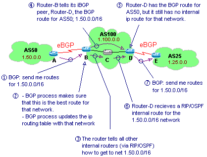

### First Condition for Announcing IP Networks into BGP:
BGP will not send out routing information that it has in its BGP routing table unless it also knows about the route within its ip routing table (IGP routing table). This process is in place so that the router does not receive traffic that it does not know where to send.

The table that the router uses to keep track of all of it's known ip routes is very much different then the table that BGP uses to keep track of all the BGP routes that it hears about.

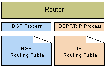

The router keeps its routes that it learns via local routing protocols like RIP, OSPF, and connected networks and static routes, in the ip routing table. This table is used by router to know which interface to send traffic to. The BGP process has it's own routing table where it stores all of it's BGP routing information like all the NLRI (network layer reachability information).

To disable this IGP/BGP synchronization feature, and permit the BGP router to send out BGP routes (to an eBGP peer) that it does not explicitly know how to get to, you can use the no synchronization command.

#### Resetting BGP Sessions
With configuration changes, the BGP routing table can become corrupt. An example of this happening would be changing a local BGP interface's ip.

You can clear the entire BGP routing table with the command clear ip bgp *. This command is generally too broad and can cause problems for you. It will clear the entire table, and if you are receiving a full BGP table, it will take a bit for the routes to be relearned. When this happens it will also cause route flaps to be generated.

If you only need to clear routes learned from a specific neighbor, you can modify the command to clear ip bgp {neighbor address}. This is the recommended method since it only removes a smaller portion of the routes.

### Peer Groups
BGP peer groups are used to make BGP configurations more readable. It allows a group of BGP speakers from the same AS to be given a common name. It is a local setting such that the names defined are local to that router, and are not passed to other iBGP (or eBGP) peers.

Below is an example network followed by the BGP configs for the Router-A in the diagram.

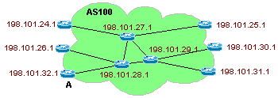


2.3 Peer Groups

Router-A BGP Configs With Peer Groups	
```
! -- enable BGP routing 
router bgp 100
! -- define the routers in 1st peer group 
neighbor 198.101.24.1 peer-group access
neighbor 198.101.25.1 peer-group access
neighbor 198.101.26.1 peer-group access
neighbor 198.101.30.1 peer-group access
neighbor 198.101.31.1 peer-group access
neighbor 198.101.32.1 peer-group access
! -- define the routers in 2nd peer group 
neighbor 198.101.27.1 peer-group backbone
neighbor 198.101.28.1 peer-group backbone
neighbor 198.101.29.1 peer-group backbone
! -- define the 1st peer group 
neighbor access peer-group
neighbor access remote-as 100
neighbor access version 4
neighbor access filter-list 10 in
neighbor access filter-list 20 out
! -- define the 2nd peer group 
neighbor backbone peer-group
neighbor backbone remote-as 100
neighbor backbone version 4
neighbor backbone filter-list 30 in
neighbor backbone filter-list 40 out
```

Router-A BGP Configs Without Peer Groups
```	
! -- enable BGP routing 
router bgp 100
! -- define 1st router
neighbor 198.101.24.1 remote-as 100
neighbor 198.101.24.1 version 4
neighbor 198.101.24.1 filter-list 10 in
neighbor 198.101.24.1 filter-list 20 out
! -- define 2nd router
neighbor 198.101.25.1 remote-as 100
neighbor 198.101.25.1 version 4
neighbor 198.101.25.1 filter-list 10 in
neighbor 198.101.25.1 filter-list 20 out
! -- define 3rd router
neighbor 198.101.26.1 remote-as 100
neighbor 198.101.26.1 version 4
neighbor 198.101.26.1 filter-list 10 in
neighbor 198.101.26.1 filter-list 20 out
! -- define 4th router
neighbor 198.101.30.1 remote-as 100
neighbor 198.101.30.1 version 4
neighbor 198.101.30.1 filter-list 10 in
neighbor 198.101.30.1 filter-list 20 out
! -- define 5th router
neighbor 198.101.31.1 remote-as 100
neighbor 198.101.31.1 version 4
neighbor 198.101.31.1 filter-list 10 in
neighbor 198.101.31.1 filter-list 20 out
! -- define 6th router
neighbor 198.101.32.1 remote-as 100
neighbor 198.101.32.1 version 4
neighbor 198.101.32.1 filter-list 10 in
neighbor 198.101.32.1 filter-list 20 out	
```
(note we are still missing the configs for the three backbone routers with another 12 lines of code.)

Highlighting the commands for creating peer groups:
- `neighbor access peer-group` Creates a peer group
- `neighbor access remote-as 100` Links the peer group to an Autonomous System Number
- `neighbor 198.101.24.1 peer-group access` Link neighbors to the peer group


### Resetting BGP Links
To reset all the connections for all the neighbors in a peer group you can use the clear ip bgp peer-group {peer-group-name} command.

### Default Route
Yes, it's true. One of the great things about BGP is that it's a routing protocol that doesn't need a default route. All the routers can know how to get to every other AS. While this is true, it's not always necessary to set things up this way. You don't always need to get a full BGP feed from all or your peers. You might want to get a very small route list from your primary provider, and then just tell all your routers to send default traffic out to that peer. After all, why spend bandwidth and memory on route tables that don't need to be used? If you want all the traffic to be sent to a specific provider anyway, you don't need to first lookup the route.

Here are two different setups for creating default routes. One has multiple defaults, and the other has one.


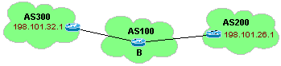

2.5 - Add Default Route

Router-B Both Neighbor AS's are Default Route	
```
! -- allow BGP to create a def route
router bgp 100
  default-information originate
  neighbor 198.101.28.1 remote-as 300
  neighbor 200.100.50.1 remote-as 400
```

Router-B One AS is the Default Route
```
! -- allow BGP to create a def route
router bgp 100
  neighbor 198.101.28.1 default-originate
  neighbor 198.101.28.1 remote-as 300
  neighbor 200.100.50.1 remote-as 400
```

Highlighting the commands for creating peer groups:
- `default-information originate` Allows the redistribution of network 0.0.0.0 into BGP. All neighbors would be assigned the default route.
- `neighbor 198.101.28.1 default-originate` Allows BGP to advertise a default route of 0.0.0.0 to a specific neighbor or group of neighbors. A route map can be used to specify what conditions need to be met before advertising the def route.


#### Transit AS
A transit AS is an AS who allows other AS's to send traffic through it. An example of a transit AS would be and ISP, where multiple companies send their traffic through them. Note that this is accomplished because it receives BGP info from one peer, and rebroadcast's it out to another peer.


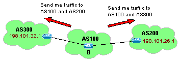

#### Stub AS
A stub AS is one who is part of the BGP network, but only sends traffic out, and does not route external traffic though it. This is accomplished because the local BGP peers do not send BGP routes learned externally to other peers.


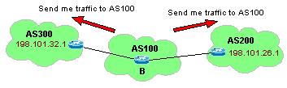

In this example, AS 100 only tells it's neighbors about its own AS. It does not tell them about the other BGP routes that it has learned. This is done through both configuration commands and thorough filtering.

An example command to only advertise local routes: ip as-path ^_$ (lookup)

### Synchronization
By default, before BGP can announce a route, it must make sure that not only the BGP router knows of the route, but also the IGP router (like RIP or OSPF) must know of the route. As mentioned above, this is to prevent receiving traffic for routes that the internal network does not yet know how to get to. So instead, the BGP process waits until it confirms that the IGP route table has a route for a specific network before BGP tells it's peer to send it traffic for that network.

In some cases it might be a good thing to not enable bgp synchronization. To disable BGP synchronization, do the following:

2.8 - disabling BGP Synchronization
```
! -- disable bgp sync.
router bgp 100
  no synchronization
```

#### Synchronization between BGP and IGP
Synchronization is the process where the BGP router engine does not broadcast routes to its peers unless the route exists in both its IGP and BGP table. As mentioned before, this can be a very important feature, preventing a router from receiving traffic that it has not yet learned a route for. Depending on how the network is configured though, this feature is not always necessary, and can be disabled.

If you are running BGP on all the routers in your network (pervasive BGP), with eBGP on the outside facing routers and iBGP on the internal routers, then synchronization can be disabled. BGP learned routes will be put in the local routers route table independent on whether the route was also learned via IGP. iBGP is more flexible, provides better control of routing updates, and presents a consistent view of this AS to external neighbors. This technique is most used by large providers, its disadvantage is that it takes up more memory then redistribution because each router must maintain the BGP forward table in addition to the full IP route table.

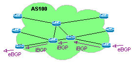

You can also setup BGP only on the outside facing routers with iBGP setup between them. All your internal routers then would only need to be running some kind of IGP routing protocol. With this scenario, you would need to make sure that synchronization was running, because you would want to make sure that the internal routers knew how to route the external routes before you started accepting traffic for them. Since you need to run synchronization, this will slow down how quickly routes can enter one side of your network and leave the other, but all the internal routers need much less memory then ones running iBGP.

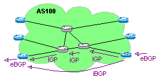

The final way you can do this is to run BGP on the external routers (without iBGP) and have IGP on the internal routers. With this method all the BGP routes will be injected into the IGP. The routers on the other end will then receive these routes and redistribute them to the other peers. The disadvantage of this method is that the redistribution into the IGP from BGP will result in a loss of all the BGP path information. When the routes are then redistributed back to BGP from IGP, all the routes will appear as originating from that AS! This is also dangerous because if the filters are not setup properly, you can create routing loops.

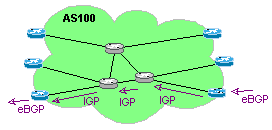

### How BGP gets its routing information
BGP gets its routing info from redistribution, network statements, and both internal and external BGP route advertisement.

#### Next Hop Address Concern
BGP transfers routes by default with next hops as the eBGP peer who sent the route update. But iBGP does not change the next hop info as it passes this route within an AS. If the network of the next hop is not within yours or their declared BGP networks, then you need to make sure that IGP gets this route and distributes it to the other iBGP peers.

With the example network below, the two routers "A" and "B" are eBGP peers and the routers "B" and "C" are iBGP peers. In this scenario, A tells B that it is the route for the network 198.1.2.0/24. Then B adds that to it's BGP route table, and puts the next hop as 200.1.20.1. This way, if it gets traffic destined to 192.1.2.0/24, it will send it to the 200.1.20.1 router.

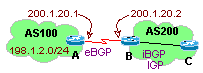

Router B then sends this route to router C, and since these two are linked via iBGP router C keeps the next hop the same; 200.1.20.1. This can easily become a problem because router B must also tell router C thorough IGP that it has the route for 200.1.20.1. In the configs below, the 200.1.20.0/24 network is not part of the BGP networks for either AS 100 or AS 200. This looks a little weird, because you are creating a static route to a connected network. But assuming that the 200* network does not belong to either (maybe a 10 net would be better for this example), then neither would have it in their routing tables. Adding the static routes ensures that the other IGP routers get the route.

2.7.1 - Next Hop Address Concern

Router A Config	
```
! -- define IGP routes
ip route 200.1.20.0 255.255.255.0 s0/0
! -- define BGP routes
router bgp 100
  network 198.1.2.0
  neighbor 200.1.20.2 remote-as 200
```

Router B Config
```
! -- define IGP routes
ip route 200.1.20.0 255.255.255.0 s0/0
! -- define BGP routes
router bgp 200
  network 300.10.10.0
  neighbor 200.1.20.1 remote-as 100
  neighbor 300.10.10.2 remote-as 200
```

Highlighting the commands above:

- `router bgp 100` & `router bgp 200` Add a static route to the local interface. (if we were running rip we would also add a "router rip" "network 200.10.50.0" statement) This command might be a bit vague, but the idea that I'm trying to get across here is that you need to make sure that IGP gets this route, and distributes it to the other IGP routers.

#### Next Hop Address - Multi access Networks
In a network where bgp peers can also directly talk to non bgp routers, that are in the same as as one of the two peers, it can be helpful to change the next-hop address so that the peer can send traffic to the router that is closest to the network, even if that router does not speak bgp.

In this example routers A, B and C are all linked together on the same network (ethernet). A is the BGP speaker for AS 100, and B is the BGP speaker for AS 200 (C does not do BGP). Networks that are directly connected to C will be advertised via BGP from B to A. But BGP by default will properly advertise the "next-hop" as coming from router C, even though it is not a BGP speaker! In other words, A will see the routes that are behind C with the next hop as C's IP, even though C is not a BGP speaker.

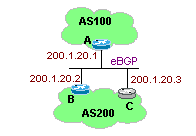

(todo: would be good to have a tcpdump file to show this.)

If we did not want router A to get the next-hop of router C, then for router B we could add the neighbor {ip-address/peer-group} next-hop-self command. This would force the router to use it's own outgoing interfaces ip as the next hop when ever it is talking to another router or group of routers.

2.7.2 Router B claiming destination for all incoming traffic
```
! -- force router to advertise all routes from it's own ip
router bgp 200
  neighbor 200.1.20.2 next-hop-self
```

### BGP Confederations
Because of the way iBGP works, all the BGP routers within an AS must link with each other. Thus if your AS has three BGP routers, then each router will need two iBGP neighbors. This is not too big a deal until you start having a lot of BGP speakers. Take for example a network that has ten BGP routers, each router would need to have nine iBGP neighbor statements! If you needed to add another router to this network, you would need to add neighbor statements to all other ten routers! (Imagine how nasty this could be if you had 100 BGP speakers! And then add five more to the pot!!!)

BGP Confederations is one way that BGP can deal with this problem. It reduces the number of peers in an AS by breaking the network into multiple (smaller) autonomous systems. These new AS's are configured with each other as eBGP peers, but behave as iBGP neighbors in the exchange of information.

- local preference
- multi-exit discriminator (MED)
- next hop address

#### BGP Confederation Commands
When you setup a confederation, you make much smaller groups of routers, each group having a different AS. This allows you to have less neighbor statements in your router configs, and thus makes managing your BGP routers easier. These AS's though, are fake numbers, that are not distributed outside of your company's routers. Along with the different "fake" AS's, all of your routers are also defined with a "confederation peer" which is the one true AS number that you will share with your outside peers.

There are two main commands when setting up a BGP Confederation, one command sets the AS for your entire network, and the other sets the AS for just your single confederation.

More specificity, normally the command router bgp AS defines the real AS that the router is part of. But if you also include the statement bgp confederation identifier AS, then the originally BGP statement becomes an internally used AS, and the bgp confederation id, defines the AS that the rest of the world will see.

The following is an example of this. The provider with the AS 900, has 4 confederations; 901, 902, 903, and 904. It also has a new outside peer with the AS 100. The outside peer (router A) only sees one AS: 900, but the router within AS 900, sees the outside peer (AS 100), as well as it's internal confederation peers.

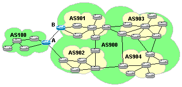


2.8.1 Defining BGP with Confederations

Router A Config	
```
! -- specify external bgp peers
router bgp 100
  neighbor 9.0.1.1 remote-as 900
  neighbor 9.0.2.1 remote-as 900
  ...
```

Router B Config
```
! -- specify both bgp and bgp confederations
router bgp 902
  bgp confederation identifier 900
  bgp confederation peers 901 903 904
  neighbor 1.0.0.1 remote-as 100
  ...	
```

Note that you can send local prefs between sudo AS's, but between real AS's, you can only send MEDs.


