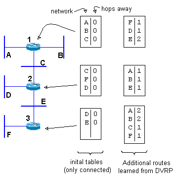
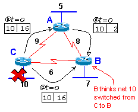

# DVRP - Distance Vector Routing Protocol

## Overview:
Key info in routing table is network & how many hops away it is

Note that the routing protocol would also have to keep track of:
- what routing info came from what interface (to send traffic the right way, and for split horizon issues)
- next router, and on what interface (because more then one router can be on the other side of a routers interface).

## Preventing Routing Loops:
- DVRP prevents routing loops with these five basic concepts.
- Route Poisoning
- Split Horizon
- Split Horizon with Poison Reverse
- Holddown Timer
- Flash Updates or Trigger Updates

### Route Poisoning:
Is used to announce the end of a known route. ie: if network "F" (above) were to be disabled, router "3" would have to tell the other two routers of the route change. It would do this by sending the network with an infinite number of hops. (can't get to it.)
(this is normally passed on to all the other routers.)

### Split Horizon:
Don't give neighbor routing info that he gave you.
ie: don't take incoming routes, blindly update master route table, and then just simply advertise all routes you know to all your neighbors. Instead, keep track of who sent you what & don't bug then with stuff they sent you.

Because it knows that it got that info from that interface, and thus it won't be confused and send the same data back down.

Here the router C gets routing info from three places: 1) from looking at who it's directly connected to, 2) from router A, and 3) from router B. With Split Horizon, Router C will not give router B info about networks 10 and 9, because that is what router B gave it.

### Split Horizon with Poison Reverse:
Same as above, except here, rather then not sending redundant info back to the source route, you do send back redundant routes, and you send it with the distance as infinite (can't get to it).

### Holddown Timer:
- When learning about a failed route, ignore any new information about that route for a set amount of time.
- Thus preventing the following problem.

It could tell C that it knows hot to get to the "new" 10, then C would tell B, and now we have a routing loop.

Network 10 goes down at time=0, router C instantly sends out route updates stating that the route is down (infinite route), but at that same time (time=0), router A happens to send out a route update to router B, and in that update, it says that it know how to get to net 10. So at the same time (time=1) router B finds out that router C can not get to net 10, but router A can (which is not true).

The holddown timer would solve this by having router B ignore the update from router A about network 10 for a while.

### Flash Updates or Trigger Updates:
- when a local interface changes states, that router instantly sends out route changes to the other routers. This quickens convergence and starts everyone's holddown timers quicker
- the route updates are full updates (not just the single route changes)

