# IPSec Theory

- [IPSec Theory](#ipsec-theory)
  - [IPSec Packets (AH/ESP)](#ipsec-packets-ahesp)
  - [AH and ESP](#ah-and-esp)
  - [Tunnel vs. Transport Modes:](#tunnel-vs-transport-modes)
  - [What are Symmetric and Asymmetric Keys?](#what-are-symmetric-and-asymmetric-keys)
    - [Symmetric Keys](#symmetric-keys)
    - [Asymmetric](#asymmetric)
  - [IKE Phase-1](#ike-phase-1)
  - [IKE Phase-2 or IPSec Tunnel Mode](#ike-phase-2-or-ipsec-tunnel-mode)

## IPSec Packets (AH/ESP)
First, lets review some of the basic characteristics of IPSec, including how it's packet is defined and how it works with IP, and what it's capabilities are.

IPSec is Layer-3 Shim
Lets review the [IP packet](http://en.wikipedia.org/wiki/IPv4#Packet_structure). 

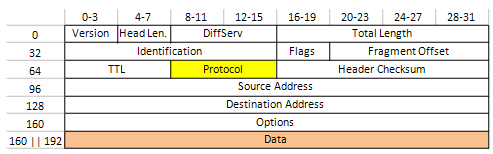

There are a bunch of fields in there including the source IP address, destination IP address, Data, etc, but there is also the "Protocol" field (see yellow).  The data in the IP protocol field designates what kind of layer 4 protocol will be in the data part of the IP Packet.  Some of the most used IP protocols are listed in the following table, but all of them can be found in [RFC 790](http://www.ietf.org/rfc/rfc790.txt).

| Protocol Code	| Protocol Description |
|--|--|
| 1	    | ICMP — Internet Control Message Protocol |
| 2	    | IGMP — Internet Group Management Protocol |
| 4	    | IP within IP (a kind of encapsulation) |
| 6	    | TCP — Transmission Control Protocol |
| 17	| UDP — User Datagram Protocol |
| 41	| IPv6 — next-generation TCP/IP |
| 47	| GRE — Generic Router Encapsulation  |
| 50	| IPsec: ESP — Encapsulating Security Payload |
| 51	| IPsec: AH — Authentication Header |

So naturally, since 50 and 51 are in the protocol list, we should assume that these are layer 4 protocols, right?  WRONG!!!   IPSec is a LAYER 3 IP Protocol, NOT a layer 4 protocol (like TCP/ICMP/UDP).  The reason this is so, is because IPSec gooses (or shims) the stack and sticks in the middle between the IP and layer 4 datagrams.

## AH and ESP
IPsec uses two protocols to provide traffic security -- Authentication Header (AH) and Encapsulating Security Payload (ESP).  Both protocols are described in more detail in their respective RFCs [KA98a](http://rfc-ref.org/RFC-TEXTS/2401/kw-ip_authentication_header.html), [KA98b](http://rfc-ref.org/RFC-TEXTS/2401/kw-ip_encapsulating_security_payload.html).

The IP Authentication Header (AH) [KA98a] provides connectionless integrity, data origin authentication, and an optional anti-replay service.

The Encapsulating Security Payload (ESP) protocol [KA98b] may provide confidentiality (encryption), and limited traffic flow confidentiality. It also may provide connectionless integrity, data origin authentication, and an anti-replay service. (One or the other set of these security services must be applied whenever ESP is invoked.)

Both AH and ESP are vehicles for access control, based on the distribution of cryptographic keys and the management of traffic flows relative to these security protocols.

([RFC2401](http://www.ietf.org/rfc/rfc2401.txt))

This will be explained a bit better in the next section, but the AH header shims between the TCP/UDP payload and the IP header because it has it's own "next header" field, which is the equivalent of the IP Protocol field. 

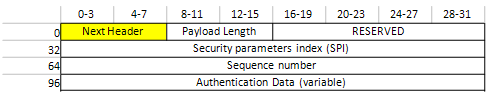

The ESP header also has a "next header" field, but at a different location within the datagram.

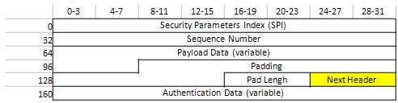

## Tunnel vs. Transport Modes:
IPSec can transport packets such that the data itself is encrypted but the IP flow information is in plain text, or it can create a VPN tunnel, and encrypt all data including the source and destination IP traffic. 

You might want to only encrypt the data, and not the IP information if you are transporting traffic within your secure company, and want to utilize all of your internal routers for packet routing.  Alternatively, you might want to create a site to site VPN across the internet between two sites, and not want to worry about NATting your routes when going out on the internet, or showing what traffic is going where to someone sniffing your data on the internet. 

If you simply shim the IPSec datagram between the layer 2 and 3 payloads, then you are just going to encrypt (with ESP) or authenticate (with AH) your data.  The diagram below first shows the IP header, and in the "protocol" field is the number "51", signifying that the next datagram will be a AH header.  Then in the AH header, the "next header" field has the number "6" indicating that the next datagram will be a TCP Packet.

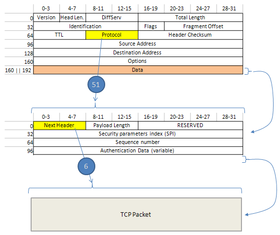

You can also create a VPN tunnel by encrypting the ENTIRE IP packet including the IP and TCP/UDP layers.  In the diagram below, the IP "protocol" field lists "50" for an ESP header, then the ESP's "next header" field lists "4" showing that the next datagram will be an IP header.

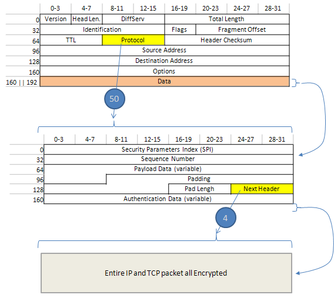

## What are Symmetric and Asymmetric Keys?
In cryptology, there are two different kinds of keys, symmetric and asymmetric.  Asymmetric keys are very much more secure, but also take very much more CPU horsepower to encrypt data when compared to symmetric keys.  On the other hand, symmetric keys must be kept secret, so transporting them can become difficult. 

In the standard IPSec protocol, we utilize both of these encryption methods.  We first setup a slow, processor intensive asymmetric key encryption between the two hosts, and encrypt a small amount of data; namely the symmetric keys.  Then once they have been passed between the two sites securly, we setup a symmetric key encryption tunnel to transmit our VPN traffic.

### Symmetric Keys
Symmetric keys are the easiest to understand.  If you want someone to encrypt data and give it to you, you give them your key, and they use it to encrypt data that only you can use. 

Symmetric key cryptology is great because it is very fast, and thus good for streams of data like what you would see on a VPN. 

It works on a very simple principle.  Each VPN concentrator (end point) has it's own lock and key. 

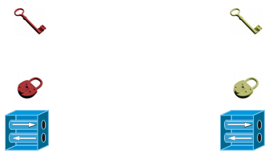

When a vpn tunnel wants to be made, the keys first must be exchanged.

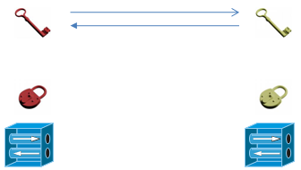

Then the sender uses the receivers key to encrypt data that should be sent to him.  This encryption "path" or "tunnel" is called an SA or Security Association. 

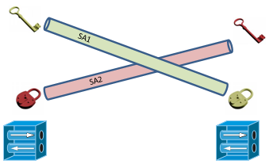

The problem with this process is with the keys.  The receiver needs to get his key to the sender so that it can be used to encrypt the data.  Unfortunately, if anyone has the key (or a copy), they can reverse engineer how the lock works, and then view or modify any of the traffic. 

So the challenge of symmetric keys is getting the keys securely to the other side.  In IPSec this can be done either out of band (like a USB memory stick or phone), or normally via an asymmetric key encryption method.

### Asymmetric
Asymmetric keys are a different beast, and quite cool when you get right down to it.  The advantage to asymmetric keys is that it is very secure, and the key that the sender needs to encrypt data to you can be passed around in public without any danger.  The disadvantage is that it is very processor intensive, and would not be used for live streaming of data. 

There are two keys in an asymmetric solution, the public and the private key.  The public key can only encrypt data, and the private key must be available to decrypt it.  If you have a copy of my public key, there is no way for you to somehow reverse engineer the private key out of it.  So I can give you my public key, have you encrypt data, and know that only I can decrypt it. 

Each side has a public and private key.  The public key is easily shared with anyone, but the private key is kept secret. 

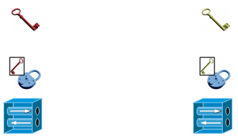

The initiator and the receiver exchange their public keys through the public internet.  Again, there is no problem passing these public keys around, because even if a bad guy intercepts the keys, they still can not decrypt any traffic between the sender and reviver

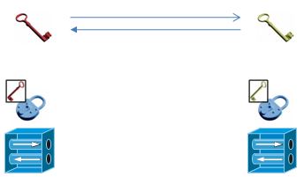

The sender then uses the receivers public key (big red key) to encrypt the data, and then sends that data to the receiver.  The receiver then needs to use his private key (small red key in box) to decrypt the message.

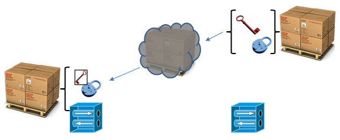

## IKE Phase-1

## IKE Phase-2 or IPSec Tunnel Mode