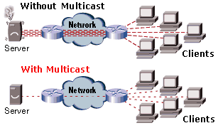

# Multicasting

## Overview: 
"IP multicasting is a bandwidth conserving technology that reduces traffic by simultaneously delivering a single stream of information to thousands of corporate recipients and homes."

"Applications that take advantage of multicast include video conferencing, corporate communications, distance learning, and distribution of software, stock quotes, and news. Today, these applications are run by two inefficient schemes - unicasting and broadcasting. In unicasting one copy of data is sent to each receiver. While unicasting is a simple mechanism for one-to-one communication, for one-to-many communication it brings the network to its knees due to its huge bandwidth demands. In broadcasting a single copy of data is sent to every user in the network solving the bandwidth problem. However it is not suitable if only few receivers requested the data. Multicasting solves these problems by streaming a single copy of data to the requesting receivers."
Cisco Systems, Inc.

"IP Multicast a bandwidth conserving technology was invented by Steve Deering in 1989. It is ideal for multi-point applications such as distance learning, software and news distribution, and corporate communications.

## References: 

- [Multicasting: A Not So Brief Overview](multicasting_v2.md): Ok, maybe you don't think so, but I wrote this up to remind me of all the different protocols dealing with multicasting. I'm missing a few, but that mostly focuses on the newer BGP versions.
- [Multicast Basics](Multicast_Notes_rough.md) Covers all the bases roughly! I really quickly spit this out as a way to take notes. Sorry about the way it looks and reads, but I don't get paid to write books.
