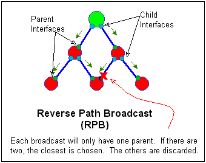

# Multicasting:

Last Modified June '99

---
- [Multicasting:](#multicasting)
  - [MAC Layer, Layer 2, IEEE 802 LANs](#mac-layer-layer-2-ieee-802-lans)
    - [IEEE 802 MAC address format:](#ieee-802-mac-address-format)
    - [Sending IP Multicast Packets over Layer 2 LANs](#sending-ip-multicast-packets-over-layer-2-lans)
  - [IGMP: (Internet Group Management Protocol)](#igmp-internet-group-management-protocol)
    - [RFC Definitions:](#rfc-definitions)
      - [Synopsis:](#synopsis)
      - [Groups:](#groups)
      - [Scopes:](#scopes)
      - [TTL:](#ttl)
    - [Versions:](#versions)
      - [IGMPv1:](#igmpv1)
      - [IGMPv2:](#igmpv2)
    - [Side Note: CGMP:](#side-note-cgmp)
  - [General Routing and Forwarding](#general-routing-and-forwarding)
    - [SAP-Session Advertising Protocol:](#sap-session-advertising-protocol)
      - [Source Based Tree:](#source-based-tree)
      - [Broadcast and Prune:](#broadcast-and-prune)
      - [Shared Tree:](#shared-tree)
      - [Multicast Routing:](#multicast-routing)
      - [Multicast Forwarding:](#multicast-forwarding)
  - [Reverse- Path Multicasting (RPM)](#reverse--path-multicasting-rpm)
    - [Overview: Evolving steps to modern RPM:](#overview-evolving-steps-to-modern-rpm)
    - [Flooding:](#flooding)
    - [Reverse-Path Broadcasting (RPB):](#reverse-path-broadcasting-rpb)
    - [Enhanced Reverse-Path Broadcasting (ERPB):](#enhanced-reverse-path-broadcasting-erpb)
    - [Truncated Reverse-Path Broadcasting (TRPB):](#truncated-reverse-path-broadcasting-trpb)
    - [Reverse-Path Multicasting:](#reverse-path-multicasting)
  - [Distance- Vector Multicast Routing Protocol: (DVMRP)](#distance--vector-multicast-routing-protocol-dvmrp)
    - [Tunneling:](#tunneling)
    - [TTL-Biased/Administrative Scoping:](#ttl-biasedadministrative-scoping)
    - [Multiple routers on a subnet:](#multiple-routers-on-a-subnet)
    - [Routing Tables:](#routing-tables)
    - [Forwarding Tables:](#forwarding-tables)
  - [Protocol- Independent Multicast (PIM)](#protocol--independent-multicast-pim)
  - [Protocol- Independent Multicast- Dense Mode (PIM-DM)](#protocol--independent-multicast--dense-mode-pim-dm)
  - [Protocol- Independent Multicast- Sparce Mode (PIM-SM)](#protocol--independent-multicast--sparce-mode-pim-sm)
    - [OverView:](#overview)
    - [PIM-SM Bootstrap Mechanisms](#pim-sm-bootstrap-mechanisms)
    - [Picking a BSR:](#picking-a-bsr)
    - [Picking a RP:](#picking-a-rp)
      - [Host Joins a Group:](#host-joins-a-group)
      - [Source Sends To A Group:](#source-sends-to-a-group)
      - [Multicast from the RP only:](#multicast-from-the-rp-only)
      - [Multicast from Source and RP:](#multicast-from-source-and-rp)
      - [Shared Tree and Source Based Flexibility:](#shared-tree-and-source-based-flexibility)


## MAC Layer, Layer 2, IEEE 802 LANs

### IEEE 802 MAC address format:
```
Bit_=__8_7_6_5_4_3_2_1_
Byte 1 * * * * * * L M
Byte 2 * * * * * * * *
Byte 3 * * * * * * * *
Byte 4 # # # # # # # #
Byte 5 # # # # # # # #
Byte 6 # # # # # # # #
```
- `*`= OUI: Organizational-Unique Identifier: Each company is issued ($$) its own blocks from IEEE
- `#`= Bytes assigned by the manufacture of NIC
- `L`= Universal/Local bit: 0 = MAC is Universal, which means that the OUI Bytes are purchased from a specific vendor and are legal.
- `M`= Multicast Bit: 0 = MAC is a multicast frame. (or broadcast.

Because the M bit is the LSB of the first octet, a multicast address must be odd. In hex, 1, 3, 5, 7, 9, B, D, F, are valid values for the least significant four bits a multicast address first octet.
Note that (in hex) a broadcast address is `FF-FF-FF-FF-FF-FF` which has its M bit as 0


### Sending IP Multicast Packets over Layer 2 LANs
Example: figuring what MAC to use for an IP multicast

Original multicast ip: `239.147.6.99`
Systems current MAC: `00-00-5e-af-43-10`

What should be its MAC???
Current MAC in Binary:
```
(0000 0000)-(0000 0000)-(0101 1110)-(bla)-(bla)-(bla)
 0000 0001   0000 0000   0101 1110 <- Change and Snag
```

Change the MAC to a multicast one, and snag the first three octets
IP in Binary:
```
(1110 1111).(1001 0011).(0000 0110).(0110 0011)
             0001 0011   0000 0110   0110 0011 <-Change and Snag
```

We change the low-order 24th bit to 0 (the first bit to the left),
and snag the last 23 bit of the IP

New Multicast MAC:
```
00000001-00000000-0101111-000010011-00000110-01100011
\________From Mac_______/ \_________From IP_________/
```

In Hex, New MAC is: `01-00-5e-13-06-63`

## IGMP: (Internet Group Management Protocol)

### RFC Definitions:

(RFC 1112, Host Extensions for IP Multicasting)
- Routers use it to learn whether members of a group are present on their directly attached subnets.
- "multicast groups" a D-Class range (224.0.0.0 - 239.255.255.255)
- Entire listing can be found on "Assigned Numbers" RFC-1700 or its successor, or at the "Internet Assigned Numbers Authority (IANA), http://www.iana.org/iana/.
- Private multicast address range (administratively scoped) 239.0.0.0 - 239.0.0.0 This range is specifically for use within private networks.
- IP hosts tell routers what multicast groups they belong to by telling the routers that they now have an additional IP address, that of the multicast group they want to receive.

#### Synopsis:

IGMP is only locally significant, routers will not forward IGMP traffic. IGMP is used by routers to poll their subnets to find if clients want multicasts, and by clients, to tell their routers to forward multicasts to their subnets.
All other protocols are how multicasts travel between routers, IGMP is how routers know it they want multicasts, and who connected to them, wants it.

#### Groups:

IGMP uses "groups" to broadcast multicasts to clients. A single multicast broadcast (like a radio station or video stream) is a single group. Many clients (no limit) can belong to a single group.

#### Scopes:

Multicasting uses the D-Class IP range to define groups. Each group has it’s own IP address. The D-Class (224.0.0.0 - 239.255.255.255) has been split into ranges of different types of multicasts by how far they are to transmit. These distance ranges or Scopes, allow administrators to control where multicasts can be transmitted to. The ranges are defined by RFC-1884: Scope Definitions. Some routers have these scopes defined within them, and will not forward packets within certain D-Class ranges (ie: Link Local Scopes).

Some examples of the Scopes are:
```
Link-Local Scope          224.0.0.0/24
Site Local Scope          239.253.0.0/16
Organization-Local Scope  239.192.0.0/14
Global Scope              224.0.1.0 - 238.255.255.255
```

#### TTL:
In both Unicast and Multicast, when a packet travels through a router its TTL value (Time To Live) is decreased by one. The TTL value, a standard throughout IP, is assigned to every IP packet. Thus if you have a multicast where each packet has a TTL=1, that multicast will not be able to leave the subnet. TTL, as well as Scopes, are how broadcasts ranges are controlled in the multicast arena.

### Versions:

#### IGMPv1:
HMQ-Host Membership Query: Routers send to subnets to see who is listening to a multicast. They send the broadcast to the "All Hosts on Subnet" multicast address; 224.0.0.1 with a TTL=1

HMR-Host Membership Report: Clients report back to the router, after receiving a HMQ, on what multicast groups they belong to. They use random report timers to prevent all clients from reporting at once. The HMR is broadcasted to the IP address of the multicast group that the client is a part of (with a TTL=1), allowing all clients of that group to hear the first HMR. Only one HMR is sent to the router after a HMQ, all other clients cancel their reporting of that group.

Random Report Timer: To prevent all the clients from responding to a HMQ all at once, when a client receives a HMQ, it sets it’s timer, and then sends it’s HMR. A HMR reporting on multicast group that the client is not a member of, resets the timer. A HMR reporting on a multicast group that the client is a member of, prevents that client from sending a HMR for that group.


#### IGMPv2:
(all the same as IGMPv1, plus)

Query Message: When a router first enables multicasting, it will send out a Query Message telling all the other devices on that subnet that it is a router and with and that it will handle multicasts for that subnet. If there are more than one router for a subnet, then the router with the lowest IP will take control, and the other routers will not send multicasts on that subnet.

Group Specific Query: Routers can now send modified HMQ’s that only poll a specific multicast group. In an unused area of IGMPv1’s HMQ packet, they include the IP of the multicast group that the router wants to poll. This way the router can ask clients from a specific multicast group to reply, and prevent all the other clients from clogging the network and sending unnecessary reply's. This message just looks like a general HMQ to a IGMPv1 client, thus making them return a HMR. In a mixed environment (IGMPv1 and IGMPv2), the IGMPv1 clients are just as noisy, but the IGMPv2 clients prevent some unnecessary chatter on the network .

Leave Group Message: An IGMPv2 client will send a LGM to the "all routers" multicast group, IP=224.0.0.2 with TTL=1, when it leaves a multicast group. This allows routers to immediately see if anyone else is listing to the multicast and shuts it down if it is not in use.


### Side Note: CGMP:
Cisco Group Management Protocol
- Used the same way as IGMP, but used by Cisco between a router and a Cat5K.
- Is needed because the 5K cannot tell the difference between "IP multicast data packets" and "IGMP Report messages", which are both MAC-level addressed to the same group address.

## General Routing and Forwarding

### SAP-Session Advertising Protocol:
Is used in the Mbone Session Directory tools. It allows efficient dynamic allocation of group addresses within the unallocated portions of the class "D" address space.
Reserved SAP Multicast Groups:

- SAPv1 Announcements
- SAPv0 Announcements (deprecated)
- `224.2.128.0/17` SAP Dynamic Assignments

#### Source Based Tree:
(Implicit Join: DVMRP, PIM-DM, Explicit Join: MOSPF, PIM-SM)


Source is the root of the Multicast tree. The source sends the signals out directly from itself, and the network, using broadcasts, figures the most efficient route to the clients.

Pros: Efficient trees; each source has a tree rooted from itself

Cons: Lots of waisted bandwidth from the source broadcasts (imagine a 8meg source creating broadcasts), each router must keep info for each source-group pair, and their prune state.


#### Broadcast and Prune:
Example of a Source Based Tree. The data is flooded out all multicast ports on a router, thus it is sometimes called "Data Driven" Multicasting (the data creates the tree). The receiving routers that do not want the multicasts send Prune states up the ports that they receive multicast bursts from. They also keep track of what multicast group they received and from which port it came from, called source group pair data. The source resend bursts regularly, in the time frame of minutes to hours, and the pruning has to be reestablished.
They can be thought of as "Implicit Join" protocols, since they assume that everyone wants to receive the multicast.

#### Shared Tree:
(Explicit Join: CBT, PIM-SM)


The source can be anywhere on the multicast tree, and a root and the shape of the tree is predefined within the routers on the network. The source sends the signal to the root, who then multicasts it out to the entire network.

Pros: Less information for routers to keep track of (no prune states), No broadcast storms, predefined trees. No traffic on uninterested branches. 

Cons: Not as efficient trees. Possible traffic congestions at the root


#### Multicast Routing:
The act of setting up a predefined tree in the Shared Tree protocol, or the Broadcast and Pruning in the Source Based Tree protocol is the Multicast Routing.

#### Multicast Forwarding:
The routers task of receiving the multicast packet, looking at the information gained from the multicast routing, and forwarding the packet to the correct ports.

## Reverse- Path Multicasting (RPM)

### Overview: Evolving steps to modern RPM:
The following is the evolving steps that got to the current RPM model. It shows what RPM is and how it was made. Multicasting is selective, where broadcasting is indiscriminate for who the receiver is.

### Flooding:
Each router takes a incoming packet and floods it out all of it’s branches. Each router keeps track of each packet to make sure that it does not resend a packet (to prevent looping). It does this by recording the source, destination, and digest of the packet, or any other identifier to tell if it has seen the packet recently. Any duplicate packets are immediately discarded.
Pros: Very easy to setup
Cons: Not efficient, creates overlapping tree structures. Also inefficient use of memory on the router by keeping tables of each packet.


### Reverse-Path Broadcasting (RPB):
When a packet arrives at a router, the router decides if the port it arrived on is the shortest path back to the source. If it is, then it forwards it to all its other ports, if not, then it discards it. The parent link is the source interface, the child links are the outbound interfaces. If a router has multiple broadcasts from different sources, then each broadcast will have its own parent and child interfaces on the same router.



### Enhanced Reverse-Path Broadcasting (ERPB):
Same as RPB with reduced packet duplication. Instead of either only having a parent or child interface, ERPB allows a child interface to query its down stream router to see if it is accepting the broadcast. If it is then it keeps the interface as a child, otherwise it does not use it as a broadcast port for that specific broadcast. (The downstream router might decide that another one of its interfaces is the shortest path to the source, and thus not accept the other routers feed.)
Deciding the router topology (who is upstream and how far) is done by the router two different ways: Link-State, and Distance-Vector.


- Link-State Routing Protocol: each router maintains a topology database of the entire routing domain. LSRP computes "costs" of hops, where "A" to "C" via "B" is more hops but with 10mb, and thus has less a cost then "A" to "C" with a modem connection (very slow=high cost).
- Distance-Vector Routing Protocol: Each router calculates how "far" away each target is and through which interface. This information is then collected and passed on to all the other routers. DVRP always uses the shortest path to send traffic, and decides the shortest path by number of hops.

Note that this is a routing protocol, not ERPB

For ERPB, finding who is upstream via link-state is straight forward, but for distance-vector, there are two different ways. One would have every router advertise its previous hop for each subnet, and the other would be for the router to "poison reverse" the source networks route for each parent.

Pros: Efficient and easy to setup. Packets follow the shortest path to there destination. Each source has its own tree structure, allowing for better network utilization.

Cons: Broadcast delivery tree, does not consider multicast groups, ensures all networks get all broadcasts. Also if a router is not interested in a broadcast, it can not prevent its transport to itself, only make sure that it gets there most efficiently.


### Truncated Reverse-Path Broadcasting (TRPB):
Includes everything from ERGP and also includes group information gathered via IGMP, which allows routers to ignore broadcasts from groups that it is not interested in. A router decides to block a broadcast group after two steps. First it broadcasts the signal to all of its child interfaces. If all the sub networks refuse the group, it is the same as having no child interfaces. It next uses IGMP to see if any hosts (non-routers) on any of its interfaces want the multicast group. If no one wants the group, then it tells its source that it is not accepting that group, and the sources interface deletes that interface as a child for that group.


Pros: Allows group membership, and can pick groups to receive and not to receive. Can also use IGMP so can query hosts as well as just sending to routers.

Cons: Does not include "grafting" (asking for a broadcast that was previously denied). Also must make an original broadcast to the entire network, but once the decision is made for who receives the group, it is never reassessed.


### Reverse-Path Multicasting:
All transmissions are referred to by there source-group pair. Meaning that the packet being sent is associated to a specific group, and the source, the interface that it is coming from, is known as well. The first packet uses the TRPB protocol to ensure that it is received through out the entire network. When a router receives a source-group pair, if it decides that none of it’s interfaces need it, rather than shutting off the parent interface, it sends a prune message referring to that source-group pair up its parent interface. That same router will store in its tables, that it received that source-group, that it was pruned. The prune information is only kept for a set time, if the multicast is still active after the prune information is timed out, then the downstream router will receive the broadcast again, and it will need to prune the source-group again. If a host wants to receive a multicast group after the router has pruned it, it tells the router that it is interested in the multicast via. IGMP, and then the router sends a GRAFT message up the source stating that it wants to receive that group. Each router upstream who does not have that group active, will repeat the graft message up its source, and this process will continue until the multicast is delivered downstream. The grafting is guaranteed delivery, so a single graft message will deliver the multicast group.


Pros: Easy to setup, like all source-based trees, it creates an efficient tree structure.

Cons: Again, like all sourced-based trees, the broadcasting technique does not scale well, using up too much bandwidth when dealing with many multicasts, large networks, or high bandwidth multicasts.


## Distance- Vector Multicast Routing Protocol: (DVMRP)

DVMRP is the multicast routing protocol of choice on the internet. It is also the default routing protocol of the Mbone.

### Tunneling:
Tunneling allows two DVMRP routers that are separated by non multicast enabled routers, to share multicast data between them.

### TTL-Biased/Administrative Scoping:
There are two ways using TTL to prevent multicasting from traveling to specific areas. The simplest, TTL-baised, has the source set the TTL values of the outgoing multicast to a level that the routers will not pass. Ie: if you only want a multicast to travel to the directly connected subnet, and the ones on the other side of the next router, setting the TTL=2 would achieve this. The other way to control where multicast packets will go is with Administrative Scoping. Here there are a set of standards for TTL values that routers will use to control the breadth of multicsating.
```
0   Restricted to the same host
1   Restricted to the same subnet
15  Restricted to the same site
63  Restricted to the same region
127 Worldwide
191 Worldwide: limited bandwidth
255 Unrestricted
```

DVMRP is based on RPM, where it uses an initial broadcast to all routers (scoped via TTL) advertising the multicast, and then all routers issue prunes to throttle the multicasts. The biggest jump above all of this is that DVMRP also uses routing information to better create the source trees.


### Multiple routers on a subnet:
If two routers want to be the source of a multicast on a subnet that they are both connected to there are ways that DVMRP can decide which it should be. The first technique is via metrics. If router "A" has a smaller metric then router "B", then "A" is preferred, and "B" will discard the traffic. If they both have the same metric, then the one with the smaller IP (on that shared subnet) will be the dominant router.

### Routing Tables:
Unlike simpler multicasting protocols, DVMRP keeps track of its DVMRP neighbors in a routing database, and distributes those tables around its neighbors. Note that this routing database is completely separate from any unicast tables kept via any Inter-Gateway Protocols. In the previous example, we had two routers connected to a subnet and one was the subordinate. The subordinate, will "poison-reverse" its network table to prevent any connectivity confusions. Poison Reverse is where a router sets its metric to a specific subnet to infinity. The information is still routed in the tables, but the infinite hop count will never be used. The DVMRP routing table does not include group membership or prune information, that is left to the Forwarding table.


Below is a explanation of fields in the routing table.

- Source Prefix: The actual of potential subnet of the source multicast
- Subnet Mask: The mask associated with the source. NOTE: DVMRP is CLASSLESS
- From Gateway: The previous hop router leading back to the source
- TTL: The time before that line will be "timed out" and deleted. NOTE: Not related to TTL-Scoping.


### Forwarding Tables:
The forwarding table is the routers source-group prune table. It is kept separate because the DVMRP routing table does not keep track of group membership.


Below is an explanation of fields in the Forwarding Table.

- Source Prefix: The subnet sending the multicast datagrams (SOURCE)
- Multicast Group: The class D ip address of the multicast datagram. (GROUP) NOTE: One source can have many groups)
- InIntf: The parent interface to the source-group. A "Pr" shows that a prune message has been sent to the upstream router.
- OutIntf: The child interface to the source-group. A #p shows that that interface (#) has received a prune message, from its downstream router.

As packets enter a DVMPR router, its source-group is matched to the information on the forwarding table. Unnecessary delivery branches are pruned quickly, within tens of milliseconds. For a new packet, the router first determine if the packet is coming from the correct source, then decides if there are any child interfaces for it. Its source-group information is then stored in the forwarding table.

Pros: Definitely well tested: The routing protocol for the Mbone. Easy to setup and easy to setup tunnels.

Cons: Internal routing protocol is limited: distance-vector routing protocol; slow to adapt to topology changes, and limited to diameter (15 hops). Must keep source-group-prune information for all multicasts it receives (until data is time-flushed), which uses up router resources. Multicast data is predictably flooded across the network to update source-group-prune information.

## Protocol- Independent Multicast (PIM)

Two different modes: Dense Mode(PIM-DM), and Sparce Mode (PIM-SM). Although they have similar names and control messages, they wholly independent routing protocols. They share control message processing and data packet forwarding among PIM-Sparce and -Dense modes. PIM-DM and PIM-SM must run in separate regions: a multicast routing region may be either sparce or dense, but sparce and dense regions may never overlap.
PIM gets its "protocol independent" name because it does not rely on any one unicats routing protocol to provide its routing information and topology changes. It can use any combination of routing protocols such as: OSPF, Integrated IS-IS, RIPv1, RIPv2, BGP-4, IGRP, E-IGRP, etc. PIM refers to sparce and dense modes as: how many of a routers subnets are used for multicasting, at a given time. Ie, if there are 20 subnets that can handle multicasting and only two multicasting at a time, or there are 20 subnets and 19 are in use at a time.

Note that the default forwarding action of implicit-join routing protocols is to broadcast all traffic away from the source, while the default action of a sparce-mode protocol is to send traffic only where it has been explicitly requested.

IETF Internet drafts:
- PIM: Motivation and Architecture
- PIM: Dense Mode Protocol Specification
- PIM: Sparse Mode Protocol Specification
- IGMP Router Extensions for Routing to Dense Multicast Groups
- IGMP Router Extensions for Routing to Sparse Multicast Groups

## Protocol- Independent Multicast- Dense Mode (PIM-DM)

PIM-DM can almost be considered a step down from DVMPR. It is a much leaner RPM type source-based tree protocol. Where DVMRP considers if its child interfaces have any active parents, and then broadcasts down only them, PIM-DM just simply broadcasts down all of its interfaces. This does increase unnecessary broadcasts, but the advantage is it takes a lot of overhead away from the router. As mentioned above, it also uses the routers current unicast routing protocols to learn about its topology. PIM-DM also sends its prune messages as multicasts, so that all other routers on that subnet can here the prune message. If one does, and wants to cancel that prune, it sends a PIM-Join message along that same multicast group.
PIM-DM is best used in a resource rich environments, where group members densely occupy large percentages of the subnets. It is based on the RPM algorithm, but lacks the embedded routing protocol. Thus it uses the existing unicast routing table to orient itself with respect to the source(s). It also forwards multicast traffic on all non-incoming interfaces until explicit prune messages are received (unlike DVMRP which calculates a set of child interfaces for each source/group pair.) This allows possible duplication, but avoids the routing overhead. It also employs reliable graft messaging to access previously pruned source/group pairs.

Prune messages are multicast packets, thus on a branch with more than two routers, if one child sends a prune, but the other child wants the multicast traffic, the second child will here the prune, and send a PIM-Join packet to ensure they stay attached to the distribution tree.

Pros: Efficient protocol that takes advantage other, more powerful routing protocols.

Cons: More broadcast-y, does not scale well in big networks because of its basic nature

## Protocol- Independent Multicast- Sparce Mode (PIM-SM)

### OverView:
PIM-SM is designed to limit multicast traffic so that only those routers interested in receiving traffic for a particular group will "see" it.
PIM-SM builds shared trees which must be explicitly joined by downstream routers. Routers with adjacent group members are required to explicitly join a sparce mode delivery tree by transmitting join messages toward a groups "Rendezvous Point". PIM-SM evolved from the core-based trees (CBT) approach, in that it employs the concept of a "core" (or rendezvous point, RP, in PIM-SM terminology) where receivers "meet" sources.

Routers join the multicast delivery by sending an explicit PIM-Join message hop by hop toward the groups RP. The source uses the RP as the "conduit" to send its broadcast to the members in the network. There can be more than one RP in an entire network, but a single group must only have one RP. This mapping of groups to RP’s is called the RP-Set (or the set of groups that the RP handles).


### PIM-SM Bootstrap Mechanisms
To allow robustness, PIM-SM runs a series of other systems that allow the RP-Set information to be distributed to the other routers, and for backup RPs to take over for failed RPs. The Bootstrap Router (BSR) is encharge of distributing the RP-Set information to all the routers. There are backup BSRs, or Candidate BSRs (C-BSR) who will take the place of the BSR if it fails. There are also Candidate RP’s (C-RP) backup the RPs incase of a failure.

### Picking a BSR:
The network first turns on with a few C-BSRs trying to decide which should be the BSR. (A network admin defines which routers should be the C-BSRs, they should be picked by where they are located in the network. Remember that the BSRs job is to flood the RP-Set to all routers, so the more central the location of the C-BSRs the better.) The C-BSR’s send bootstrap messages to the network advertising their existence. The BSR election process employs a spanning-tree-like protocol. Candidate BSRs emit RP-Set messages hop by hop. These RP-Set messages include their IP addresses and a preference value, which is configurable by the intranet manager. The C-BSR with the highest preference value is elected BSR. If two or more C-BSRs share the highest preference value, the C-BSR with the numerically highest IP address wins.

### Picking a RP:
Once a BSR is chosen, it begins to collect the C-RP advertisements. (Note that the C-RPs are also specified by the intranet manager.) The C-RP advertisements binds each C-RP to it’s allowed group prefixes. Once the BSR has collected the list of C-RPs, it distributes the list as a RP-Set across the PIM-SM region. Each router in the region uniquely determines the RP for a group by using a hash function, which has the following independent variables as inputs:

- `G` (the group whose RP is being sought)
- `RPn` (the IP address of C-RPs whose group-prefix covers G)
- `M` (a hash mask which allows a small number of consecutive groups to resolve to the same RP)
- `j` = 1,103,515,245 (some bad ass specified number )
- `x` = 12,345 (some other specified number)

The hash function is as follows:
```
( j ( ( j (G&M)+ x ) XOR RPn) + x ) mod 2^31
```

Once determined, some unique RP is found to be the rendezvous point for the group G’s shared tree, also known as G’s RP-Tree.

#### Host Joins a Group:
If a single broadcast area has more than one router that is accepting IGMP, the router with the highest IP address is selected as the designated router (DR) for that LAN. The DR sends Join/Prune messages toward the RP on behalf of the LAN.
Once the router checks its route table for that source group pair, (notated as (S,G) pair), it transmits a unicast PIM-Join message toward the groups RP. The intermediate PIM-SM routers then resend the PIM-Join message toward the RP until it gets to the RP or to a router that is currently receiving that (S,G) pair.


#### Source Sends To A Group:
When a source transmits a multicast packet to a group, its DR tunnels the multicast to the RP to then be distributed. The DR encapsulates the source’s initial mulitcast packets in PIM-SM-Register packets and unicasts them to the RP. The PIM-SM-Register packets inform the RP of the new source. At this point, two things can happen.

#### Multicast from the RP only:
Here the sources DR takes the multicast packets being transmitted by the source and tunnels them to the RP. This technique allows the RP to be the only point where multicast traffic comes from. The DR encapsulated the sources multicast packets in PIM-SM-Register unicast packets. If the RP has no one to distribute the multicast traffic to, it will send a PIM-Register-Stop to the Source DR to tell it to stop sending the traffic.

#### Multicast from Source and RP:
When the source first starts broadcasting, the system behaves like the "Multicast from the RP only". If the RP sends a PIM-Join message to the source’s DR, then the sources DR multicasts the traffic to the RP using the shortest path tree (SPT) algorithm, and all the routers in between the source and RP will note that the (S,G) pair is originating from the source and not the RP. Once the RP has successfully received the multicast stream from the source, it then sends a PIM-Register-Stop to tell the sources DR to stop sending the encapsulated packets. Thus, in the bigger picture, the traffic is still rooted at the RP, but anyone directly connected to the path between the source and the RP can receive the signal as it goes from the source to the RP (as opposed as then coming back down from the RP).

#### Shared Tree and Source Based Flexibility:
PIM-SM routers have the ability to switch from standard PIM-SM shard tree broadcasts, where all the multicasts come form the RP, to sourced based trees, where the traffic comes directly form the source. This switch is controlled by metrics set up in the routers, and decisions are made on a per-source basis. It is also not a one-for-one decision. For a single source’s multicast, there can be receivers receiving the traffic from the RP, and others from the source via a sourced based tree. An example of this is if the receivers are on the opposite side of the source as the RP. The receiver can then get the multicast directly from the source and not from the RP.
