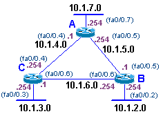

# Basic RIP Network Layout (1)

This is an example network with three routers with three virtual interfaces running RIP.

## Logical Diagram



## Router Configs
For the example above, this would be a basic set of cisco configs

### Router A
```
hostname Router_A
!
int fa0/0.7
 encap dot1q 7
 ip address 10.1.7.254 255.255.255.0
int fa0/0.4
 encap dot1q 4
 ip address 10.1.4.1 255.255.255.0
int fa0/0.5
 encap dot1q 5 
 ip address 10.1.5.254 255.255.255.0
!
router rip
 network 10.0.0.0
```

### Router B
```
hostname Router_B
!
int fa0/0.2
 encap dot1q 2
 ip address 10.1.2.254 255.255.255.0
int fa0/0.5
 encap dot1q 5
 ip address 10.1.5.1 255.255.255.0
int fa0/0.6
 encap dot1q 6 
 ip address 10.1.6.254 255.255.255.0
! 
router rip
 network 10.0.0.0
```

### Router C
```
hostname Router_C
!
int fa0/0.3
 encap dot1q 3
 ip address 10.1.3.254 255.255.255.0
int fa0/0.4
 encap dot1q 4
 ip address 10.1.4.254 255.255.255.0
int fa0/0.6
 encap dot1q 6 
 ip address 10.1.6.1 255.255.255.0
!
router rip
 network 10.0.0.0
```

