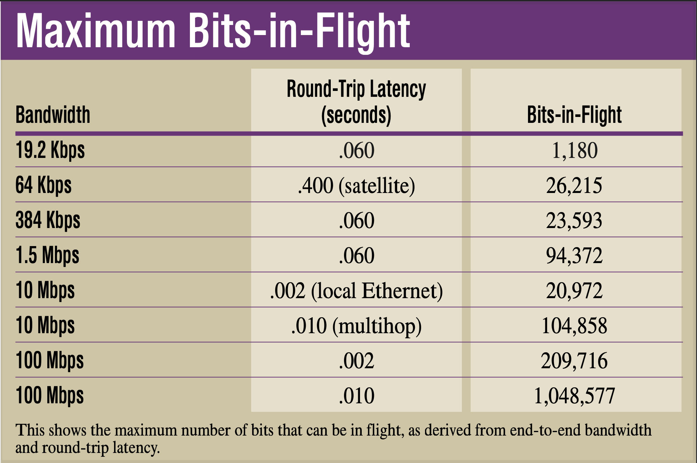
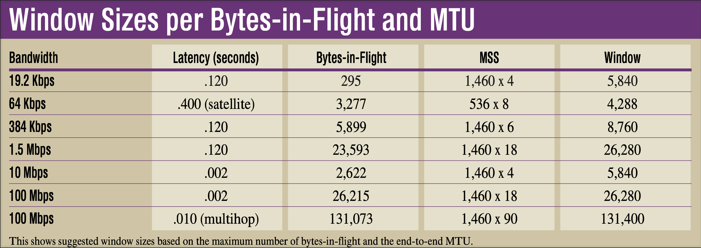

# Don't Ignore TCP Performance-Tuning
June 28, 1999
By Eric A. Hall

Originally from [Network Computing](http://www.nwc.com/1013/1013ws1.html) Copied

When it comes to tuning application servers, most network administrators take all the obvious steps: They pick an effective OS, use a strong server platform and build a robust infrastructure. Unfortunately, few take the time to fine-tune their TCP/IP stacks for optimal performance. This is a crucial step in maximizing overall performance because TCP provides all flow-control services used to move data over the network.

There are several TCP elements you can pick to tweak performance, but the most important one is the TCP window size; it dictates how much data a system can send at any given time. Every TCP packet (called a "segment" in the IETF standards) has a header that contains the "window" field (among other things). This field advertises the amount of available space in a system's receive buffers at the time a segment was sent. By telling the remote system how much space is available, the advertising host controls how much data the remote host will transmit. Large windows allow a sending system to transmit much more data than if the window were set at a smaller value. In contrast, small windows constrict the amount of data being exchanged, which can result in suboptimal utilization.

The trick to maximizing performance is to define the window field being advertised by your network's end points appropriately, so that the amount of data being exchanged is equal to the available bandwidth. If the TCP window is too small for a given network, the end points won't be able to saturate the network fully, and overall performance will be slower than expected. However, making the TCP window too large can introduce error-recovery problems, so setting this value too high can degrade performance substantially.

Fortunately, all systems have a "default" size that they use for the TCP window. You can adjust this value so all your applications use an appropriate window size. Some applications also let you set window size on a per-connection basis, using system-level APIs that the application calls when it first binds to TCP. You may be better off using an application-specific setting, depending on your usage patterns, but you'll be able to do so only if you have access to the application source code.

Accurately determining the appropriate TCP window size for your network can be complicated, requiring many measurements and calculations to find the best setting. Note that these calculations are connection-specific, and therefore will be of little use if you have a variety of connections coming in from different networks and locations (values that are optimal for one network may be suboptimal for others). For this reason, tweaking your system's TCP window size is most beneficial when all your users are on networks with similar characteristics, and all the end points (including the application server and clients) can be configured the same way. By the same token, if you have a popular Web server that gets dial-up connections from remote locales and the T3 circuit next door, you won't be able to fine-tune anything. In that situation, using the system defaults is probably the best you can do without using add-on traffic-shaping gear.

```
Bandwidth x Delay = Bits-In-Flight
```

When deciding upon the most efficient window size for your network, the two most important considerations are round-trip latency and the end-to-end bandwidth on the network. Both elements determine the amount of data that can be on the network ("in-flight") at any given time.
Latency is the amount of time it takes for a bit of data to travel from your system to another, including all of the in-between hops and the processing time of the two systems. The longer it takes for data to travel across the network, the more bits that can actually be in the network at any given time. For example, a network that has a latency of 60 milliseconds will allow six times as many bits to be in transit simultaneously as a network with a latency of 10 milliseconds. However, round-trip latency (which includes the amount of time for the data to be sent and acknowledged) is a truly important measure, as we'll soon see.

Likewise, end-to-end bandwidth affects the number of in-flight bits, since it affects how many bits can be sent for every unit of latency. If you have a 1-Mbps pipe, then you can send only 1 megabit for every second of latency. Similarly, a 100-Mbps pipe will allow 100 Mb of data to be sent in that same second.

Multiplying the round-trip latency by the end-to-end bandwidth provides you with the maximum amount of data that any particular TCP virtual circuit will allow. This figure essentially defines the optimal TCP window size. Setting a value that is smaller will result in a constrained system; the sender will be restricted to the value advertised by the remote system's window field rather than the network's capacity. Once this window value has been reached, the sender must stop transmitting data until an acknowledgment arrives. But if the value is sized correctly, the sender will be able to send data continuously because the acknowledgment will always appear just as all of the data has been sent. This will allow for a continuous exchange of data, and enables fast recovery times in the event that data gets lost.

When you perform these window-size-related calculations, remember that end-to-end bandwidth should be your primary focus; it will serve as the throttling point for the entire link. If you have a 100-Mbps Ethernet card, but the remote system is using 64-Kbps ISDN, 64 Kbps is the maximum bandwidth for the end-to-end connection. In addition, you need to measure latency in terms of round-trip delivery times. If you're sending data over a wide area ATM network, but the remote system is transmitting acknowledgments to you over a satellite link, your round-trip latency times will be the latency of the ATM network plus the latency of the satellite link.

Measuring round-trip latency times is easy: Simply ping a remote system. However, be sure that you ping the system several times during a normal workday--network congestion will result in longer latency times at peak traffic periods--and that you use the most common latency time (which may not necessarily be the average). You will need to use a ping client that generates custom-length messages, which sends ping probes that are equal in size to the most common packets on your network. Using very short ICMP (Internet Control Message Protocol) messages results in lower latencies than TCP segments will encounter in reality. In contrast, using ICMP messages that are too large may create excessively long latency times or cause fragmented IP packets (this will only further corrupt your test results). For Ethernet, you should generate 1,500-byte IP packets, which will each have a 20-byte IP header and an eight-byte ICMP header. This translates into ICMP probes with 1,472 bytes of data.

When you do the math, be sure to use the same unit of measure for everything--bits per second or bytes per second when appropriate, or milliseconds instead of seconds. Otherwise, your measurement data will be incorrect. Also, keep in mind that kilobytes are 1,024 bytes, and that megabytes are 1,024 x 1,024 bytes.

For example, when you multiply the throughput of a 19.2-Kbps modem (19.2 x 1,024 bits) by an average round-trip time of 60 milliseconds (.06 seconds), the maximum amount of in-flight data on the network is approximately 1,180 bits (rounded up from 1,179.648 bits). For additional examples of this formula at work, [see "Maximum Bits-in-Flight" (page 97)](http://img.cmpnet.com/nc/1013/graphics/ws1.pdf). 

 

Note that this formula only tells us how many bits can be in flight at any given time and does not tell us the optimal window size.

As you can see in the "Maximum Bits-in-Flight" table, the number of bits in flight changes dramatically according to the network's bandwidth and latency. Notice that the results for the 384-Kbps WAN link with 60 milliseconds of delay are similar to the results for 10-Mbps Ethernet with two milliseconds of latency. With Ethernet, the available bandwidth is substantially greater, but the end-to-end delay is extremely low: It provides little opportunity for the bits to build up in the network. Also, note how much build up is allowed in the 100-Mbps LAN with 10 milliseconds of latency compared with the same LAN if it has only two milliseconds of delay. The more infrastructure devices you add to your network, the greater the latency will become. This explains why measuring your own network is so important.

### Maximum Segment Size Multiples

It's important to note the bits-in-flight value alone is not the optimal window size. You must also consider the maximum segment size (MSS) in use on the connection, and multiply that value by even numbers until you exceed the value derived for the maximum bits-in-flight. This is due to the way in which TCP's Delayed Acknowledgment algorithm refrains from sending acknowledgments until two fully sized TCP segments have been received. If the sender does not transmit enough data in even multiples, the recipient will not return acknowledgments quickly, and the exchange will be jerky.
For example, if the segment size is 1,460 bytes (common for Ethernet and PPP connections), the window must be an even multiple of 1,460 bytes. If the TCP window is an odd multiple of the MSS, eventually the recipient will not receive two full-sized segments, thereby holding off the acknowledgment until the delayed acknowledgment timer expires.

Actually, the default window value should be at least four times the MSS because a smaller receive window would not foster a steady data flow. If the receive window were only twice the MSS, the sender would transmit two segments and then stop to wait for an acknowledgment while the segments worked their way through the network. Once received, the recipient's acknowledgment would also have to return to the sender before more data could be sent, causing further delay. Having a default window size four times the size of the MSS would at least allow the sender to transmit four segments, with the last segment being sent just as the acknowledgment for the first two segments was being returned.

This is why many TCP stacks use a simple formula of MSS x 4, with the resulting value as the default window size for all connections. While this methodology works for networks with very low latency levels, it is not sufficient for slower connections, where multiples of six or eight are more appropriate. ["Window Sizes per Bytes-in-Flight and MTU" (on page 98)](http://img.cmpnet.com/nc/1013/graphics/ws12.pdf) shows some window sizes based on the maximum bits-in-flight and using some common segment sizes (shown here in bytes instead of bits).

 

Notice that the 10-Mbps link with two milliseconds of latency is the only LAN configuration that is able to use a default setting of 4 x MSS. The rest of the configurations--particularly 100-Mbps Ethernet over a multihop network, which requires an MSS multiple of 90--would suffer serious performance limitations with this setting.

This is a particular problem when Fast Ethernet networks are used on highly distributed LANs with numerous bridges and routers. If you have a few hundred users using a single internal Web server over a multihop internal network, you're probably not realizing the best possible performance. Unfortunately, if you set the default window size for all your clients for a very large value that reflects this particular usage scenario, you will likely experience other problems; a window this size will be too big for most other usage scenarios. Users that are hooking up to the Internet will establish connections using these large window sizes, even though their end-to-end bandwidth may drop to 256 Kbps or less (resulting in much lower levels of in-flight data).

When a window is too big, TCP can have difficulties trying to recover from lost data. For example, if a remote Web server sees a window size of 131 KB advertised by your client, then it eventually will try to send that exact amount of data--even if the bandwidth times delay for that connection only enables 4 KB of in-flight data. As a result, the remaining 127 KB would be queued in a router somewhere between the Web server and your client.

If any of that data is lost and retransmitted, the retransmitted data will have to sit in a router queue behind the rest of the data from the earlier transmission, while your system continues to receive (and reject) all the earlier segments. Eventually, the client will simply abort the connection because it will think that the connection cannot be recovered. Alternatively, the continuous stream of duplicate acknowledgments sent by your client back to the remote server may cause the server to abort the connection as well. Having an appropriately sized window would prevent these events from occurring.

This scenario illustrates why it's very important not to set a window value that is too large. If some of your calculations indicate big windows for some internal services but small-sized windows for other services (local or remote), you may wish to move some of those servers closer to the client, so you can average the maximum window sizes to more reasonable values. In this regard, determining the most efficient window sizes for your organization may indicate that the infrastructure needs to be modified.

Also, it is important to note that since the TCP window field is only 16 bits long, the maximum value for this field is 65535. If you have a satellite network or some other connection that is slow but offers a lot of capacity, the optimal window size will exceed this value, requiring the use of the TCP Window Scale Option (described in detail in "[Advanced TCP Options](www.networkcomputing.com/1003/1003ws1.html),").


### How to Change the Default TCP Window Size in Your Network

These instructions provide a starting point for setting the systemwide default for the TCP receive window. For more information on specific platforms, refer to the vendor documentation.

#### Windows NT 4.0
Using REGEDIT, navigate to the `HKEY_LOCAL_MACHINE\SYSTEM\CurrentControlSet\Services\Tcpip\Paramaters` key and add a new DWORD value called TcpWindowSize if one does not already exist. The system default is 8192 rounded up to a multiple of the MSS (maximum segment size)--this is 8760 for Ethernet--, or four times the MSS, whichever is larger. To set your own value, enter the results from your calculations (be sure to click the "decimal" radio button first) and reboot the system.

#### Solaris 7
System parameters are tweaked using NDD. To view the current TCP window size, execute the "`ndd /dev/tcp tcp_recv_hiwat`" command, which will display the value currently assigned with the `tcp_recv_hiwat` variable. To set the window size, execute the "`ndd -set /dev/tcp tcp_recv_hiwat`" command. Note that Solaris has a minimum value of six times the MSS, so you cannot set the window size to a multiple of four.

#### Digital Unix 4.0d
To view the current TCP window size, execute the "`sysconfig -q inet tcp_recvspace`" command. The default setting is 32 kilobytes. To temporarily change the default value, use the "`sysconfig -r inet tcp_recvspace=XXX`" command, where "XXX" is the value you want to use. This will affect all new processes, but will not be permanent across reboots. If you want to change this setting on a permanent basis, you will need to rebuild the system kernel.

#### Linux 2.0 kernel
TCP parameters can be set a number of different ways with Linux, though the most common method is to tweak the system's routing table. The system default is 32 kilobytes, so hard-core users will want to recompile the kernel to use a more appropriate value. To view the current setting, execute the "`netstat -r`" command, which will display the current routing table, including the MTU (maximum transmission unit) and window sizes associated with each destination. To set the value, modify the system startup scripts so that the default route (and/or internal routes) have more appropriate levels.

#### NetWare
The TCP window size cannot be modified in NetWare.

---

Eric A. Hall is president of EHS Co., a network technology research and testing firm in San Mateo, Calif. Send your comments on this article to him at ehall@ehsco.com.
