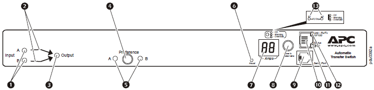
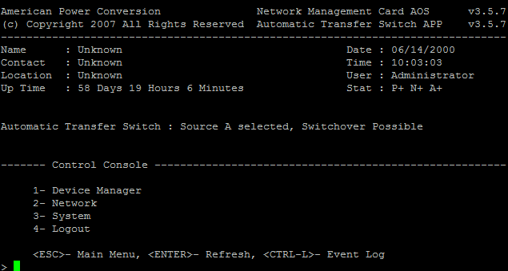

# ATS

## Overview:
Takes two power sources, and combines them for single power supply devices.  

1. Power Cable (on/off).  Shows if they is power to the cables
2. Power Cable Source.  Which input leg is in use
3. Overall Power availability.  Shows that there is power to the system

## Login:
Via RS232 (standard 9600/8/1)
Default user/password is apc/apc
Configuration is very basic.  

