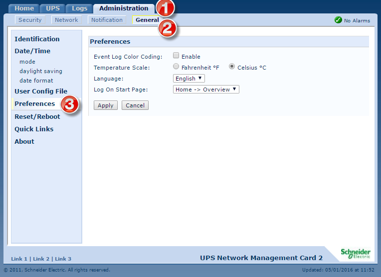
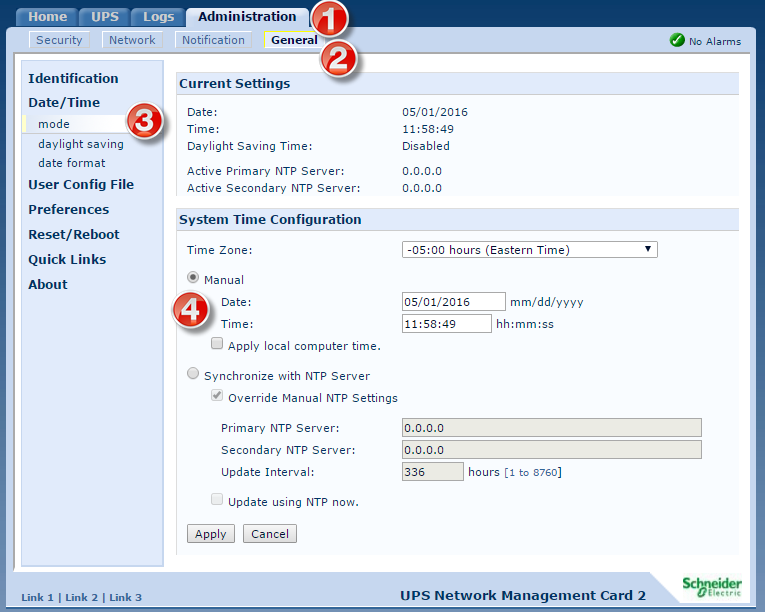
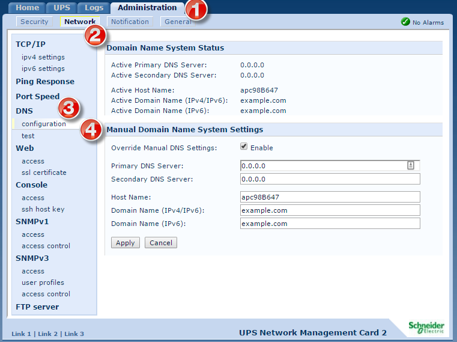

# Basic Admin

## Temp: 
**Administration :: General :: Preferences**

Then set the temperature to Fahrenheit or Celsius, and then Apply.  

  

## Time: 
**Administration :: General :: Date/Time :: Mode** 

Under time, define the timezone for the device (+0hr utc), and tell it to synchronize with NTP servers: 

- 2.north-america.pool.ntp.org
- 3.north-america.pool.ntp.org

## DNS: 
**Administration :: Network :: DNS :: configuration**

Under DNS, set the primary and secondary DNS, and define this devices hostname, and domain.  

