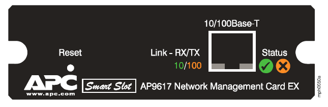
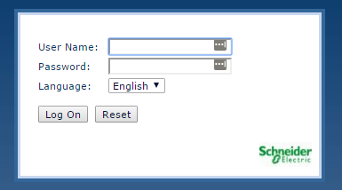
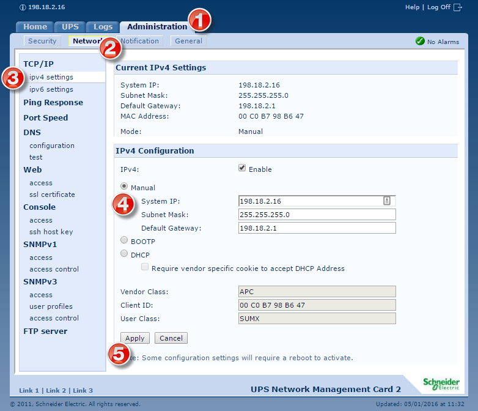

# First time startup

## Overview: 
The following are the steps to configure the Network Management Card that plugs into the UPS's.  



Make sure to note, that these cards DO NOT have console ports!  The UPS does have a console port, but BE VERY CAREFUL if you plug anything into the UPS's console port, that might be enough to power off the UPS!   (A normal console cable will trip the UPS and power it off.  - Their wiring is different, so don't plug in anything to the console port without planning for it.)

## Connecting to the Web Service: 
When NMC will get an IP from DHCP.  

### Finding the IP: 
If you are on the same broadcast domain as the UPS, you can scan the local network and look for MAC's that are registered to APC. 
```
> nmap -sP 198.18.2.0/24 | grep -B 2 American
Nmap scan report for 198.18.2.16
Host is up (0.018s latency).
MAC Address: 00:C0:B7:98:B6:47 (American Power Conversion)
Generally speaking, they have three different services running
> nmap 198.18.2.16/32
Starting Nmap 6.49BETA4 ( https://nmap.org ) at 2016-05-08 15:54 Eastern Daylight Time
Nmap scan report for 198.18.2.16
Host is up (0.0025s latency).
Not shown: 997 closed ports
PORT   STATE SERVICE
21/tcp open  ftp
23/tcp open  telnet
80/tcp open  http
MAC Address: 00:C0:B7:98:B6:47 (American Power Conversion)
Nmap done: 1 IP address (1 host up) scanned in 7.41 seconds
```

### Logging In: 
A direct connection to the http port will provide the following login window.  



The default user/pass is `apc` / `apc`. 

### Set the Network Interface: 
You will probably want to change the IP for the unit so that it statically will be assigned. 

Once you log in, select the **Administration** tab(1), and the **Network submenu**(2).  



Once there, under IPv4 Configuration, select the Manual radio button (4), and enter in the new IP that you want the unit to resolve to.  When your done, select the Apply (5) button.


