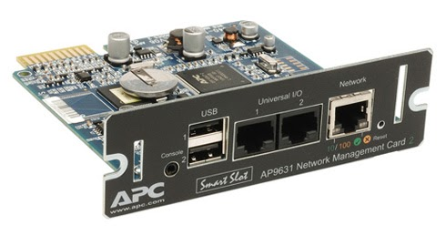
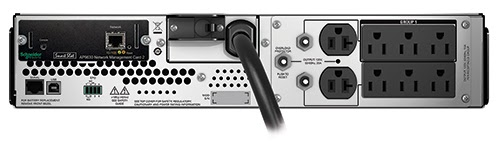
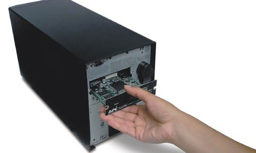

# NMC

## Overview: 
Controller card for APC UPS's. Allows remote monitoring and control.  

<table>
    <tr>
        <td colspan="2"; text-align:center;></td>
    </tr>
    <tr>
        <td></td>
        <td></td>
    </tr>
</table>

## How To's: 
- [First time startup](first-time-startup.md): When its first plugged in, what should you do? 
- [Basic Admin](basic-admin.md): Set time, temp, DNS. 
- User Accounts: admin/readonly, and for who? 
- [User Access](user-access.md): Setup web/telnet/ssh/ftp access
- Save/Import Configuration: once the box is setup, you can backup or push configs. 
- SNMP: Enabling polling of the UPS. 
- Syslog: collection of log data from the ups
- Email: the ups can also send out email alerts. 

## Ref: 
 - [Users Guide: Network Management Card](bin/PMAR-8KRDZG_R0_EN.pdf).pdf (11/2006)