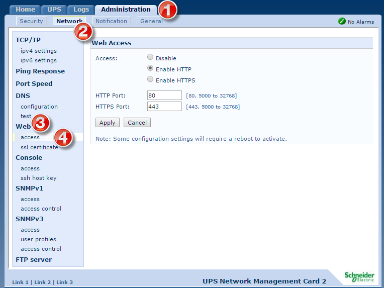
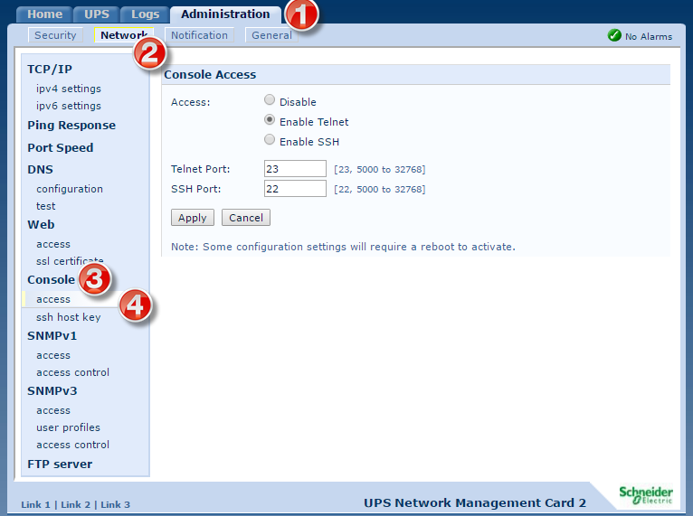
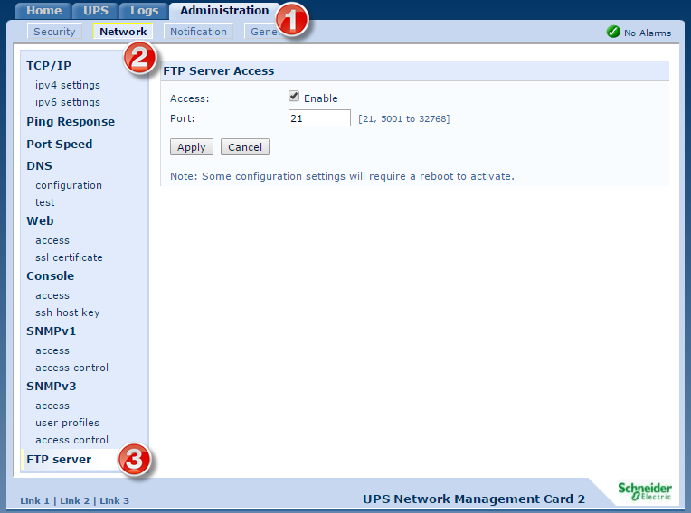

# User Access

## web
**Administration :: Network :: Web :: Access**

Change the web service so it only runs on https. 

## telnet / ssh
**Administration :: Network :: Console :: Access**

Change access so that ssh is enabled.  

## ftp
**Administration :: Network :: FTP server**

I would argue that this, like telnet, we can run without.  

