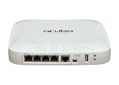

# 7005

## System Basics
Just the basics
- Virginise the box
- [Serial Connectivity](serial-connectivity.md)
- OS Upgrade
- [show/save configuration](showsave-configuration.md): output the configs to save them.

## Initial Setup
Get the box working, and all the connectivity stuff. 
- [Initial Setup Wizard](initial-setup.md): Console in and give the box an IP.  
- [Add an interface/vlan](add-an-interfacevlan.md): create a backend network. 
- [Adding ACLs on the external Interface](adding-acls-on-the-external-interface.md): Block all unneeded ports

## VIA
Setting the controller up to allow client VPNs to terminate to it
- [VPN Client](vpn-client.md): Software that goes on your laptop that lets you VPN to your controller
- [Configure Controller for VIA clients (basic)](configure-controller-for-via-clients-basic.md): how to get the controller to allow vpn clients

## VPN
- [Basic VPN Client Setup](basic-vpn-client-setup.md): How to get a VPN working with minimal effort
- [Enabling VPN Clients](enabling-vpn-clients.md): How to get desktops to VPN to the device

