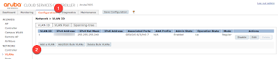
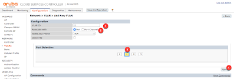
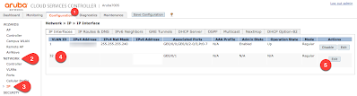
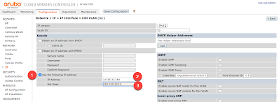

# Add an interface/vlan

## In the web gui

select Configuration (1) and then Add a VLAN (2)



Enter in the VLAN ID (1) that you would like to assign to the interface, and the associate it with a port (2).  Then define which port on the controller to link to the vlan (3), and select apply (4).  



Under the Configuration(1) tab, select Network (2) and then IP(3).  In the table, select the VLAN ID (4) that was just created, and select that row's edit (5) button.  



In the Edit VLAN window, select the Use the following IP address (1) for defining a static IP address, then enter in the IP (2) and the Mask (3), and then select apply at the bottom of the page to save the addition.  



## At the CLI
Check the ARP table 

```Shell
(fw2b01.mb2) #show arp

Protocol Address Hardware Address Interface
Internet 38.111.225.241  40:ce:24:3e:13:34 vlan1

(fw2b01.mb2) #
```

Check vlan interface
```Shell
(fw2b01.mb2) #show interface vlan 32

VLAN32 is up line protocol is up
Hardware is CPU Interface, Interface address is 20:4C:03:1A:00:BC (bia 20:4C:03:1A:00:BC)
Description: 802.1Q VLAN
Internet address is 10.36.32.254  255.255.255.0
IPv6 Router Advertisements are disabled
Routing interface is enable, Forwarding mode is enable
Directed broadcast is disabled, BCMC Optimization disabled ProxyARP disabled Suppress ARP enable
Encapsulation 802, loopback not set
MTU 1500 bytes
Last clearing of "show interface" counters 47 day 15 hr 29 min 8 sec
link status last changed 0 day 19 hr 21 min 42 sec
Proxy Arp is disabled for the Interface
Auto Operstate up is enabled for this Interface

(fw2b01.mb2) #
```

```Shell
(fw2b01.mb2) #show port stat

Port Status
-----------
Slot-Port  PortType  AdminState  OperState  PoE  Trusted  SpanningTree  PortMode  Speed   Duplex  SecurityError
---------  --------  ----------  ---------  ---  -------  ------------  --------  -----   ------  -------------
0/0/0      GE        Enabled     Up         N/A  Yes      Disabled      Access    1 Gbps  Full    No
0/0/1      GE        Enabled     Up         N/A  Yes      Disabled      Access    1 Gbps  Full    No
0/0/2      GE        Disabled    Down       N/A  Yes      Disabled      Access    Auto    Auto    No
0/0/3      GE        Disabled    Down       N/A  Yes      Disabled      Access    Auto    Auto    No

(fw2b01.mb2) #
```

```Shell
(fw2b01.mb2) #show port link-event

Slot/Port   UP     DOWN              Slot/Port   UP     DOWN
---------   --     ----              ---------   --     ----
   0/0/0    1      0                    0/0/1    0      0
   0/0/2    0      0                    0/0/3    0      0

(fw2b01.mb2) #
```