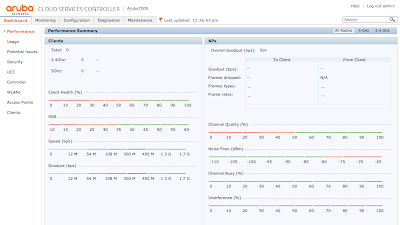

# Initial Setup Wizard

**Contents**
- [Initial Setup Wizard](#initial-setup-wizard)
  - [Connecting to the device](#connecting-to-the-device)
    - [Setup via web](#setup-via-web)
    - [Setup via Console](#setup-via-console)
  - [References](#references)


## Connecting to the device
You can get to the box either by https or console.   

### Setup via web
If you want to connect via the web,

> The PC or workstation must either be configured to obtain its IP address using DHCP, or configured to have a static IP address on the 172.16.0.0/24 subnetwork. The default IP address of the controller is 172.16.0.254. Connect a PC or workstation to a line port on the controller, then enter this IP address into a supported Web browser to launch the Setup Wizard."


### Setup via Console

If you want to connect via console, the terminal is 9600baud, 8/n/1

```
Auto-provisioning is in progress. Choose one of the following options to override or debug...
    'enable-debug'  : Enable auto-provisioning debug logs
    'disable-debug' : Disable auto-provisioning debug logs
    'mini-setup'    : Stop auto-provisioning and start mini setup dialog for branch role
    'full-setup'    : Stop auto-provisioning and start full setup dialog for any role

Enter Option (partial string is acceptable): full
```

Next comes the setup wizard.  Fill it out to configure the basics of the host.  
```
Enter System name [Aruba7005]:
Enter Switch Role (master|local|standalone|branch) [master]:
Enter VLAN 1 interface IP address [172.16.0.254]: 8.11.25.244
Enter VLAN 1 interface subnet mask [255.255.255.0]: 255.255.255.240
Enter IP Default gateway [none]: 8.11.25.241
Do you wish to configure IPV6 address on vlan 1 (yes|no) [yes]: no
This controller is restricted, please enter country code (US|PR|GU|VI|MP|AS|FM|MH) [US]:
You have chosen Country code US for United States (yes|no)?: yes
Enter Time Zone [PST-8:0]:
Enter Time in UTC [18:43:15]: 19:00:00
Enter Date (MM/DD/YYYY) [6/29/2018]:
Enter Password for admin login (up to 32 chars): *******************************
Re-type Password for admin login: *******************************
Enter Password for enable mode (up to 15 chars): ************
Re-type Password for enable mode: ************
Do you wish to shutdown all the ports (yes|no)? [no]:

Current choices are:

System name: Aruba7005
Switch Role: master
VLAN 1 interface IP address: 8.11.25.244
VLAN 1 interface subnet mask: 255.255.255.240
IP Default gateway: 8.11.25.241
Option to configure VLAN 1 interface IPV6 address: no
Country code: US
Time Zone: PST-8:0
Ports shutdown: no

If you accept the changes the switch will restart!
Type <ctrl-P> to go back and change answer for any question
Do you wish to accept the changes (yes|no)yes
Creating configuration... Done.

System will now restart!
```

Then you can watch the reboot process until the box comes back online.  (it takes a few min)
```
[19:03:06]:Starting rebootme

[19:03:06]:Shutdown processing started
[19:03:11]:Starting database backup
[19:03:11]:Syncing data...
...

[19:03:14]:done.
[19:03:14]:Shutting down database server
[19:03:17]:Starting Time sync
[19:03:17]:Time sync [Done]
Please stand by while rebooting the system.


Stage 1 Loader 1.0.5.0 (build 56553)
Built: 2016-09-22 at 05:05:37

Secure Boot Enabled on the Processor

Bank: Primary
CPLD:  rev: 3.2 (0x10:002c)
PRID: 000C1203
POWER ON RESET CFG:C3C0FE2
Initialized I2C0 Controller.
Initialized I2C1 Controller.
SPD Rev:0x11 DIMM:0 Type:2 Speed:666MHz #Rank:1
DDR3: Node 0 Channel 0 Mem size = 4096 MB UDIMM
set freq:666666
DDR3: Node 0 DRAM frequency 666 MHz
DDR3: Node 0 CPU frequency 500 MHz
mtb_ps:125 clock:1500 trc:33 trcd:9 trp:9
AP3:A0CFFF0 ODTP1:10000
Board DDR VDD set to 1.35V.
N:0 CH:0 additional rdlvl rdly:1
N:0 Ch:0 m:32 s:32 R OK.
Rank:0 HW WLVL Passed Mask:1FF
AP3:A0CFFF0 ODTP1:10000
n:0 ch:0 RTT WR:0200
===N:0 Ch:0 m:32 s:32 RW OK.
Node:0 Ch:0 TGE Set Memory:4096 MB value:FF FF -- PASS
Node:0 Ch:0 TGE Set Memory:4096 MB value:FF 00 -- PASS
Node:0 Ch:0 TGE Set Memory:4096 MB value:AA 55 -- PASS
Node:0 Ch:0 TGE Set Memory:4096 MB value:00 00 -- PASS

DDR3 Initialization Passed.
NBU0 DRAM BAR0 base: 00000000 limit: 0013f000 xlate: 00000001 node: 00000000 (    0 MB ->   320 MB, size:   320 MB)
NBU0 DRAM BAR1 base: 001d0000 limit: 00bff000 xlate: 00090001 node: 00000000 (  464 MB ->  3072 MB, size:  2608 MB)
NBU0 DRAM BAR2 base: 00e00000 limit: 0128f000 xlate: 00290001 node: 00000000 ( 3584 MB ->  4752 MB, size:  1168 MB)
Hit Ctrl + X keys to stop autoboot:  0

CPBoot image is signed
Verifying CPBoot checksum...
CPBoot check passed
Signer Cert OK
Policy Cert OK
RSA signature verified.
## Starting application at 0x8C100000 ...


CPBoot 1.0.7.0 (build 56553)
Built: 2016-09-22 at 04:52:55

DRAM:  4 GB
CPLD:  rev: 3.2 (2c)
Flash: 16 MB
PCIE (B0:D01:F0) : No Link.
Pwr Mngr: 24
Power: DC Adapter
Bank:  Primary
Board: A7005
CPU:   XLP208 Rev B1 (Secure Boot)
Clock: Core 500 MHz / SoC 500 MHz (0c3c0fe2)
Reboot code: 0:2:19: 3:32
Proto :5
Net:   ge-3, ge-2, ge-1, ge-0
Inventory Verification: PASS
Hit Ctrl + X key to stop autoboot:  0
USB0:   setting speed to USB_SPEED_HIGH
2 USB Device(s) found
#1 Storage Device(s) found
##Loading image 0:0###################
Image is signed; verifying checksum...
passed
SHA2 Signature available
Signer Cert OK
Policy Cert OK
RSA signature verified using SHA2.
[    0.000000]   0:xlp_napi_vc_mask 0xf
[    0.000000]   0:sae frequency is 250
[    0.000000]   0:nlm_hal_set_sae_engine_sel: xlp2xx return
[    0.000000]   0:-- SAE Frequency set to 250
[    0.000000]   0:cde frequency is 333
[    0.000000]   0:CDE Frequency set to 333MHz
[    0.000000]   0:MSGRING_NAPI: Initializing NLM NAPI subsystem
[19:04:54]:...Starting rcS...

Aruba Networks
ArubaOS Version 6.5.1.4 (build 58698 / label #58698)
Built by p4build@pr-hpn-build04 on 2017-03-10 at 08:39:15 UTC (gcc version 4.4.5)
(c) Copyright 2016 Hewlett Packard Enterprise Development LP.

          <<<<<    Welcome to Aruba Networks - Aruba A7005-US    >>>>>

[19:05:01]:Probing for EEPROM devices                 [ OK ]
[19:05:01]:Probing for real-time clock                [ OK ]
[19:05:01]:Uncompressing core image files             [ OK ]
[19:06:09]:Extracting corefs                          [ OK ]

[19:06:12]:Enabling watchdog                          [ OK ]
[19:06:12]:Starting device manager

Performing eUSB Flash fast test...                    [ DONE ]
    [ OK ]
[19:06:13]:Mounting flash                             [ OK ]
[19:06:14]:Initializing 511MB as swap on zRam0        [ OK ]
[19:06:16]:Turning swap ON on zRAM0                   [ OK ]
[19:06:16]:Checking system inventory                  [ OK ]
[19:06:16]:Installing ancillary FS                    [ OK ]
Performing integrity check on ancillary partition 0   [ OK ]

[19:06:18]:Reboot Cause: User reboot (Intent:cause:register 78:86:0:2c)
[19:06:18]:Starting syslog service                    [ OK ]
[19:06:19]:Restoring the database                     [ OK ]
[19:06:30]:Generating SSH keys                        [ OK ]
[19:06:30]:Initializing TPM and certificates          [ OK ]
[19:06:58]:Checking for configuration upgrade         [ OK: Intra-Version Upgrade ]
[19:07:00]:rcS Done(126 sec)

[19:07:00]:Starting OS services                       [ OK ]


Reading configuration from default.cfg
Retrieving Configuration...will take approximately 1 minute


(Aruba7005)
User:
```

Once it's rebooted, connect to the web interface



## References
- [ArubaOS 6.4.1 Quick Start Guide](): 
- [Understanding the role of 'master', 'local' and 'standalone'](): Airheads Community, Aug,2015