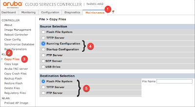

# show/save configuration


## From the CLI: 
Show all of the config without any paging (show it all in one go.  Don't stop per page)
```Shell
 #no paging
 #show configuration
```

## From GUI: 
You need to either save the configs to a USB flash disk plugged into the controller, or to output it to a local ftp/tftp server

From Maintenance (1), select File (2) and Copy Files (3).  Then select either Running or Startup Configs (4), and then select where you want to put the configs, either on a local USB, or a FTP or TFTP server (5)

