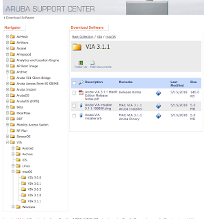
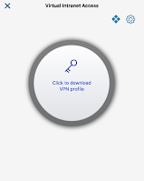

# VPN Client

## Getting the client software
The vpn client software is called "VIA", and can be downloaded from the support page: 
- https://support.arubanetworks.com/

Look for the "VIA" section in the download software page, and get the client for your client type (mac, windows, etc.)

## Download the Profile
Once the client is installed, it needs to know where to connect to and how.  

## References
- [VPN Services in ArubaOS](https://www.arubanetworks.com/products/security/vpn-services/): 
