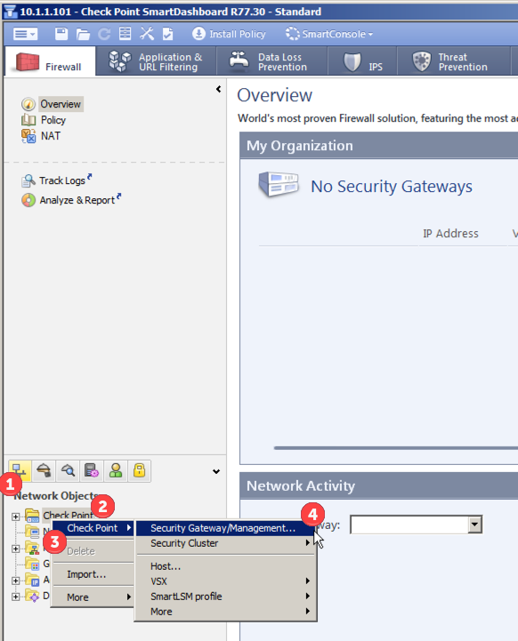
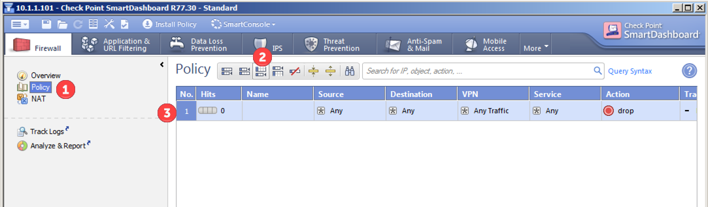
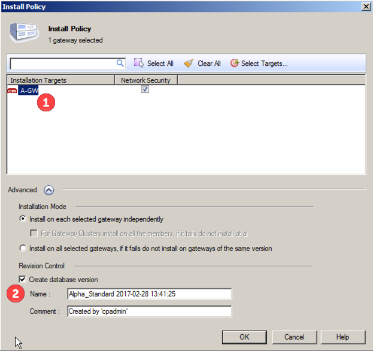

# Add firewalls to GAIA
open up the smart dashboard

## Create a new firewall object
start in the gaia portal and select 

Network Objects :: Check Point (right click):: Check Point :: Security Gateway/Management...

first time you do this, you need to confirm that you want classic mode, and to not see the annoyance message again

In the classic mode of the gateway, make sure you define the following: 

- name of the firewall
- primary IP of firewall
- comment to describe the firewall
- color of the firewall's icon in the smart dashboard
- what blades the firewalls should run

Then setup communications between the database (gaia) and the firewall by setting up SIC communications by pressing the communications (6) button 

This will pull up the SIC window where you enter in the SIC one time password (1) that you defined when you first setup the firewall, and then setup the connection by pressing the Initialize (2) button.  

when the connection is set, you will see the state enabled (3) and then you can press ok (4) to setup.  

It will then show you the interfaces (topology) of that firewall which you can close out to continue

Then you can confirm that the state with the new gateway is trusted (1)

Modify the interface settings by selecting Topology (1) and then selecting one of the interfaces (double clicking or single click & Edit)

In this case, we will want to define the interface as a DMZ network, so select Topology (1) and select the Interface leads to DMZ (2).  

by ok'ing the changes, you will get back to the overview page, that now includes the new firewall in the "my organization" section (1) and also a new firewall in the Checkpoint (2) section. 

## Create a new host node
Under Network Objects :: Nodes (right click) :: Node :: Host...

For that host device, define 

- name for the host
- IP address
- additional comment describing the object
- color to use for the icon in the gui

once you commit that object (by pressing ok) you will see the object show up in the Nodes (1) section in the lower left corner of the SmartDashboard.

## Create a network object
you can also define a network object like a vlan.  to do this, select Network Objects :: Network (right click) :: Network...

Define the network object by modifying the following fields

- name of the network
- comment or description of the network
- color of the network icon when show in gaia
- network IP
- network mask

once the object is created, you will be able to see it in the bottom left of the SmartDashboard under Networks: 

## Creating Rules (ACLs) 
In the SmartDashboard, select Policy (1), then add a new policy (2), and a new line will appear (3) in the policy window.  

### Cleanup Rule: 
The checkpoint has default (implied) acl rules that are not shown.  One is that there is a default deny that does not log, which can be tricky when you're troubleshooting because packets are being dropped and you don't know why.  To fix this, let's define a default deny acl statement that logs.

Modify the new policy by double clicking (1) on the blank fields to modify the name field 

right click on the Track field and select Log to log every time this policy gets a hit.  

### Management Rule: 
You also want a rule that will allow access to the firewalls from the SMS host and the admin's hosts.  

Add a new policy with the add rule on top (1) button, then enter in the name (2) like noted before

There are a couple of different ways to enter objects into the source and destination fields.  One way, is to select and drag the icons directly onto the field.  

Another way is to click the little plus symbol in the field to add (1), then enter in part of the object's description (2) in the search field, and then select the object you are looking for (3) 

You can use the (+) method for adding objects in the service and other fields as well.  

Right click on the Action field to change the Drop to Accept

And for the management rule, also make sure that you track hits to the rule by sending to log

## Modify Implied (default) Firewall ACL rules 

Lets modify the default firewall rules to allow the them to reply to ICMP.  To do this, select the Launch Menu Icon () and select Policy :: Global Properties... 

Under Firewall (1) check Accept ICMP request (2) and select the First (3) pulldown.  Select Log Implied Rules (4) and ok(5).  

## Save Policy: 

The rules you have entered are not saved by default, so you need to save them by clicking the save icon (), or File :: Save As

Then name your saved configs, and press ok.  

You will then see the name of the saved change in the window

## Installing The Policy: 
To push these changes to the firewall, you will need to select the "install policy" button in the SmartDashboard window.  

Make sure that you are selecting the correct gateway (1) , and make sure that you are saving a version of the database (2) and then select ok to compile the change. 

once the revision has been compiled, it will then be pushed to the firewalls.  

## Adding a Remote Firewall (gateway) 
Here, we are trying to add a remote firewall.  The trick here is that you need to define the remote firewall and update the local firewall, then you can link up the SIC connection.  

Create a new firewall like defined above.  

When you select the SIC communication button (1), enter in the SIC one time password (2) like before, and then press Initialize (3) to attempt the connection.  

That connection will fail because the local firewall does not know about the remote one.  

Then select CANCEL (not ok)

And click yes to resetting the SIC.  

Click OK at the new firewall/gateway's properties page, and accept the warning 

Then push the policy

But here, only push the change to the "A" (local) firewall, and deselect the "B" gateway for the update (because you can't connect to it yet).  But this will push the update to the "A" gateway, allowing it to know about the "B".  

Once the policy is pushed to the local firewall, then re-edit the remote "B" object, test the communications (1), enter in the SIC passcode (2), test (3), and confirm. 

