# Build a FW Server (R77.30)

## Overview: 
You can get checkpoint firewalls as VM images.  To configure them, follow the following: 

## Getting the VM image installed: 
At the grub page, select to install Gaia on this system

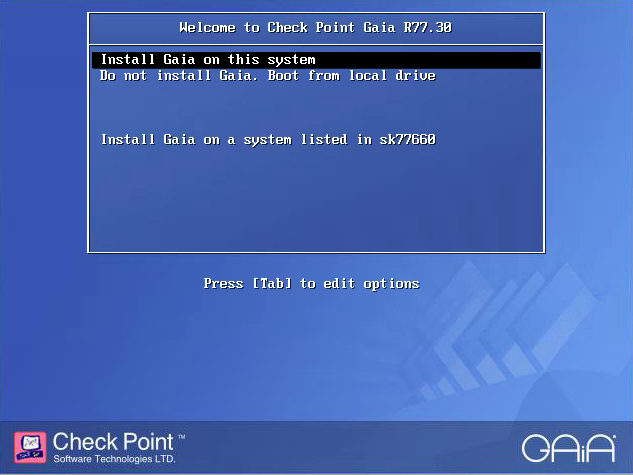

From the Welcome screen, select OK and move forward

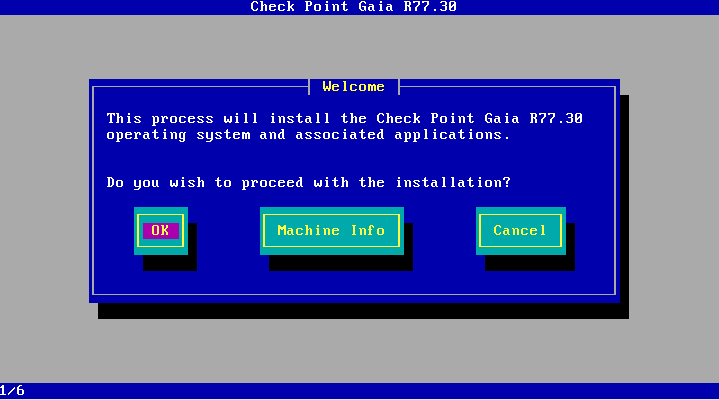

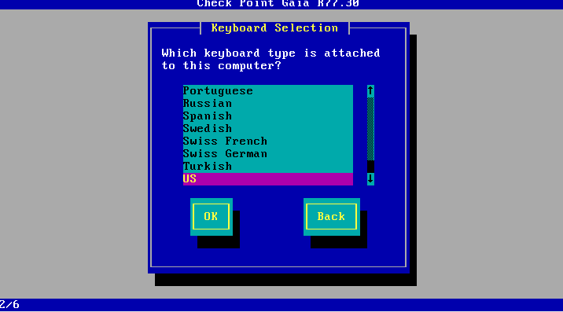

Select the partitions that you want for this firewall

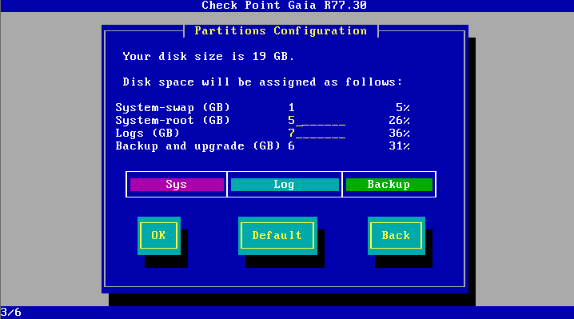

Define the admin password

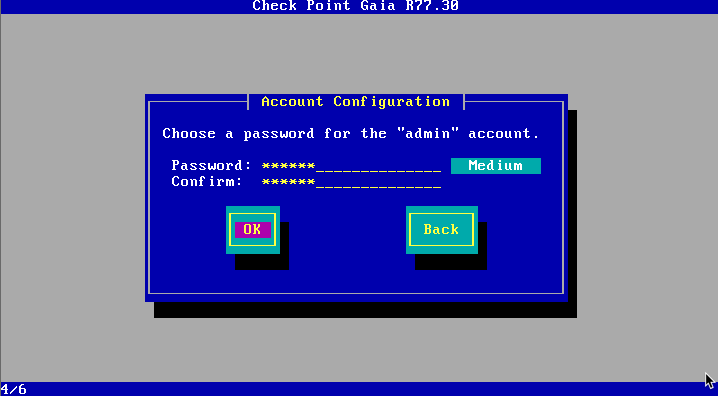

Then  choose what interface should be the management interface

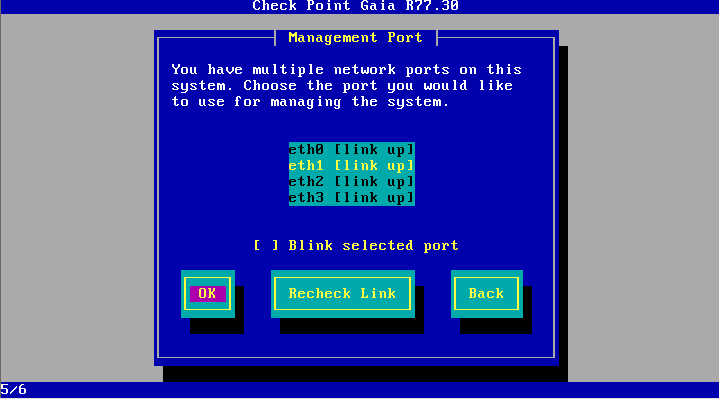

Configure the IP for the management interface

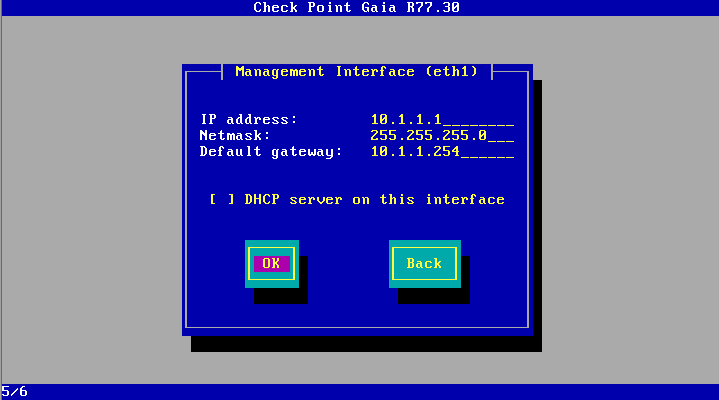

Then select OK to start with the install

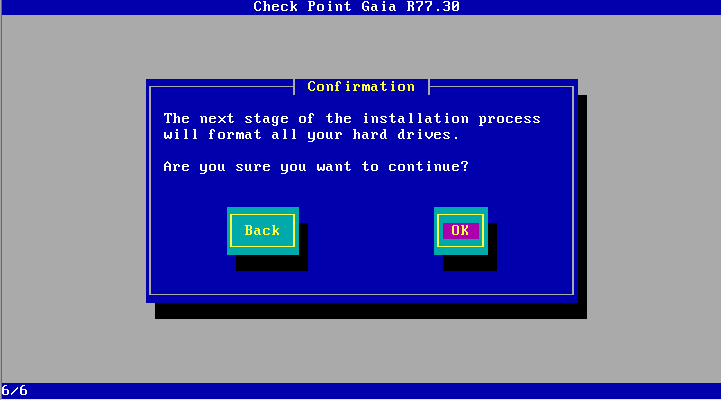

Then wait a long time until the host is configured.  

Once complete, reboot the server

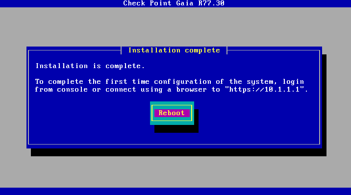

and then at the command prompt, log in to confirm that it's all set: 

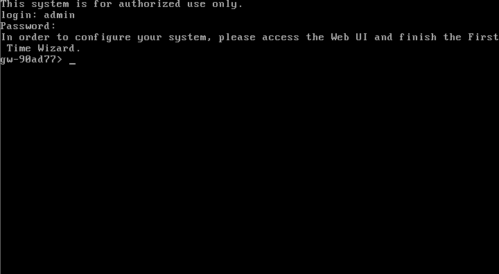

## Configure via browser and Wizard
From a web browser, connect to the firewall over https

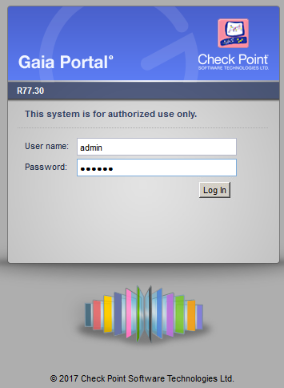

And select next at the first time wizard

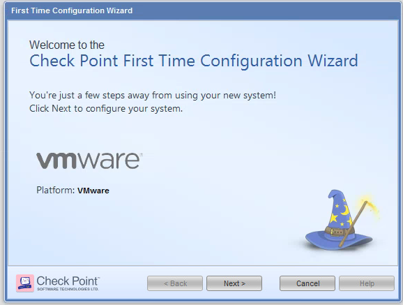

Continue...

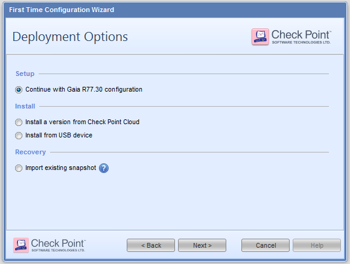

Confirm that the network settings are correct for the management interface

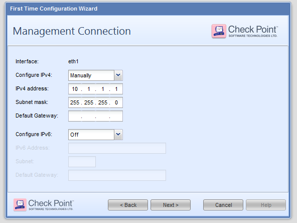

Continue through the management connection page (this will get setup later)

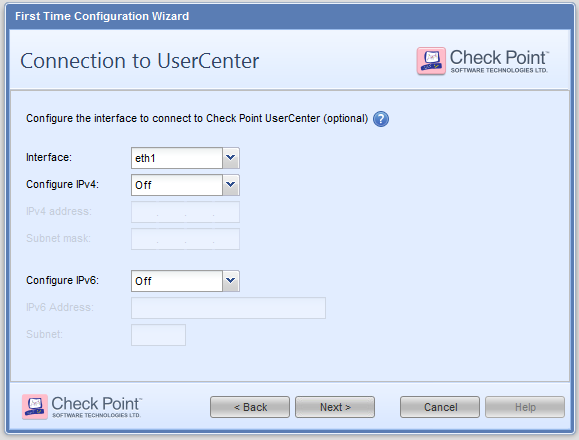

Define the hostname, domain, and DNS names

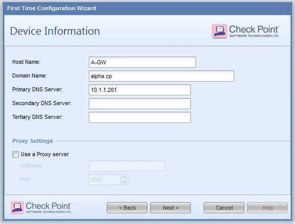

Define NTP settings

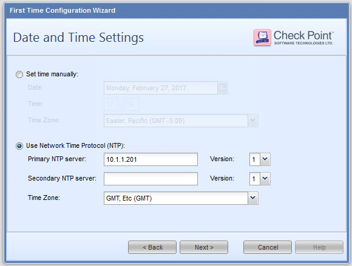

only setup a security gateway (since this is just a firewall)

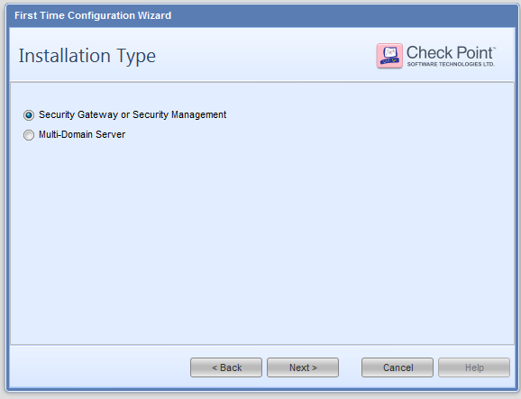

And configure the security gateway, and have it auto download updates.  

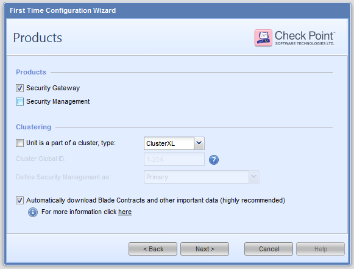

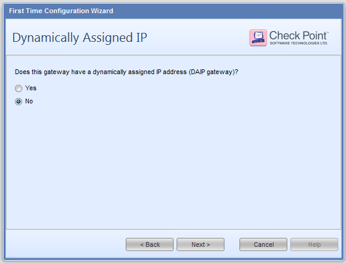

Don't set up the firewall to auto define IPs

and set the one time key to be used between the firewall and the SMS server.  

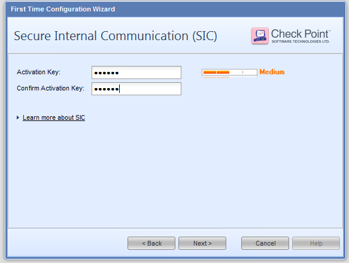

And then finish the setup 

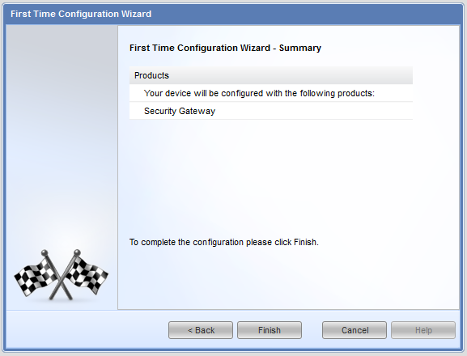

and wait for the install to get completed.  

One it's complete, log into the firewall 

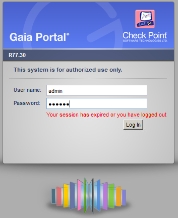

Then you'll get to the login page for the firewall

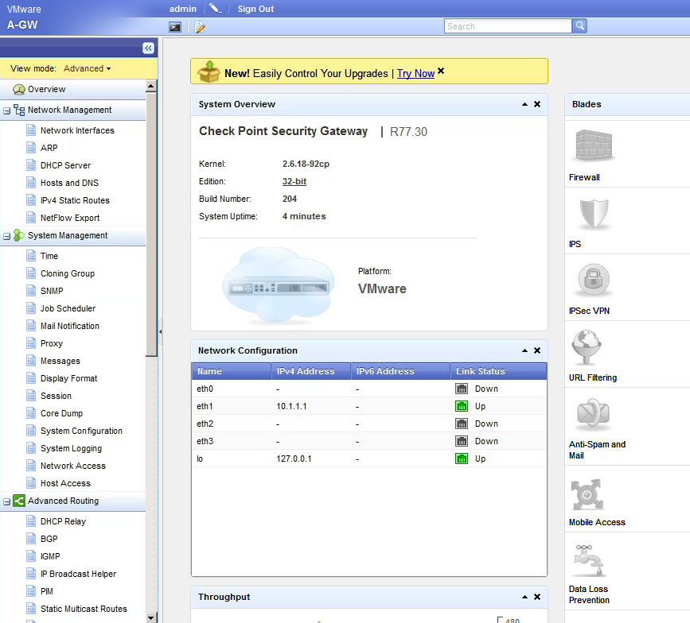

## Configure via browser 
From the main web page from before, 

Select network interface, and the eth1 interface, and then select edit

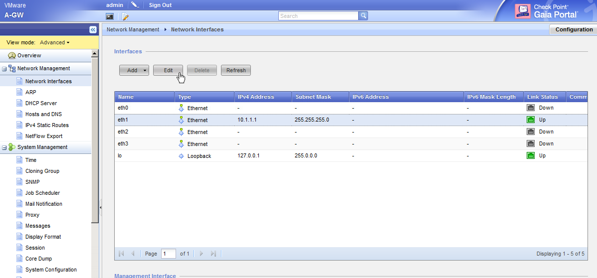

press ok when you get the error, and then give a comment for the internal interface, and select ok. 

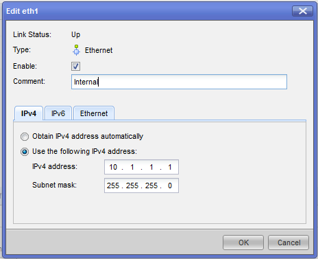

Select another interface to edit (select the interface, and press edit) to define another interface

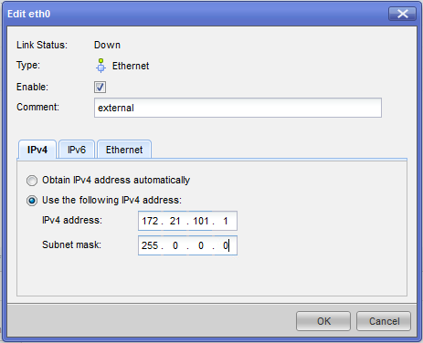

When you're done, you should have all your interfaces complete

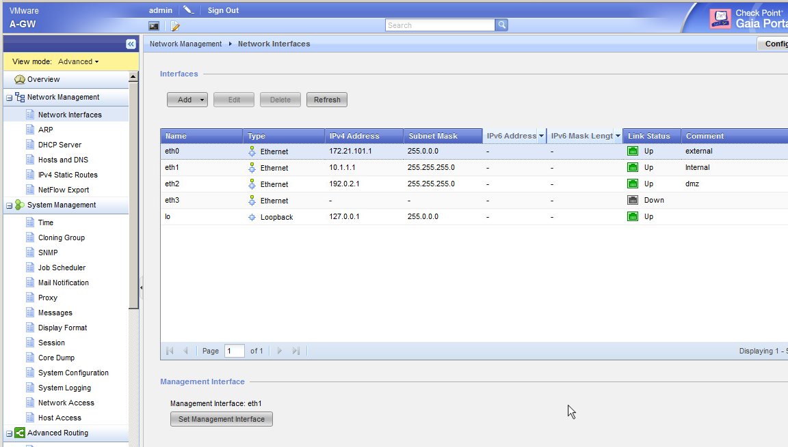

Define routes by going to Network Management :: IPv4 Static Routes, select the default route and press edit.  

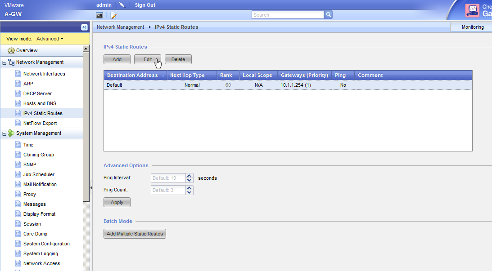

You can modify the default gateway by either adding a new gateway with the Add Gateway button, or modify the existing gateway with the edit button.  When you do, you will get a popup that provides you a space to define the IP, and it's route priority.  

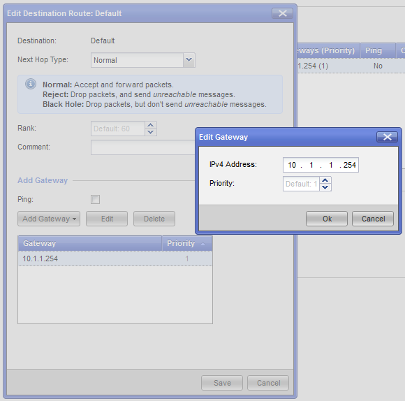

Modify the banner message by selecting System Management :: Messages  and then editing the banner field.  

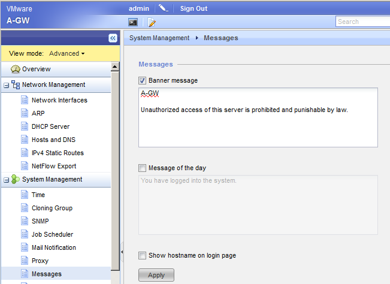

Then log out and re-log back in to confirm the message looks fine.  

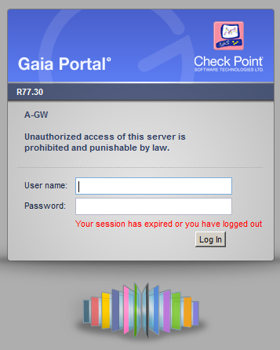

