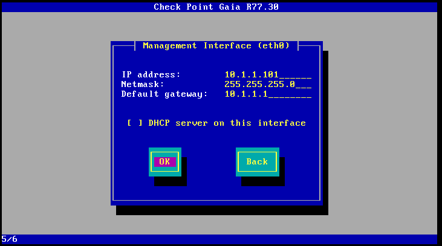
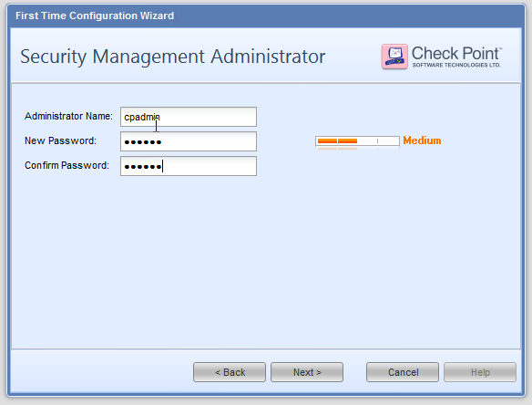

# Build an SMS Server (R77-30)

- [Build an SMS Server (R77-30)](#build-an-sms-server-r77-30)
  - [Overview:](#overview)
  - [Installing the Image:](#installing-the-image)
  - [Configure SMS via web GUI and Wizard](#configure-sms-via-web-gui-and-wizard)
  - [Configure SMS via web GUI](#configure-sms-via-web-gui)

## Overview: 
The SMS (Security Management Server) is the database that contains all the firewall rules for all of the checkpoints.  You need to build this before you can configure the firewalls themselves.  

Assumption is that your building one in a VM, but you can also do this on their physical hardware. 

## Installing the Image: 
At the grub window, select "install Gaia on this system"

At the welcome screen, select "ok"

Modify partitions as needed

Enter a password for user "admin" 

Define the IP address for the primary interfaces

Select OK to continue

Wait a long time for the system to install.....

Reboot the system (removing any CDs as needed)

Login when you get the prompt to confirm the host is installed properly.  

## Configure SMS via web GUI and Wizard
Connect to the SMS server via a web browser (via https)

First time you connect, you'll be brought to the Configuration Wizard.  

Continue with the R77.30 install

Confirm that the network interface is configured properly

Define the hostname/domain for the box, and what it's DNS servers are

Configure NTP 

Configure the unit just to be a Security Manager,  

And within the Products, just select Security Management.  Make sure that the unit is Primary, and that It will automatically download new updates.

 

Next, define the account for the SmartConsole (or the account used when connecting to the database).  

Define what hosts are allowed to connect to the Database of the SMS and make changes: 

You probably don't need to send data to checkpoint (unselect that) and press Finish

Then wait a bit longer for the system to configure....

And then when your done, your get the webUI for the firewall. 

## Configure SMS via web GUI 
Confirm that the default routes are set properly under Network Management :: IPv4 Static Routes   

You can get to the messages page either via the search window, or via System Management :: Messages   

Here you can modify the banner message and the message of the day.

Then log out, and re log in and confirm the message works: 

