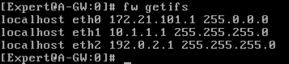
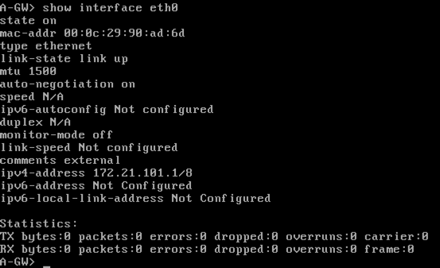
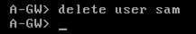

# Command Line

## clish vs. bash
Depending on how the user account is setup, when you login to a gateway (firewall) or SMS (database) you will be put either in bash (expert) or clish (checkpoint cli) mode.

The clish ("cli"-"shell") starts with a carrot "`>`", whereas, the bash prompt starts with a pound "`#`" and the prefix of "`Expert`".

### clish   


 
### bash


### bash password
before you can login to bash, you need to set its password (aka the enable password).  You do this with the "set expert-password" command.  You can also tab-complete commands in clish which will also show you possible alternative commands matching what you have already typed in.  


### Save config changes
any changes made to the firewall from the clish prompt need to be saved via the "`save config`" command

### Moving between clish and bash
The following commands will move you between the two input methods: 

clish -> bash
```
expert
```

bash -> clish
```
exit
```


## Bash Commands: 
### cpconfig
make changes to the licenses of the firewall, including changing the SIC password (#5 Secure Internal Communications). 


### tcpdump
capture data from the firewall interfaces.  To break out of the capture, press [Ctrl]+[c]


### shutdown
shutdown the firewall

### reboot
reboot the firewall

### fw stat
name of the security policy installed on the gateway


### fw unloadlocal
unloads the policy from the firewall.  In other words it removes the firewall rules pushed from the DB to the unit.  It converts the firewall to a more "virgin-like" state, but keeps routes and interface settings.  Good if something horrible was pushed, and you just need to get control back to the unit.  


note, that if you enter fw stat after you have unloaded the gateway, it will show without a running policy


### fw ver
view the running OS version on the firewall


### fw getifs
view the interfaces on the gateway


### netstat -rn
views the routing table


### netstat -an
view running services and the ports

### cpstat os -f cpu
stats on the firewalls cpu



### cpstat os -f multi_cpu
View the status of the different processors


### cpview
view the cpview utility to see ~lots~ of different stats on the firewall via a command prompt.


You can scroll up and down (1) to see more of the results.  You can also see multiple tabs (2) by pushing the left and right buttons


to get out of cpview, press [Ctrl]+[c]


## clish Commands: 
note that "`netstat`", "`cpstat`", and the "`fw`" commands work both in bash and clish.  

### show interfaces 
view all of the interfaces configured on the firewall


### show interface eth0
see the stats of one interface


### show route
view the routes defined on the gateway


### show users
view current user accounts allowed on the gateway



### Add user: 
To add a user, use the add user command, define the uid, and the home directory
```
add user sam uid 200 homedir /home/sam
```


set the password for the new user
```
set user sam newpass vpn123
```


set the roles for the new user with the Role Based Access subcommand
```
add rba user sam roles adminRole
```


confirm user with the `show users` command again: 


remove a user with the `delete user` command: 
```
delete user sam
```

### clear screen 
to clear your screen in checkpoint press [Ctrl]+[l]

### backup and restore 
first save the running config
```
save config
```

then make a backup of the local host
```
add backup local
```


view the status of the backup (is it still copying?)  
```
show backup status
```


view the backup file in expert mode.  Since it's stored in linux, you can scp it off as needed.  you can rename this file as needed to remind you of the status point



importing the backup is done with the 
```
set backup restore restore local <tab>
```


