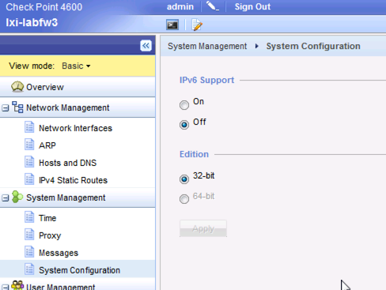

# Confirming hardware edition

Need to confirm if we can run in 64 bit mode rather then 32. 

Currently the box is set to 32: 


You can confirm if you can upgrade this one of two ways: 

## Checking via CLI: 
Checking the stats on the box: 
```
lxi-labfw3> show asset all 

Platform: T-160-00
Model: Check Point 4600
Serial Number: 1345B00170
CPU Frequency: 2926.079
Disk Model: WDC WD2503ABYX-01WERA1
Disk Capacity: 251 GB
Memory Slot 1 Size: 4096 MB
Number of line cards: 0
``` 

If it's more than 6MB, you can run 64.  

if so, you would upgrade with the `set edition` command  (and then you reboot)

## Checking from the GUI: 
You can also simply click the "32-bit" link


from there you will get a page that shows if you can change the edition or not.  



