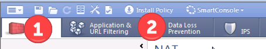

# Create the Gateway object on the NPM

## Set the management interface
Since your going to manage the firewall remotely, you want to change the management interface to the external int.  

From the interface window, select Set Management Interface: 


Change the interface to eth1


And click ok. 


## Create new object in NPM: 
Under Network Objects, Chdkpoint (1) select Checkpoint (2) and Security Gateway/Management (3)


For the new firewall definition, add the name, type of platform and it's IP.  


Enter the SIC password that you created when you first ran the setup wizard on the firewall itself. 


If all goes well, the NPM will connect to the firewall, and start communicating using the SIC password for authentication.  


## Setup new policy: 
Install the blades you want for your new firewall: 


Save the configs: 


Create a new encryption domain by creating the group and the network range 

File :: Manage :: Network Objects :: New :: Group :: Simple Group


Create the network Object


   


Set OK to create the group


Save the configs to the new policy package


<p>


Set the installation targets for the new policy.  


Make sure that this new policy only includes the new lab firewall: 


## Finish setting up the Firewalls policy
Create a VPN Community: 

Under IPSec VPN, select new


Then in the popup window, provide the following information: 
```
General: 
  Name = LXI_LAB_VPN
  Comment = From lexington to lab
  color = red
Center Gateway
  LEX-CLUSTER-01
Satellite Gateway
  lxi-labfw3
Encryption
  IKEv1 for IPv4
  Custom :: p1: AES-256, SHA-256. p2: AES-128, SHA-256
Tunnel Management: 
  One Tunnel per subnet
Advanced Settings :: VPN Routing
  To center only (selected)
Advanced Settings :: Advanced VPN Properties
  Diffie-Hellman :: group2
  IKE sec associations 1440min
  IPsec sec associations 3600sec
  disable nat inside of vpn (selected)
```

Then add the route domain into the firewall


Then go through the firewall rules and make sure that it is what you want.


Then Save and Push Policy: 



