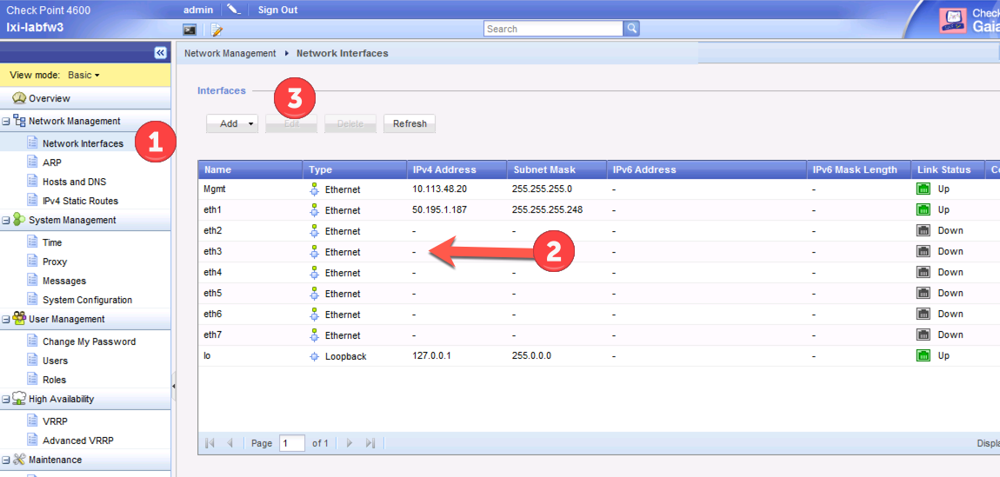
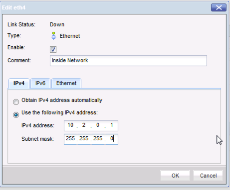
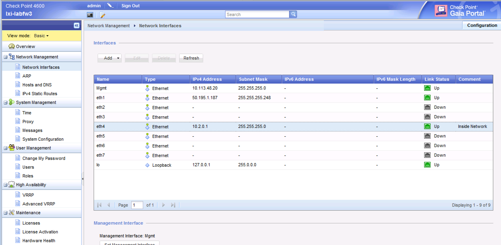
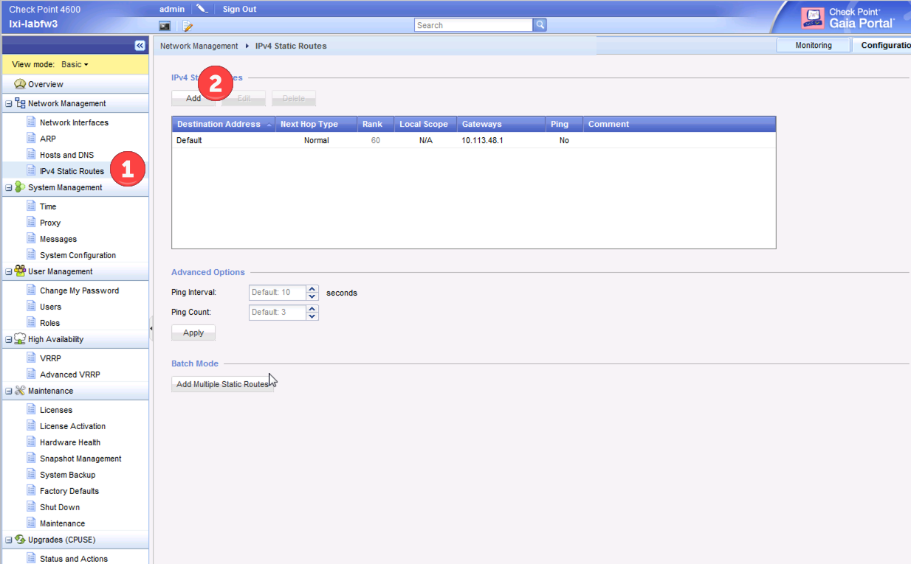
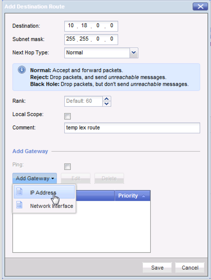
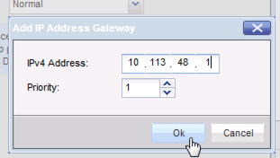
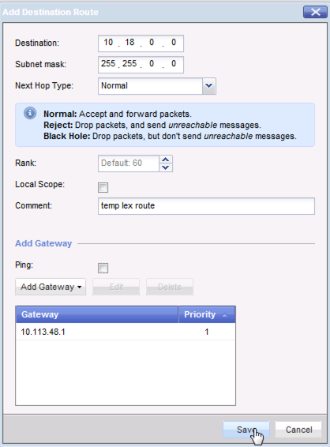
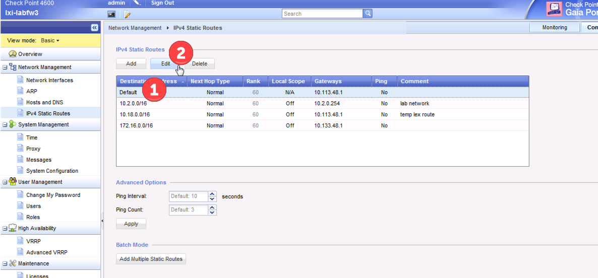
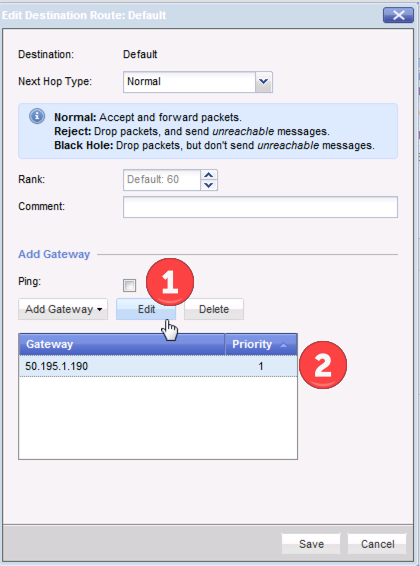

# Defining interfaces

## From the CLI: 

### view the current interfaces: 
```
gw-3a1b80> show configuration interface 

set interface Mgmt link-speed 1000M/full
set interface Mgmt state on
set interface Mgmt auto-negotiation on
set interface Mgmt ipv4-address 10.132.30.15 mask-length 24
set interface eth1 state off
set interface eth2 state off
set interface eth3 state off
set interface eth4 state off
set interface eth5 state off
set interface eth6 state off
set interface eth7 state off
set interface lo state on
set interface lo ipv4-address 127.0.0.1 mask-length 8
```

### Add management interface: 
```
gw-3a1b80> set interface Mgmt ipv4-address 10.113.48.20 mask-length 24
gw-3a1b80> set static-route default nexthop gateway address 10.113.48.1 
```

### confirm routes: 
```
gw-3a1b80> show configuration static-route 

set static-route default nexthop gateway address 10.113.48.1 on
set static-route default nexthop gateway address 10.132.30.0 on
set static-route default nexthop gateway address 192.168.1.254 on
```

### Remove unwanted routes: 
```
gw-3a1b80> set static-route default nexthop gateway address 10.132.30.0 off
gw-3a1b80> set static-route default nexthop gateway address 192.168.1.254 off
```

### Confirm Routes:

```
gw-3a1b80> show configuration static-route 
set static-route default nexthop gateway address 10.113.48.1 on
gw-3a1b80> 
```

### Confirm Interfaces
```
gw-3a1b80> show configuration interface 
set interface Mgmt link-speed 1000M/full
set interface Mgmt state on
set interface Mgmt auto-negotiation on
set interface Mgmt ipv4-address 10.113.48.20 mask-length 24
set interface eth1 state off
set interface eth2 state off
set interface eth3 state off
set interface eth4 state off
set interface eth5 state off
set interface eth6 state off
set interface eth7 state off
set interface lo state on
set interface lo ipv4-address 127.0.0.1 mask-length 8
gw-3a1b80> 
```

### confirm that the management interface is still on the right port
```
gw-3a1b80> show configuration management 
set management interface Mgmt  
gw-3a1b80> 
```

## From the GUI: 
In the Menu, under Network Management, select Network Interfaces (1), then select the interface you want to modify (2) and then select the Edit (3) button.  



Enable the interface, give it a comment so you know what it is, and then provide the IP and Mask.  



Once you add the interface it will show up in the Network Interface window.  



To setup the routes, under Network Management, select IPv4 Static Routes (1), and then select the Add(2) button.  



Define the destination route(1) (network / mask) and a comment(2).  Then select the Add Gateway (3) pulldown, and select "IP Address". 



 Then add the IP for the gateway (and you can also include a weight for the route).  



When your done, the final configuration will show up.  



To change the default route, within the IPv4 Static Routes, select Default (1), and select Edit (2)



then select Edit (1) and in the popup window modify the route (2)



Set the management interface


